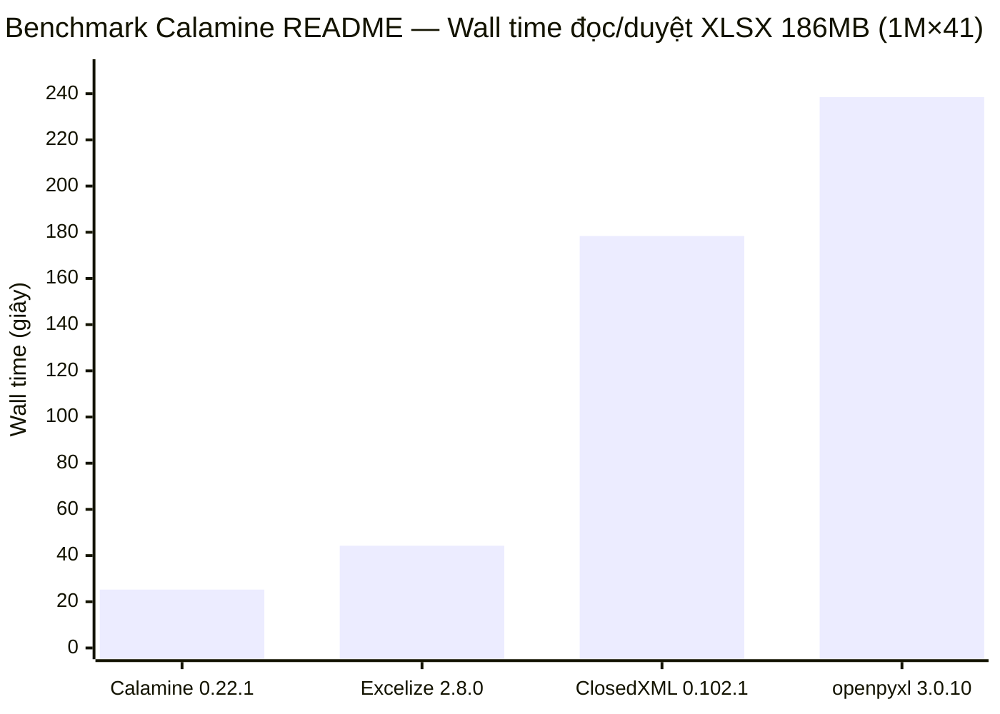
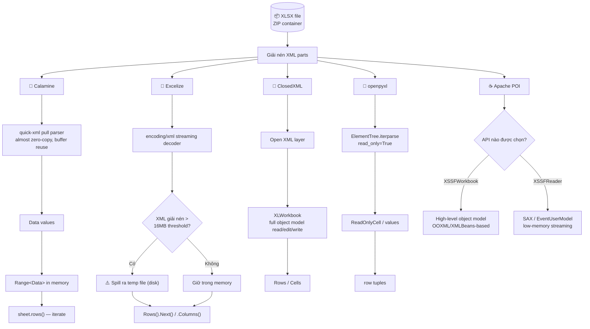
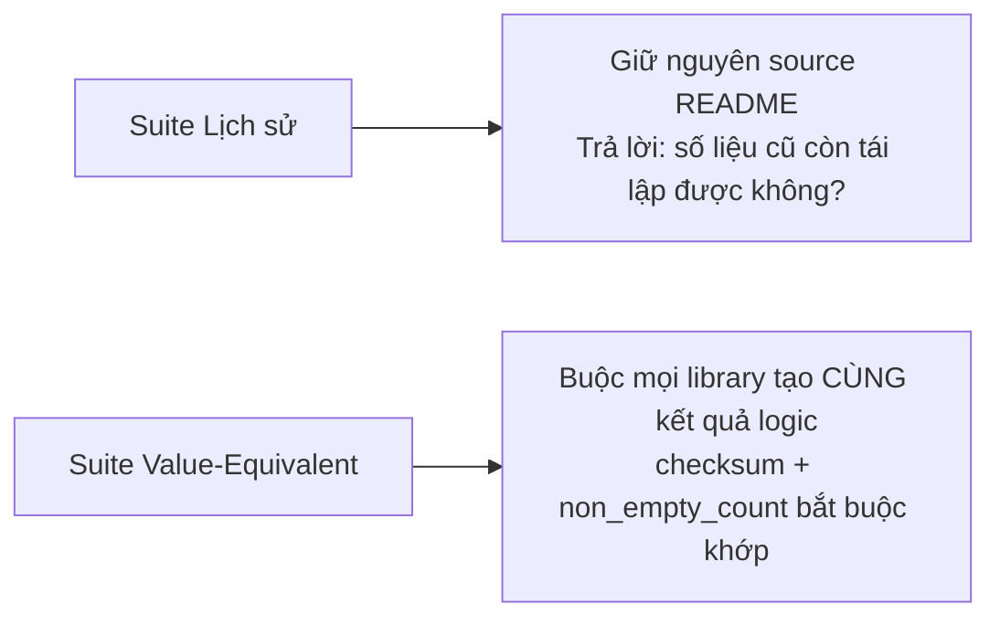

# 🦀 Calamine (Rust) vs Excelize / ClosedXML / openpyxl — Mổ xẻ Benchmark 1M×41 và Bài học Kiến trúc

> **Mục tiêu:** Hiểu **chính xác** benchmark 1.000.001×41 trong README của Calamine chứng minh gì, không chứng minh gì — và rút ra nguyên tắc kiến trúc áp dụng được cho [[file-etl]] (Rust decoder đang thay thế Java + Apache POI SAX của [[pdms]]).

---

## 🎯 TL;DR — Executive Summary

> [!question] Câu hỏi ban đầu
> "Calamine tối ưu nhất về hiệu năng so với các lib ngôn ngữ khác" — đúng hay không?

> [!success] Kết luận đúng (có bằng chứng)
> Calamine là **thư viện nhanh nhất trong benchmark lịch sử này** (README, version 0.22.1, một file cụ thể, một máy cụ thể).

> [!failure] Kết luận SAI (quá rộng, không có bằng chứng)
> Calamine là "**thư viện Excel tối ưu hiệu năng nhất nói chung**" — không có benchmark nào cô lập được yếu tố ngôn ngữ (Rust) khỏi yếu tố API/scope/implementation để chứng minh điều này.

Số liệu gốc trên file XLSX 186 MB, **1.000.001 hàng × 41 cột = 41.000.041 ô, 28.056.975 ô có giá trị**, đo bằng `hyperfine --warmup 3`, 10 lần chạy, trên AMD Ryzen 9 5900X @ 4.0GHz / Windows 11:

| Library | Mean wall-time | Chậm hơn Calamine |
|---|---:|---:|
| **Calamine 0.22.1** | 25.278 s | 1.00× |
| Excelize 2.8.0 (Go) | 44.254 s | **1.75×** |
| ClosedXML 0.102.1 (.NET) | 178.343 s | **7.05×** |
| openpyxl 3.0.10 (Python) | 238.554 s | **9.43×** |
| Apache POI (Java) | *không có trong benchmark* | *không xác định* |



**Điểm mấu chốt bị bỏ qua khi người ta trích dẫn benchmark này:** README **không** buộc 4 thư viện làm cùng một khối lượng công việc. Calamine đã materialize toàn bộ `Range<Data>`; Excelize trong benchmark **chỉ gọi `Next()`** (tìm ranh giới `<row>`) mà **không gọi `Columns()`** (bước thực sự parse giá trị ô). Nghĩa là 44.254s của Excelize là một phép đo "nhẹ hơn" về mặt công việc so với 25.278s của Calamine — vậy mà Excelize vẫn thua. Đây vừa là điểm yếu về fairness, vừa là bằng chứng gián tiếp **rất mạnh** cho core read-path của Calamine.

---

## 📊 Thiết lập benchmark gốc — Đọc kỹ trước khi trích dẫn

| Thuộc tính | Giá trị công bố |
|---|---|
| Dataset | `NYC_311_SR_2010-2020-sample-1M.xlsx` (chuyển từ CSV gốc) |
| Format benchmark | **XLSX only** — không có benchmark CSV tương ứng |
| Kích thước file | 186 MB |
| Range | 1.000.001 × 41 = 41.000.041 ô |
| Ô có giá trị | 28.056.975 |
| CPU / OS | AMD Ryzen 9 5900X @ 4.0GHz / Windows 11 |
| Runner | `hyperfine --warmup 3`, 10 runs |
| Build | Calamine & ClosedXML: **release build** |
| Số thread | ❌ không công bố |
| RAM hệ thống | ❌ không công bố |
| Peak RSS (số cụ thể) | ❌ không công bố |
| Python version | ❌ không công bố |


Tất cả 4 harness đều theo mô hình tuần tự này — **không có harness nào chủ động song song hóa** việc đọc worksheet. Nhưng điều đó *không* có nghĩa toàn bộ process chỉ chạy 1 OS thread: Go/.NET/JVM đều có GC/runtime threads chạy nền mà README không pin hay báo cáo. Mô tả chính xác nhất: **single-worker/sequential application benchmark, với runtime-internal threading không kiểm soát.**

### I/O — điểm bất ngờ nhất của benchmark

| Library | Disk read |
|---|---:|
| Calamine | ~186 MB (≈ đúng kích thước file nén) |
| ClosedXML | ~208 MB |
| openpyxl | ~192 MB |
| **Excelize** | **~1.5 GB** |

Excelize đọc gấp **8×** dung lượng file gốc! Nguyên nhân: `UnzipXMLSizeLimit` mặc định = 16 MB. Khi XML giải nén (worksheet/sharedStrings) vượt ngưỡng này, Excelize **chủ động ghi XML ra temporary file trên disk** để tránh RAM tăng cao — một trade-off có chủ đích: đổi RAM thấp lấy I/O cao hơn. Đây **không phải** "Go chậm hơn Rust" — đây là một cấu hình mặc định thận trọng về bộ nhớ mà chính benchmark vô tình phơi bày cái giá của nó.

---

## 🏗️ Kiến trúc xử lý XLSX — Đường đi chung, 5 cách triển khai khác nhau

XLSX về bản chất là **ZIP chứa nhiều XML part**. Hot path khi đọc bảng lớn luôn gồm:

```
mở ZIP → giải nén sharedStrings.xml + styles/workbook metadata + worksheet.xml
       → tokenize/parse XML
       → resolve shared strings / type / style
       → tạo representation trong ngôn ngữ đích
       → trả values cho application
```

5 thư viện triển khai đúng 5 triết lý khác nhau cho từng bước:



> [!tip] Vì sao đây là biểu đồ quan trọng nhất bài viết
> Mỗi nhánh trong sơ đồ trên là một **quyết định kiến trúc**, không phải một "đặc tính ngôn ngữ". Calamine chọn nhánh hẹp nhất (chỉ đọc giá trị); ClosedXML/openpyxl/POI-XSSFWorkbook chọn nhánh rộng nhất (full object model để đọc+sửa+ghi). Chênh lệch tốc độ phần lớn nằm ở **độ rộng của nhánh được chọn**, không chỉ ở ngôn ngữ implement nhánh đó.

---

## 🔬 5 nguyên nhân có bằng chứng tốt nhất cho lợi thế của Calamine

### 1. `quick-xml` — pull parser gần zero-copy, tái sử dụng buffer

```rust
// Calamine — pattern thực tế được benchmark dùng
use calamine::{open_workbook, Reader, Xlsx, Data};

let mut workbook: Xlsx<_> = open_workbook("NYC_311_SR_2010-2020-sample-1M.xlsx")?;
let range = workbook.worksheet_range("Sheet1")?;   // ⬅ materialize Range<Data> tại đây

for row in range.rows() {                           // ⬅ benchmark chỉ đo phần này
    for cell in row {
        match cell {
            Data::String(s) => { /* ... */ }
            Data::Float(f)  => { /* ... */ }
            _ => {}
        }
    }
}
```

`quick-xml` tự mô tả là **high-performance pull reader**, dùng `Cow` để "almost zero-copy" khi khả thi, và thiết kế API cho phép **reuse buffer** giữa các lần đọc token — giảm mạnh allocation churn trên workload hàng chục triệu XML element.

> [!warning] Cảnh báo chính xác hoá
> Calamine **không** zero-copy end-to-end. `worksheet_range()` trả về `Range<Data>` — nghĩa là parser **vẫn phải** tạo representation sở hữu (owned) cho toàn bộ worksheet. "Almost zero-copy" là thuộc tính của **lớp tokenization trong quick-xml**, không có nghĩa 28 triệu cell là borrowed slice trỏ thẳng vào ZIP buffer.

### 2. Lazy sheet loading (format-specific, không phải universal)

Mở workbook **không** mặc nhiên materialize mọi sheet — sheet chỉ được đọc khi `worksheet_range()` được gọi. Điều này tránh chi phí không cần thiết khi ứng dụng chỉ cần 1 trong N sheet.

> ⚠️ README ghi rõ: hành vi này là **của XLSX/XLSB**. Format XLS/ODS trong Calamine mặc định load sheet sớm hơn — đây là lợi thế **format-specific**, không phải thuộc tính chung của mọi format mà Calamine hỗ trợ.

### 3. Không có tracing GC (Rust ownership)

```
Rust:    ownership + borrow checker tại compile-time
         → không cần tracing GC walk graph runtime
         → nhưng VẪN có: allocation, deallocation, copy, UTF-8 construction, branch misprediction

Go:      native compiled, NHƯNG có GC
         → GC cost = fixed cost/cycle + cost tỷ lệ với live heap
         → allocation rate cao → cycle chạy thường xuyên hơn → throughput giảm

.NET:    managed heap + generational GC + tiered JIT
         → object construction cho XLWorkbook = nhiều managed allocation
         → GC có "live graph" lớn hơn khi giữ triệu cell/row/style dưới dạng object

Python:  refcount + cyclic GC + GIL
         → mọi ReadOnlyCell, tuple, list là Python object thực sự
         → C-code bên dưới ElementTree không cứu được toàn bộ chi phí object layer

Java:    JVM GC (nhiều loại: G1, ZGC, Parallel...) + JIT warm-up
         → XSSFWorkbook (XMLBeans-based) rất nặng object graph
         → XSSFReader (SAX) tránh được phần lớn chi phí này
```

> [!important] "Không GC" ≠ "không có chi phí memory-management"
> Đây là điểm dễ hiểu lầm nhất. Lợi thế thật của Calamine là tổ hợp **Rust + parser/data-layout tốt + phạm vi chức năng hẹp** — không thể quy toàn bộ 1.75×–9.43× cho một mình "ownership model".

### 4. Representation gọn: `Range<Data>` thay vì object graph giàu tính năng

Sau `worksheet_range()`, benchmark chỉ đi qua `sheet.rows()` — một cấu trúc dữ liệu phẳng, cache-friendly hơn nhiều so với object model nơi mỗi workbook/worksheet/row/cell/style là managed object riêng với con trỏ indirection riêng. (README xác nhận dùng `Vec` tăng capacity theo bậc thang — nhưng **không có** con số "cache-miss thấp hơn X%" nào được đo bằng hardware counter.)

### 5. Scope hẹp: reader thuần túy, không hỗ trợ ghi

Calamine 0.22.1 tập trung vào **đọc cell values + VBA**, không có writing, không có nhiều loại formatting/extra content. Một reader nhiệm vụ hẹp có thể **bỏ qua hẳn** nhiều layer mà một thư viện round-trip (đọc+sửa+ghi) như ClosedXML/openpyxl/POI-XSSFWorkbook buộc phải có.

> [!note] Đây là lựa chọn product scope, không phải "compiler magic"
> Một phần đáng kể tốc độ của Calamine đến từ việc **nó làm ít việc hơn** theo thiết kế — không chỉ từ việc Rust compile nhanh hơn.

---

## ⚖️ Điểm mù quan trọng nhất: benchmark không cân bằng công việc

### Trường hợp Excelize — API khác nhau cho kết quả khác nhau tới 4.5×

```mermaid
sequenceDiagram
    participant App as Go application
    participant Dec as XML Decoder
    participant Row as "&lt;row&gt; boundary"
    participant Cell as "&lt;c&gt; cell elements"

    App->>Dec: rows.Next()
    Dec->>Row: Di chuyển decoder đến &lt;row&gt; tiếp theo
    Row-->>App: true
    Note over App,Row: 🔴 README benchmark DỪNG Ở ĐÂY — 44.254s<br/>Giá trị ô CHƯA được đọc!

    opt Chỉ khi gọi thêm
        App->>Dec: rows.Columns()
        Dec->>Cell: Parse &lt;c&gt;, resolve shared string
        Cell-->>App: []string — giá trị thật
        Note over App,Cell: ✅ Đây mới là "đọc toàn bộ 28M giá trị"
    end
```

```go
// README benchmark — CHỈ đo phần này
for rows.Next() {
    // không gọi rows.Columns() → không lấy giá trị ô!
}

// Phiên bản "đọc thật" — cần cho benchmark công bằng với Calamine
for rows.Next() {
    cols, _ := rows.Columns()   // ⬅ bước resolve shared string thực sự nằm ở đây
    _ = cols
}
```

Bằng chứng cho thấy lựa chọn API quan trọng hơn cả ngôn ngữ: cùng Excelize, cùng máy, `GetRows()` (materialize `[][]string`) cho **199.709 giây** — chậm hơn Calamine **7.9×**. Đổi sang iterator `Rows()` (không gọi `Columns()`), thời gian giảm còn 44.254 giây — chậm hơn Calamine chỉ **1.75×**. Chênh lệch API **trong cùng một thư viện** đã lớn hơn 4.5×.

> [!danger] Bài học phương pháp luận
> "Go chậm hơn Rust 7.9×" (rút ra từ `GetRows()`) và "Go chậm hơn Rust 1.75×" (rút ra từ `Rows()` không gọi `Columns()`) đều là kết luận **sai về nguyên nhân** — cả hai đang đo chi phí *data-structure/API choice*, không phải chi phí *language runtime*.

### Bảng "ai làm bao nhiêu việc" trong benchmark gốc

| Library | Công việc thực tế đã hoàn thành khi tính giờ dừng |
|---|---|
| **Calamine** | Đã materialize toàn bộ `Range<Data>` — **nặng nhất** |
| ClosedXML | Đã dựng `XLWorkbook` đầy đủ |
| openpyxl | Parse cell **trong lúc** duyệt (`read_only=True`, streaming thật) |
| **Excelize** | Chỉ tìm ranh giới `<row>` — **KHÔNG** resolve giá trị ô |

→ Calamine thắng dù đang làm khối lượng công việc **nhiều nhất** trong 4 thư viện. Đây là **tín hiệu kiến trúc rất mạnh**, dù benchmark tổng thể vẫn thiếu fairness.

---

## 🌐 Ảnh hưởng ngôn ngữ & runtime — chi tiết từng thư viện

### 🐹 Excelize (Go) — native compile nhưng GC vẫn tính phí

Go tạo native executable nên Excelize không có interpreter overhead kiểu Python. Nhưng Go GC có chi phí CPU tỷ lệ với allocation rate và live heap. Excelize chủ động giảm áp lực này bằng cách **spill XML lớn ra temp disk** (ngưỡng `UnzipXMLSizeLimit` 16 MB) — đổi RAM/GC lấy I/O. Đây chính là nguồn gốc con số 1.5 GB disk read đã nói ở trên.

Goroutine cũng **không phải "tăng tốc miễn phí"**: API được ghi "concurrency-safe" chỉ nghĩa là *có thể* dùng an toàn trong pattern concurrency — vòng `for rows.Next()` đơn lẻ trong benchmark không tự động song song hoá gì cả.

### 🔷 ClosedXML (.NET) — abstraction cao, object graph phong phú

`new XLWorkbook(...)` phục vụ đọc **+ chỉnh sửa + ghi** — nhiều khả năng hơn hẳn một value-only reader. Benchmark riêng của ClosedXML (BenchmarkDotNet, Ryzen 5 5500U, .NET 7.0.11 RyuJIT/AVX2): workload 1.000.000×10 text-only load trong **49.046 giây, dùng 801 MiB**. (⚠️ Không thể đặt cạnh 25.278s của Calamine để suy tỷ lệ — khác cột, khác file, khác phần cứng, khác version.)

Chênh 7.05× với Calamine **không nên** hiểu đơn giản là "C# JIT chậm hơn Rust 7 lần" — phần lớn nhiều khả năng đến từ khối lượng object construction + validation/metadata + managed allocation mà `XLWorkbook` phải làm.

### 🐍 openpyxl (Python) — streaming thật nhưng vẫn trả giá ở lớp Python

`read_only=True` là streaming/lazy thiết kế **thật sự**, được chính dự án khuyến nghị cho file lớn. Nhưng streaming không đồng nghĩa nhanh: mỗi row/cell vẫn đi qua logic package Python, type conversion, Python object.

```python
# Pattern README dùng — tạo row tuples / ReadOnlyCell representation
wb = openpyxl.load_workbook("NYC_311...", read_only=True)
ws = wb["Sheet1"]
for row in ws.rows:          # ⬅ vẫn tạo ReadOnlyCell object mỗi cell
    for cell in row:
        _ = cell.value

# Path "trần" hơn — nên đo song song để tách chi phí object layer
for row in ws.iter_rows(values_only=True):   # ⬅ bỏ qua ReadOnlyCell wrapper
    _ = row
```

**Điểm bị bỏ sót nghiêm trọng nhất trong benchmark:** README **không ghi Python version**. Benchmark riêng của chính openpyxl cho thấy chỉ đổi Python 3.6.9 → 3.8.0 đã giảm read-only workload từ **~65.6s xuống ~54.9s** — runtime version một mình đã tạo chênh lệch ~17%.

CPython còn có GIL — tài liệu chính thức của openpyxl vì thế khuyến nghị dùng **nhiều process/workbook instance** để khai thác nhiều CPU, thay vì kỳ vọng một stream tự scale bằng thread.

### ☕ Apache POI (Java) — vắng mặt trong benchmark, nhưng chính là baseline quan trọng nhất với [[file-etl]]

> [!important] Trả lời trực tiếp câu hỏi ban đầu
> **Không có Apache POI trong benchmark README.** Không tìm thấy benchmark chính thức nào của POI trên đúng file NYC 1M×41, và FAQ của POI cũng không công bố wall-time cho case này. **Mọi con số "POI = X giây" trong các bài so sánh trên mạng đều là số bịa hoặc extrapolation cross-hardware không đáng tin.**

POI có **hai mô hình rất khác nhau** — và khoảng cách giữa 2 mô hình này của *cùng một thư viện* có thể còn lớn hơn khoảng cách "Java vs Rust":

| API | Đặc điểm | Dùng khi nào |
|---|---|---|
| `XSSFWorkbook` | High-level, xây trên OOXML/XMLBeans | Cần đọc + sửa + ghi, tiện lợi |
| `XSSFReader` + `XSSFSheetXMLHandler` (SAX/EventUserModel) | Low-memory streaming, lấy sheet dưới dạng `InputStream` | **Benchmark công bằng với Calamine phải dùng API này** |

```java
// ❌ Baseline SAI cho benchmark hiệu năng — nặng, full object model
XSSFWorkbook workbook = new XSSFWorkbook(new File("NYC_311...xlsx"));
Sheet sheet = workbook.getSheetAt(0);
for (Row row : sheet) { for (Cell cell : row) { /* ... */ } }

// ✅ Baseline ĐÚNG — SAX streaming, tương đương triết lý với Calamine
OPCPackage pkg = OPCPackage.open("NYC_311...xlsx");
XSSFReader reader = new XSSFReader(pkg);
SharedStringsTable sst = reader.getSharedStringsTable();
XMLReader parser = XMLReaderFactory.createXMLReader();
parser.setContentHandler(new XSSFSheetXMLHandler(reader.getStylesTable(), sst, mySheetContentsHandler, false));
parser.parse(new InputSource(reader.getSheetsData().next()));
```

> [!danger] Bẫy phương pháp luận giống hệt Excelize `GetRows()`
> Chỉ benchmark `XSSFWorkbook` rồi tuyên bố "Java/POI chậm" sẽ lặp lại đúng sai lầm mà Excelize `GetRows()` (199.7s) đã mắc phải so với `Rows()` (44.254s). POI FAQ chính thức cũng chỉ dẫn dùng `XLSX2CSV` (dùng SAX) khi điều tra read performance — **không phải** `XSSFWorkbook`.

---

## 📐 Bảng tổng hợp yếu tố triển khai (5 thư viện)

| Yếu tố | Calamine | Excelize | ClosedXML | openpyxl | Apache POI |
|---|---|---|---|---|---|
| XML model | `quick-xml` pull parser | `encoding/xml` streaming | OpenXML-backed + object model | `ElementTree.iterparse` | SAX EventUserModel hoặc XSSF high-level |
| Sheet lazy/stream | Lazy-load, sau đó `Range` materialized | `Rows()` streaming | Workbook model materialized | `read_only=True` streaming | `XSSFReader` SAX streaming |
| Parser-level zero-copy | **Có** (quick-xml, "almost") | Không có claim tương đương | Không có claim | Không có claim | Không có claim |
| End-to-end zero-copy | ❌ Không | ❌ Không | ❌ Không | ❌ Không | ❌ Không |
| GC | **Không tracing GC** | Go GC | .NET GC | Python refcount + cyclic GC | JVM GC |
| Temp disk mặc định cho XML lớn | Không thấy trong benchmark | **Có** (theo threshold) | Không thấy | Không thấy | Tùy API |
| SIMD chứng minh trong benchmark lịch sử | Không đủ bằng chứng | Không đủ bằng chứng | Không đủ bằng chứng | Không | Không đủ bằng chứng |
| Scope | Reader thiên về values | Read/write, nhiều tính năng | Full read/edit/write | Full Python read/write | Full stack + event API |

---

## 🧭 Bảng độ tin cậy — mức độ có thể tin từng khẳng định

| Khẳng định | Số liệu | Độ tin cậy cho **benchmark lịch sử** | Độ tin cậy cho **khẳng định tổng quát** |
|---|---|---|---|
| Calamine nhanh nhất trong README | 25.278s | 🟢 Cao | 🟡 Trung bình |
| Excelize chậm hơn 1.75× | 44.254s | 🟢 Cao (wall-time) | 🟠 Trung bình-thấp (semantic fairness — thiếu `Columns()`) |
| Excelize `GetRows()` chậm hơn 7.9× | 199.709s | 🟢 Cao (reproduction) | 🔴 Không nên dùng làm đại diện |
| ClosedXML chậm hơn 7.05× | 178.343s | 🟢 Cao | 🟡 Trung bình (attribution) |
| openpyxl chậm hơn 9.43× | 238.554s | 🟢 Cao | 🟡 Trung bình |
| **"Rust là nguyên nhân duy nhất Calamine nhanh"** | — | — | 🔴 **Thấp — không có dữ liệu hỗ trợ** |
| **"SIMD/parallel decompression giải thích 25s"** | — | — | 🔴 **Thấp — không được benchmark công bố** |
| **Xếp hạng Apache POI so với Calamine** | — | — | ⚪ **Không xác định — không có phép đo cùng file** |

> [!quote] Kết luận cân bằng nhất có thể rút ra
> Khoảng cách với Excelize chỉ 1.75×, trong khi với ClosedXML/openpyxl là 7–9×. Mẫu này khớp với giả thuyết **"Calamine và Excelize đều có data path tương đối low-level; ClosedXML/openpyxl trả nhiều chi phí abstraction/object-runtime hơn"** — chứ *không* khớp với lý thuyết đơn giản "Rust nhanh, mọi ngôn ngữ khác chậm".

---

## 🧪 Thiết kế một benchmark công bằng hơn (nếu bạn muốn tự tái lập)

Cần tách **2 mục tiêu riêng biệt** — trộn chung sẽ mất khả năng so sánh với README gốc:



### Cấu hình path nên đo cho suite value-equivalent

| Library | Path bắt buộc |
|---|---|
| Calamine | `worksheet_range()` → iterate mọi `Data` → checksum |
| Excelize | `Rows()` → **`Columns()` mỗi row** → checksum (thêm `RawCellValue` nếu muốn tránh formatting) |
| ClosedXML | `XLWorkbook` → iterate cell/value thực → checksum |
| openpyxl | `read_only=True` → `iter_rows(values_only=True)` → checksum (+ 1 run `ReadOnlyCell` riêng) |
| POI | `XSSFReader` + SAX handler → checksum (+ `XSSFWorkbook` baseline riêng) |

### Metrics bắt buộc thu thập mỗi lần chạy

```
wall-clock: mean / median / p95
CPU: user time, system time, process CPU%
Memory: peak RSS / private working set, page faults
I/O: bytes read/write, bytes ghi/đọc temp directory, file-cache state
GC runtimes: total allocated bytes, GC cycle count, total GC CPU, max/total pause, heap high-water mark
Hardware counters: cycles, instructions, IPC, branch misses, cache misses
```

### Kiểm soát fairness

- Cùng máy / SSD / OS build / power profile, pin CPU affinity
- Không chạy cloud sync/antivirus trong lúc benchmark
- Khóa version compiler/runtime/library, ghi rõ `rustc`/Go/.NET SDK/Python/JVM version + build flags
- Thống nhất semantics: có resolve shared strings? apply number format? date → native datetime? formula: expression hay cached value? empty cell có tạo object không?
- Chạy **single-worker trước**, suite parallel riêng sau (XML event stream vốn tuần tự — song song hợp lý hơn ở cấp nhiều sheet/nhiều file)
- Tách riêng **cold-cache** và **warm-cache** thay vì gộp chung

---

## 🚧 5 giới hạn của benchmark gốc — phải biết trước khi trích dẫn số liệu

1. **Version drift** — Calamine 0.22.1 (hiện đã 0.36.1+ với nhiều cải tiến buffer reuse), Excelize 2.8.0, ClosedXML 0.102.1, openpyxl 3.0.10. Số liệu 1.75×/7.05×/9.43× là **ảnh chụp lịch sử**, không phải "latest vs latest".
2. **Work equivalence** — như đã phân tích ở trên, mỗi thư viện làm một lượng công việc semantic khác nhau dù cùng pattern code "iterate rows".
3. **Thông số không công bố đầy đủ** — RAM vật lý máy, peak RSS bằng số, Python version, .NET GC mode, thread count, CPU affinity, compression level khi CSV→XLSX, trạng thái OS file cache đều thiếu.
4. **Một loại file duy nhất** — 1M×41, một phân bố dữ liệu, một tỷ lệ string/number/date. XLSX thực tế biến thiên rất nhiều (inline vs shared strings, formula density, styles, sparse cells, merged cells...). Vì Calamine tập trung vào cell-value reading, benchmark này thiên về đúng use-case mạnh nhất của nó.
5. **Apache POI hoàn toàn vắng mặt** — không có cơ sở để xếp hạng POI so với Calamine.

---

## 🔗 Kết nối với `file-etl` / PDMS — vì sao bài này quan trọng với công việc thực tế

> [!info] Bối cảnh
> [[file-etl]] đang được thiết kế như Rust-native Data Migration & Validation Runtime để **thay thế/shadow-cutover pipeline Java + Apache POI SAX validator hiện có của [[pdms]]**, target 10M+ record files (XLSX/CSV).

### 🎯 Bài học 1 — Đừng benchmark POI bằng `XSSFWorkbook` để biện minh cho việc chuyển sang Rust

Pipeline hiện tại của PDMS **đã dùng POI SAX validator** — tức đã ở đúng nhánh "low-memory streaming" trong sơ đồ kiến trúc phía trên, không phải nhánh `XSSFWorkbook` nặng nề. Nghĩa là:

- Bất kỳ benchmark nào so sánh **calamine crate** với **POI hiện tại của PDMS** phải đối chiếu với `XSSFReader`/SAX, **không phải** `XSSFWorkbook` — nếu không sẽ mắc đúng lỗi phương pháp luận mà Excelize `GetRows()` đã mắc.
- README của Calamine hoàn toàn không cho biết Calamine sẽ nhanh hơn POI-SAX bao nhiêu — con số đó **phải tự đo trên file đại diện cho PDMS**, không được suy ra từ benchmark NYC 311.

### 🎯 Bài học 2 — `SemanticStreamDigest` của file-etl chính là "value-equivalent suite" mà báo cáo đề xuất

Report khuyến nghị: mỗi library phải đọc mọi row, chuyển mỗi non-empty cell thành representation quy định, feed vào **checksum/count accumulator**, rồi so khớp `non_empty_count` + checksum giữa các library để đảm bảo benchmark không "ăn gian" bằng cách bỏ sót công việc.

Đây **chính xác** là nguyên lý đằng sau `SemanticStreamDigest` + per-chunk checkpoint đã có trong thiết kế `file-etl` (điều được ghi nhận là gap G07 — thiếu durable per-chunk checkpoint). Khi benchmark decoder XLSX mới (dựa trên calamine hoặc quick-xml trực tiếp) so với POI SAX hiện tại, nên tái sử dụng chính cơ chế digest này làm **fairness checksum** — vừa validate tính đúng đắn của decoder mới, vừa đo hiệu năng công bằng trong cùng một lần chạy.

### 🎯 Bài học 3 — "Lazy per-sheet loading" khớp tự nhiên với nguyên tắc "bounded memory qua chunked pipeline"

`file-etl` đã đặt nguyên tắc **bounded memory via chunked pipeline** làm core design principle. Lợi thế lazy-sheet-loading của Calamine (chỉ đọc sheet khi `worksheet_range()` được gọi) và "reader hẹp, value-oriented `Range`" là mô hình rất tương thích với một pipeline chunk-hoá — miễn là tầng đọc file của `file-etl` **tự quản lý windowing/chunking phía trên** thay vì phụ thuộc Calamine tự động lazy-load ở granularity sheet (Calamine lazy theo *sheet*, không lazy theo *row-range* — nếu cần bounded memory trong một sheet 10M dòng, `file-etl` vẫn cần tự thiết kế streaming ở tầng ứng dụng, không thể "mượn" lazy-loading của Calamine cho việc đó).

### 🎯 Bài học 4 — Câu hỏi cần trả lời trước khi đưa số liệu vào design review

| Câu hỏi | Vì sao quan trọng cho file-etl |
|---|---|
| Đã benchmark calamine crate với **chính API tương đương SAX** của POI chưa, hay đang so với `XSSFWorkbook`? | Tránh lặp lại lỗi Excelize `GetRows()` |
| Fixture benchmark có đại diện shape dữ liệu PDMS thật (số cột, tỷ lệ string/number/date, sparse cells) hay chỉ NYC 311? | Report giới hạn #4 — 1M×41 NYC không đại diện mọi workload |
| Có đo GC/allocation của JVM (G1/ZGC, heap size) khi benchmark baseline Java hiện tại không? | Nếu không, không thể tách "JVM chậm" khỏi "code Java chậm" |
| Checksum/`non_empty_count` giữa decoder cũ và mới có khớp không? | Đảm bảo decoder mới **đúng**, không chỉ **nhanh** |

---

## 💡 Tips & Tricks

> **Tip 1 — Muốn benchmark Excelize đúng cách, luôn gọi `Columns()`**
> ```go
> for rows.Next() {
>     cols, err := rows.Columns()   // bắt buộc, nếu không chỉ đo row-boundary scan
>     if err != nil { break }
>     _ = cols
> }
> ```

> **Tip 2 — openpyxl: dùng `values_only=True` để loại bỏ chi phí object wrapper**
> ```python
> for row in ws.iter_rows(values_only=True):
>     _ = row   # tuple giá trị thô, không tạo ReadOnlyCell
> ```

> **Tip 3 — POI: chọn đúng API theo nhu cầu, đừng mặc định `XSSFWorkbook`**
> ```
> Cần đọc + sửa + ghi, file nhỏ/vừa   → XSSFWorkbook (tiện, chậm hơn, tốn RAM hơn)
> Cần đọc file lớn, chỉ lấy giá trị    → XSSFReader + SAX (nhanh, low-memory, code phức tạp hơn)
> ```

> **Tip 4 — Khi so sánh cross-language, luôn hỏi 3 câu trước khi tin số liệu**
> ```
> 1. Hai bên có làm CÙNG một lượng công việc semantic không? (materialize vs scan-only)
> 2. Version của mỗi library/runtime là bao nhiêu — có phải bản mới nhất?
> 3. Cấu hình GC/heap/thread có được công bố và kiểm soát không?
> ```

---

## 📝 Key Takeaways

1. Calamine là thư viện **nhanh nhất trong benchmark README 1M×41** — kết luận này có bằng chứng mạnh (🟢 Cao).
2. Calamine là thư viện **Excel tối ưu hiệu năng nhất nói chung** — kết luận này **quá rộng**, không có bằng chứng cô lập yếu tố ngôn ngữ.
3. Benchmark **không cân bằng công việc**: Excelize trong README chỉ `Next()`, không `Columns()` — vẫn thua Calamine dù đang làm ít việc hơn.
4. **Lựa chọn API trong cùng một thư viện** có thể thay đổi kết quả hơn 4× (Excelize `GetRows()` 199.7s vs `Rows()` 44.25s).
5. "Không tracing GC" là lợi thế thật của Rust, nhưng **không đồng nghĩa "không có chi phí memory-management"**.
6. Excelize đánh đổi RAM thấp lấy I/O cao (1.5GB disk read do `UnzipXMLSizeLimit` 16MB) — một quyết định thiết kế, không phải "Go chậm".
7. openpyxl version ảnh hưởng đáng kể (Python 3.6.9→3.8.0 giảm ~17% thời gian) — README không ghi version dùng, là một thiếu sót.
8. **Apache POI hoàn toàn vắng mặt** trong benchmark — mọi con số "POI = X giây" trôi nổi trên mạng đều không đáng tin.
9. POI có 2 API rất khác nhau (`XSSFWorkbook` vs `XSSFReader` SAX) — benchmark công bằng với Calamine bắt buộc dùng SAX.
10. Với `file-etl`: benchmark quyết định chuyển từ POI SAX sang Rust decoder phải tự đo trên fixture đại diện PDMS, dùng đúng API SAX của POI làm baseline, và tận dụng cơ chế `SemanticStreamDigest` sẵn có làm checksum fairness.

---

## 🔗 Liên kết

- [[file-etl]] — Rust-native Data Migration & Validation Runtime, mục tiêu thay thế decoder Java/POI SAX này
- [[pdms]] — Hệ thống PDMS hiện đang chạy Java + Apache POI SAX validator
- [[Rust-Zero-To-Hero/Bai-17-Zero-Cost-Performance]] — nền tảng zero-cost abstraction/ownership liên quan đến lý do Calamine không cần tracing GC
- [[Performance-Pitfalls-Rust]] — các bẫy hiệu năng Rust cần tránh khi tự viết decoder
- [[Performance-System-Programming/01-Database-Internals/03-BTree-vs-LSM]] — một case study khác về trade-off kiến trúc quyết định hiệu năng nhiều hơn "ngôn ngữ nhanh hơn"

> **Nguồn gốc bài viết:** Tổng hợp và tái cấu trúc từ deep research report cá nhân (2026-08), đối chiếu README chính thức của [tafia/calamine](https://github.com/tafia/calamine), issue #1695 của qax-os/excelize, README performance của ClosedXML, tài liệu performance chính thức của openpyxl, và FAQ Apache POI.
