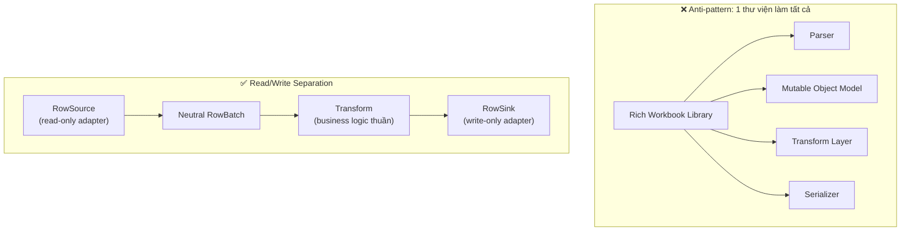
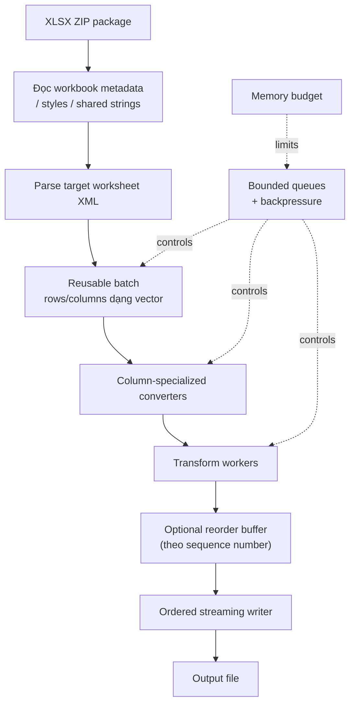
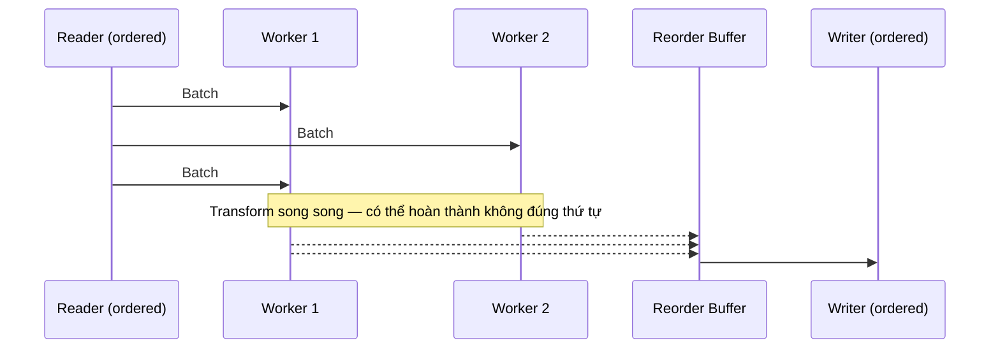
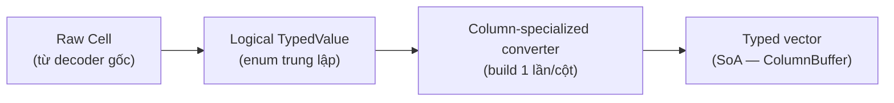

# 🔀 Tách Read/Write Engine — Kiến trúc Type Conversion Tổng quát cho Spreadsheet/CSV ETL

> **Tiếp nối:** [[Performance-System-Programming/03-Data-Format-Parsing/01-Calamine-Cross-Language-Benchmark]]. Bài trước trả lời "vì sao Calamine nhanh"; bài này trả lời câu hỏi thực dụng hơn cho [[file-etl]]: **khi phải tách Read và Write, kiến trúc nào tối ưu nhất — đặc biệt khi type conversion phải tổng quát cho mọi kiểu dữ liệu?**

---

## 🎯 TL;DR

> [!success] Nguyên tắc cốt lõi
> **Thư viện đọc/ghi spreadsheet là một adapter, không phải data model của ứng dụng.** Kiến trúc mạnh nhất không phải "1 thư viện làm tất cả" (parse + object model + transform + serialize), mà là:
>
> **Read Engine hẹp/streaming → Neutral Typed Batch (columnar) → Bounded Pipeline có reorder → Write Engine hẹp/streaming**
>
> Type conversion "tổng quát cho mọi type" đúng nghĩa **không phải** generic `<T>` hay `dyn Trait` per-cell — mà là một **closed tagged-union enum** cho tập kiểu logic hữu hạn, với converter build **1 lần/cột** thay vì switch **N lần/cell**.

---

## 🧩 Vì sao phải tách Read khỏi Write



Buộc 1 thư viện (ClosedXML, openpyxl full-model, POI XSSFWorkbook) đóng vai trò vừa parser, vừa object model có thể sửa, vừa transformation layer, vừa serializer — đó **chính là lý do các thư viện "tiện lợi" chậm hơn reader hẹp**: chúng phải duy trì trạng thái đủ giàu để phục vụ *mọi* vai trò cùng lúc, kể cả khi job hiện tại chỉ cần một vai trò.

### `RowSource` / `RowSink` — interface trung lập

```rust
trait RowSource {
    fn metadata(&self) -> &WorkbookMeta;
    // Điền vào batch tái sử dụng. Trả về false khi hết dữ liệu (EOF).
    fn next_batch(&mut self, dst: &mut RowBatch) -> Result<bool, ReadError>;
}

trait RowSink {
    fn begin_sheet(&mut self, spec: &SheetSpec) -> Result<(), WriteError>;
    fn write_batch(&mut self, batch: &RowBatch) -> Result<(), WriteError>;
    fn finish_sheet(&mut self) -> Result<(), WriteError>;
}
```

```java
// Java tương đương gần như 1-1
interface RowSource extends AutoCloseable {
    WorkbookMeta metadata();
    boolean readBatch(RowBatch dst) throws IOException;  // true = có batch
}

interface RowSink extends AutoCloseable {
    void beginSheet(SheetSpec spec) throws IOException;
    void writeBatch(RowBatch batch) throws IOException;
    void finishSheet() throws IOException;
}
```

**4 lợi ích cùng lúc:**

1. Job chỉ đọc → không bao giờ khởi tạo cấu trúc writer.
2. Job chỉ ghi → không bao giờ dựng cấu trúc đọc workbook.
3. Read-then-write → chạy như **bounded pipeline**, không materialize 2 workbook model đầy đủ cùng lúc.
4. Đổi adapter (Calamine → POI SAX, hoặc `rust_xlsxwriter` → SXSSF) **không đụng vào business transformation**.

---

## 🏗️ Data path tổng thể



---

## 📦 Chunking & kiểm soát bộ nhớ

> [!warning] Đừng định nghĩa chunk chỉ bằng "N rows"
> Độ rộng row và độ dài string biến thiên rất lớn. Một batch production nên bị chặn bởi **cả row count lẫn số byte đã decode ước lượng**.

Khoảng khởi điểm hợp lý (không phải hằng số phổ quát — phải benchmark trên workload thật): **4K–32K rows hoặc ~8–64 MiB dữ liệu đã decode**, tùy cái nào đến trước.

```
M_working ≈ M_reader-state + M_shared-strings/styles
          + D_queue × M_batch
          + M_writer-state + M_transform
```

`D_queue` (độ sâu queue) phải **nhỏ và có chặn**. Ví dụ 4 batch × 32 MiB chỉ tạo ~128 MiB dữ liệu đang chờ trong queue — thay vì để producer chạy trước writer hàng triệu dòng.

> [!danger] Backpressure là bắt buộc, không phải tùy chọn
> Một queue không chặn (unbounded) sẽ âm thầm biến kiến trúc streaming trở lại thành kiến trúc in-memory toàn bộ. Dùng blocking bounded channel, buffer pool có semaphore, hoặc ring buffer theo byte-budget.

---

## ⚙️ Concurrency: reader tuần tự, transform song song có kiểm soát, writer tuần tự

XLSX parsing **không tự động scale tuyến tính** theo số core — ZIP decompression, XML parsing, shared-string lookup và output compression đều cạnh tranh core/băng thông bộ nhớ.

Baseline vững chắc cho 1 worksheet:

```
1 ordered reader → N transform workers (nhỏ) → 1 ordered writer
```

- Nếu transform đơn giản → thêm worker có thể làm **chậm hơn** (bottleneck là XML parse/compression, không phải transform).
- Nếu transform tốn kém (validation, hashing, lookup DB) → worker parallelism giúp ích thật sự.



> [!important] Writer phải luôn tuần tự có thứ tự trên 1 worksheet
> Excelize `StreamWriter` yêu cầu ghi hàng theo thứ tự tăng dần. POI SXSSF vốn là sliding-window writer có thứ tự. `rust_xlsxwriter` chế độ constant-memory flush hàng khi tiến tới hàng kế tiếp và **không thể sửa hàng trước đó nữa**. Cả 3 writer mạnh nhất đều đồng thuận: **row-ordered write là ràng buộc kiến trúc, không phải giới hạn của riêng 1 thư viện.**

Song song hoá **giữa nhiều worksheet/nhiều file độc lập** an toàn hơn nhiều so với chia nhỏ 1 sheet thành các vùng XML song song tùy ý (phải xử lý ranh giới XML, shared strings, styles, ZIP-entry access rất cẩn thận — Calamine vẫn còn issue mở yêu cầu multithreaded row loading, cho thấy đây không phải optimization "cắm vào là chạy").

---

## 🦀 Cấu hình Rust mạnh: Calamine (read) + rust_xlsxwriter (write)

```rust
let mut reader = CalamineSource::open("input.xlsx")?;
let mut writer = RustXlsxWriterSink::create("output.xlsx")?
    .constant_memory(true);

let mut batch = RowBatch::with_capacity(8192);
writer.begin_sheet(&SheetSpec::new("Data"))?;

while reader.next_batch(&mut batch)? {
    convert_batch(&mut batch, &schema)?;
    transform_batch(&mut batch)?;
    writer.write_batch(&batch)?;
    batch.clear_reuse();
}
writer.finish_sheet()?;
```

Điểm mấu chốt **không phải** API wrapper cụ thể — mà là: **không kiểu `calamine::Data` nào, không kiểu cell riêng của writer nào được rò rỉ vào business layer.** Cả hai chỉ giao tiếp qua `RowBatch` trung lập.

## ☕ Cấu hình Java tương đương: POI XSSF SAX (read) + SXSSF (write)

```
OPCPackage / XSSFReader
   ↓
XSSF SAX/Event handler
   ↓
neutral RowBatch
   ↓
typed conversion
   ↓
bounded queue
   ↓
SXSSFWorkbook
```

POI tài liệu hoá chính thức: XSSF/SAX là lựa chọn low-memory cho **đọc**, SXSSF là lựa chọn low-memory cho **ghi** (sliding window mặc định 100 hàng, flush hàng cũ ra temp storage). Tránh dùng full `XSSFWorkbook` object model làm intermediate representation cho job ETL giá trị-lớn.

---

## 🧬 Type Conversion "Tổng quát cho mọi type" — bài toán trung tâm

### 3 cách tiếp cận, đánh đổi khác nhau

```
1. Generic<T> (monomorphization compile-time)
   → CỰC NHANH, nhưng bắt buộc biết T lúc compile
   → ❌ Không dùng được: schema file-etl load RUNTIME từ Schema Registry

2. dyn Trait (dynamic dispatch, vtable, thường kèm Box<dyn ..>)
   → Tổng quát thật sự — mọi type tuân theo interface đều chạy được
   → ❌ vtable indirection + thường allocation → chậm khi gọi
      hàng chục triệu lần/cell

3. Closed tagged-union (enum LogicalType + match)
   → "Tổng quát" theo nghĩa thực dụng: chấp nhận MỌI giá trị thuộc
     một tập hữu hạn kiểu logic (Bool/I64/F64/Decimal/Utf8/Date/...)
   → match biên dịch thành jump table — KHÔNG vtable, KHÔNG allocation,
     inline được
   → Schema runtime chỉ quyết định CỘT NÀO map vào VARIANT NÀO —
     không cần biết type cụ thể lúc compile
   → ✅ Đáp ứng đúng "domain-agnostic, schema runtime-configured"
      mà KHÔNG hy sinh hiệu năng hot path
```

> [!quote] Insight quan trọng nhất của kiến trúc này
> Câu hỏi đúng không phải "làm sao generic hoá cho **mọi type Rust có thể có**", mà là **"đóng gói vũ trụ giá trị mà một spreadsheet/CSV cell có thể mang thành 1 enum hữu hạn, rồi để runtime chỉ chọn variant"**. Domain-agnostic ≠ type-unbounded. *Schema* runtime-configured, nhưng *tập kiểu logic* vẫn đóng và biết trước tại compile-time.

```rust
enum LogicalType { Bool, I64, F64, Decimal128, Utf8, Date, DateTime, Duration }

enum TypedValue<'a> {
    Missing,
    Blank,
    Bool(bool),
    I64(i64),
    F64(f64),
    Decimal(Decimal128),
    Text(&'a str),          // borrowed — chỉ sống trong lifetime của batch/arena
    Date(Date),
    DateTime(DateTime),
    Duration(Duration),
    Error(CellError),
    Formula {
        expression: Option<&'a str>,
        cached: Option<Box<TypedValue<'a>>>,
    },
}
```

### Kiến trúc 2 tầng: Raw → Logical → Column-converter → Typed vector



---

## 📈 Schema inference — widening lattice

```
Null/Blank
   ↓
Boolean
   ↓
Int64
   ↓
Decimal hoặc Float64
   ↓
Date / DateTime / Duration
   ↓
Text
```

> Đây **không** phải nói "boolean nhỏ hơn integer về mặt số học" — đây là chiến lược xác định representation nào an toàn chứa được các giá trị đã quan sát.

Thuật toán inference hiệu năng cao:

1. Quan sát 1 sample ban đầu có thể cấu hình (1.000–10.000 giá trị non-empty/cột).
2. Giữ candidate type flags cho mỗi cột.
3. Dùng physical cell type + style info **trước khi** thử parse text.
4. Commit converter khi đủ tin cậy.
5. **Widen — không bao giờ silent-narrow** — khi dữ liệu sau xung đột với giả định trước.
6. Ghi giá trị ngoại lệ vào error/null side-channel, **không** throw exception per bad cell.

---

## 🛡️ Safe coercion rules — default policy phải conservative

| Input | Target | Default policy |
|---|---|---|
| Missing/blank | nullable target | null |
| Missing/blank | non-nullable target | error hoặc default đã cấu hình |
| Số nguyên đúng | i64/long | Chỉ accept nếu đúng range và exact |
| Số có phần thập phân | integer | Reject trừ khi có policy rounding rõ ràng |
| Số | float | Accept, có ghi rõ precision semantics |
| Text | numeric | Chỉ parse khi schema/policy cho phép |
| 0/1 | boolean | **Không** coerce trừ khi bật rõ ràng |
| Text "true"/"false" | boolean | Cần policy locale/case rõ ràng |
| Số dạng Excel date | date/time | Cần bằng chứng date-format/column-schema |
| Formula | target type | Chọn rõ ràng: cached-result hay evaluate |
| Error cell | string | **Không** silent-stringify ở strict mode |
| Empty string | null | Tùy policy; phân biệt với "missing" khi cần |

> [!danger] Bẫy locale kinh điển
> **Không bao giờ** convert `1234.5` thành `"1.234,5"` rồi parse ngược lại thành số chỉ vì workbook hiển thị theo locale đó. Giữ giá trị số **luôn ở dạng số**. Chỉ áp locale khi cell nguồn thực sự là text, hoặc khi tạo display output.

Excel dates đặc biệt cần bằng chứng style: số serial + style-id được classify là Date (POI dùng `DateUtil.isCellDateFormatted()` chính vì lý do này) — không parse "đoán" dựa trên giá trị số một mình.

---

## 🏎️ Column-specialized conversion — build 1 lần, chạy N lần

Sai lầm phổ biến khi "tổng quát hoá": dynamic type-switch **cho từng cell**:

```
for every cell:
    inspect runtime type
    test bool
    test integer
    test float
    test date pattern
    test locale number
    test string
```

Cách đúng — compile 1 converter/cột ngay khi `ColumnPlan` ổn định (tương đương lúc `ExecutionPlan` được compile trong file-etl):

```rust
struct ColumnPlan {
    logical_type: LogicalType,     // quyết định 1 lần cho cả job
    nullable: bool,
    style_hint: Option<StyleId>,   // style-id → Date/Percentage cache sẵn
}

enum ColumnBuffer {                 // SoA — Struct-of-Arrays
    I64  { values: Vec<i64>,  valid: Bitmap },
    F64  { values: Vec<f64>,  valid: Bitmap },
    Bool { values: Bitmap,    valid: Bitmap },
    Utf8 { bytes: Vec<u8>, offsets: Vec<u32>, valid: Bitmap },
}

fn convert_cell(
    raw: &RawCell,
    plan: &ColumnPlan,
    out: &mut ColumnBuffer,
    ctx: &ConvertContext,
) -> Result<(), ConversionCode> {
    if raw.is_missing_or_blank() {
        return out.push_null_if_allowed(plan.nullable);
    }
    match plan.logical_type {
        LogicalType::I64 => raw.exact_i64()
            .map(|v| out.push_i64(v))
            .ok_or(ConversionCode::NotExactInteger),

        LogicalType::DateTime => {
            if ctx.styles.is_date(raw.style_id()) {           // cache sẵn, không regex/lần
                let serial = raw.numeric_f64().ok_or(ConversionCode::InvalidDate)?;
                out.push_datetime(ctx.excel_epoch.decode(serial)?);
                Ok(())
            } else {
                ctx.text_date_parser.parse_if_schema_allows(raw, out)
            }
        }
        LogicalType::Utf8 => out.push_text(raw.as_text(ctx)?),
        // ...
    }
}
```

```java
// Java — tránh box mọi số thành Long/Double
sealed interface ColumnBuffer permits LongBuffer, DoubleBuffer, TextBuffer, BooleanBuffer {}

static ConversionCode convert(RawCell cell, ColumnPlan plan, ColumnBuffer out, ConversionContext ctx) {
    if (cell.isMissing() || cell.isBlank()) {
        if (!plan.nullable()) return ConversionCode.NULL_NOT_ALLOWED;
        out.addNull();
        return ConversionCode.OK;
    }
    return switch (plan.logicalType()) {
        case INT64 -> cell.hasExactLong()
            ? ok(((LongBuffer) out).add(cell.longValue()))
            : ConversionCode.NOT_EXACT_INTEGER;
        case DATETIME -> {
            boolean dateStyle = ctx.styleKind(cell.styleIndex()) == StyleKind.DATE;
            yield (cell.isNumeric() && dateStyle)
                ? ok(((DateTimeBuffer) out).add(ctx.excelDateDecoder().decode(cell.doubleValue())))
                : ctx.parseConfiguredTextDate(cell, out);
        }
        // ...
    };
}
```

**Vì sao đây là cấu hình nhanh nhất có thể tổng quát:**

- Không lặp lại dynamic type-switch cho mỗi cell — chỉ 1 lần khi build `ColumnPlan`.
- `ColumnBuffer` dạng **SoA** thay vì `Vec<TypedValue>` — tránh boxing từng giá trị, cache locality tốt hơn hẳn object graph (đây chính là lý do kiến trúc ClosedXML/openpyxl-full-mode chậm hơn — chúng giữ object per-cell).
- Style classification cache sẵn (`style_id → Date/Percentage/General`) — không re-parse number-format code hàng triệu lần.

Lỗi convert nên ghi gọn, có giới hạn:

```rust
struct ConversionError {
    row: u32,
    col: u16,
    code: ConversionCode,
    raw_sample_id: Option<u32>,
}
// Giới hạn số lỗi chi tiết lưu lại (vd: count + vài trăm ví dụ đầu)
// để 1 cột lỗi hàng loạt không nuốt hàng GB bộ nhớ lưu lỗi.
```

---

## 🔓 Escape hatch cho type hiếm — vẫn giữ domain-agnostic thật sự

Nếu tương lai cần 1 logical type ngoài tập chuẩn (business-key composite encoding đặc thù chẳng hạn), **đừng mở rộng enum cốt lõi** — dùng hybrid: enum đóng cho >95% traffic (fast path, zero dyn dispatch) + 1 variant escape hatch cho phần hiếm:

```rust
enum LogicalType {
    Bool, I64, F64, Decimal128, Utf8, Date, DateTime,
    Custom(Box<dyn ColumnConverter>),  // hiếm — chấp nhận trả giá vtable CHỈ ở đây
}
```

Cách này đạt cả 2 mục tiêu cùng lúc: **thực sự tổng quát** (không giới hạn engine vĩnh viễn ở 1 tập cứng) **và hiệu năng tối đa cho đường nóng** (vì phần lớn cột thực tế rơi vào 6-8 kiểu chuẩn).

---

## 🧮 Vì sao pipeline quan trọng hơn micro-optimize `convert_cell` thêm vài %

```
Sequential (không overlap):   T_total = T_read + T_transform + T_write
Bounded pipeline (overlap):   T_total ≈ max(T_read, T_transform, T_write) + overhead sync/drain
```

Ví dụ minh hoạ (không phải số đo thật): nếu read mất 25.3s và write mất 20s trên cùng workload, chạy tuần tự cần ~45.3s + transform. Pipeline overlap lý tưởng có cận dưới lý thuyết ~25.3s nếu read là bottleneck. Thực tế XLSX processing sẽ nằm giữa 2 giá trị vì decompression/transform/ZIP-compression cạnh tranh CPU và băng thông bộ nhớ.

→ Đây là lý do **kiến trúc pipeline có backpressure quan trọng hơn nhiều** so với vặn thêm vài % trong 1 hàm `match`.

---

## 🔗 Áp dụng trực tiếp vào `file-etl`

| Khái niệm trong bài | Thành phần tương ứng trong `file-etl` |
|---|---|
| `RowSource` | Trait riêng trong `infra-file`, bọc quanh decoder XLSX (calamine) / CSV |
| `RowSink` | Trait riêng trong `infra-postgres` (COPY) / `infra-sink` |
| Neutral `TypedValue` enum | `TypedValue` đã có trong Phase A Semantic Core |
| `RowBatch` (SoA) | Chunk trong bounded pipeline — khớp nguyên tắc *bounded memory via chunked pipeline* |
| Sequence number để reorder | **`SourceOrder`** (file_ordinal, sheet_ordinal, physical_row_number) đã đóng băng ở ingestion |
| Reorder buffer sau parallel transform | Bounded in-flight semaphore — permit chỉ release sau L3 có thứ tự (đã chốt) |
| `ColumnPlan` build 1 lần | Tương ứng compile-time của `ExecutionPlan` từ Rule DSL + Schema Registry |
| Error side-channel, không fail-fast per cell | `RowOutcome` lattice — nguyên tắc row-level error handling đã có |
| Checksum/fairness khi so sánh decoder mới với POI cũ | `SemanticStreamDigest` (gap G07) — dùng làm value-equivalence checksum |

> [!important] Không cần thiết kế lại — chỉ cần audit ranh giới crate
> Phần lớn nguyên tắc trong bài này **đã có sẵn** trong thiết kế `file-etl` (SourceOrder, bounded semaphore, RowOutcome, TypedValue). Việc cần làm là đảm bảo **`infra-file` không rò rỉ kiểu `calamine::Data` ra ngoài crate**, và `infra-postgres`/`infra-sink` hoàn toàn không phụ thuộc decoder cụ thể — chỉ nói chuyện qua `TypedValue`/`RowBatch`. Đây là điều kiện để sau này đổi decoder (vd: shadow-test một decoder XLSX khác) mà không đụng business logic ở tầng rule/validation.

### Câu hỏi nên trả lời trước khi khoá kiến trúc

1. `ColumnPlan` có được build **1 lần/job** từ `ExecutionPlan` đã compile, hay đang bị re-evaluate mỗi chunk? (Nếu re-evaluate mỗi chunk → mất lợi ích column-specialized converter.)
2. `ColumnBuffer` trong `RowBatch` hiện tại là SoA (`Vec<i64>`, `Vec<f64>`...) hay đang là `Vec<TypedValue>` per row? Cái sau vẫn boxing từng giá trị và mất phần lớn lợi ích cache locality.
3. Style/date-format classification có được cache theo `style_id` một lần, hay đang parse number-format string lại mỗi cell?
4. Writer (`infra-postgres` COPY) có yêu cầu thứ tự tăng dần theo `SourceOrder` giống ràng buộc row-ordered của Excelize StreamWriter/SXSSF/rust_xlsxwriter không — và điều đó có tương thích với cách `SourceOrder` đang được dùng để reorder sau L3 không?

---

## 🗺️ Bảng khuyến nghị theo workload (tổng hợp)

| Workload | Thiết kế khuyến nghị đầu tiên |
|---|---|
| Đọc XLSX throughput tối đa | Calamine (reader hẹp, narrow scope) |
| Rust: đọc → tạo XLSX mới | Calamine → neutral batch → `rust_xlsxwriter` constant-memory |
| Java: đọc XLSX khổng lồ | POI XSSF SAX/Event API |
| Java: ghi XLSX khổng lồ | POI SXSSF (sliding window) |
| Java: ETL đọc→ghi | POI SAX → neutral batch → SXSSF |
| Go: service đọc/ghi XLSX | Excelize `Rows()` + `StreamWriter` |
| .NET: chỉnh sửa workbook giàu tính năng | ClosedXML (đánh đổi lấy ergonomics) |
| Python: đọc XLSX khổng lồ | Engine backed bởi Calamine (qua binding) khi semantics phù hợp |
| Trao đổi dữ liệu bảng thuần | Ưu tiên CSV/columnar format thay vì XLSX khi được phép |

---

## 📝 Key Takeaways

1. Thư viện spreadsheet nên được coi là **adapter**, không phải data model của ứng dụng — tách qua `RowSource`/`RowSink`.
2. "Tổng quát cho mọi type" đúng nghĩa cho hot path = **closed tagged-union enum**, không phải generic `<T>` (cần biết compile-time) hay `dyn Trait` (vtable overhead per cell).
3. Schema *runtime-configured* và tập *kiểu logic đóng, biết trước* là hai chuyện khác nhau — domain-agnostic không có nghĩa type-unbounded.
4. Converter phải được build **1 lần/cột**, không switch động **N lần/cell** — đây là chỗ dễ đánh mất toàn bộ lợi thế của reader nhanh.
5. `ColumnBuffer` nên là **SoA**, không phải `Vec<TypedValue>` per row — object-per-cell chính là lý do các thư viện "tiện lợi" chậm.
6. Widening lattice cho schema inference: chỉ **mở rộng**, không bao giờ silent-narrow; lỗi ghi vào side-channel, không throw per cell.
7. Coercion rule mặc định phải **conservative** — đặc biệt tránh bẫy locale (số → string theo locale → parse ngược lại số).
8. Writer phải **tuần tự có thứ tự** trên 1 worksheet (Excelize/SXSSF/rust_xlsxwriter đều đồng thuận) — song song hoá an toàn hơn ở cấp nhiều sheet/nhiều file.
9. Bounded pipeline với backpressure quan trọng hơn micro-optimize từng hàm convert — `T ≈ max(T_read, T_transform, T_write)` thay vì tổng.
10. Escape hatch `Custom(Box<dyn ..>)` cho type hiếm giữ được cả tính tổng quát thật sự lẫn hiệu năng tối đa cho đường nóng.

---

## 🔗 Liên kết

- [[Performance-System-Programming/03-Data-Format-Parsing/01-Calamine-Cross-Language-Benchmark]] — phân tích benchmark gốc, vì sao Calamine nhanh
- [[file-etl]] — nơi áp dụng trực tiếp: `TypedValue`, `SourceOrder`, `RowOutcome`, `SemanticStreamDigest`
- [[pdms]] — hệ thống đích, hiện dùng Java + Apache POI SAX validator
- [[Rust-Zero-To-Hero/Bai-6-Generics-Traits-Advanced]] — nền tảng trait objects/generics liên quan đến lựa chọn enum vs dyn Trait
- [[Performance-Pitfalls-Rust]] — các bẫy hiệu năng cần tránh khi tự viết converter

> **Nguồn gốc bài viết:** Tổng hợp và tái cấu trúc từ deep research report cá nhân "Why Calamine Is So Fast — and How to Design a High-Performance Spreadsheet Read/Write Architecture" (2026-08), đối chiếu tài liệu chính thức của Calamine, `rust_xlsxwriter`, Apache POI (XSSF SAX/SXSSF), Excelize, ClosedXML, openpyxl, và benchmark độc lập Fastexcel/Haki Benita.
