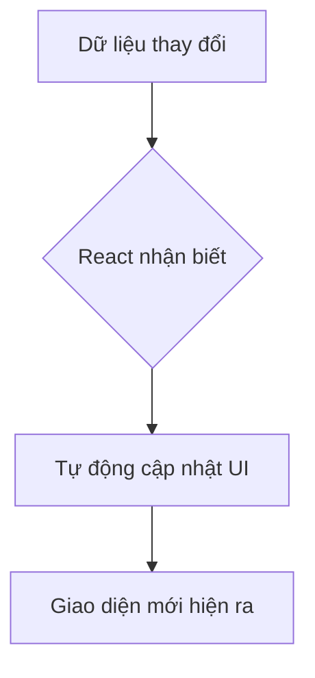
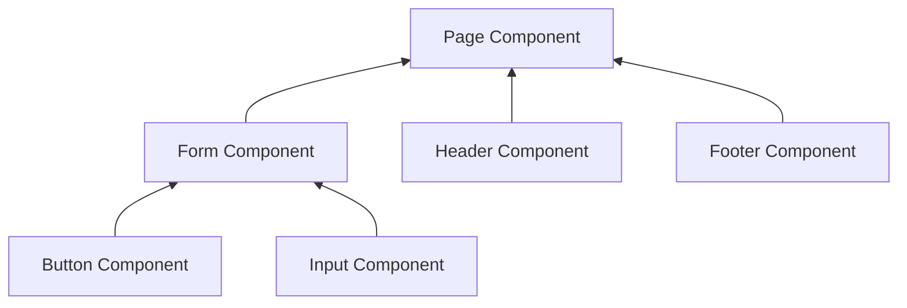

# Chào mừng bạn đến với React! 🚀

Chào bạn mới! Nếu bạn đang bắt đầu hành trình chinh phục Frontend, React chắc chắn là một cái tên không thể bỏ qua. Hãy cùng mình tìm hiểu xem React thực chất là gì và tại sao nó lại "hot" đến vậy nhé!

## 1. Triết lý của React: Declarative (Khai báo) vs Imperative (Mệnh lệnh)

Để hiểu React, hãy tưởng tượng bạn đang gọi một món ăn ở nhà hàng.

*   **Imperative (Mệnh lệnh):** Bạn đi vào bếp, chỉ tận tay đầu bếp: "Đầu tiên lấy hành ra, thái nhỏ, sau đó bật bếp lên, cho dầu vào, rồi bỏ hành vào phi..." (Bạn chỉ dẫn từng bước một).
*   **Declarative (Khai báo - Cách của React):** Bạn chỉ cần ngồi vào bàn và nói: "Cho tôi một đĩa cơm rang hành." (Bạn mô tả **kết quả mong muốn**, còn việc làm thế nào là việc của nhà hàng).

Trong React, bạn chỉ cần mô tả giao diện sẽ trông như thế nào dựa trên dữ liệu. Khi dữ liệu thay đổi, React sẽ tự động cập nhật giao diện cho bạn.

## 2. Tư duy theo kiểu React (Thinking in React)

React khuyến khích chúng ta chia nhỏ giao diện thành các phần nhỏ hơn gọi là **Components**. 

Hãy tưởng tượng bạn đang chơi Lego. Thay vì xây một lâu đài khổng lồ từ một khối nhựa duy nhất, bạn xây từng cái tháp, từng bức tường, sau đó lắp ghép chúng lại. Mỗi tháp, mỗi tường đó chính là một Component.

## 3. Kiến trúc dựa trên Component (Component-based Architecture)

Mọi thứ trong React đều là Component. Một trang web có thể bao gồm:
*   `Header` component
*   `Sidebar` component
*   `ProductList` component
*   `Footer` component

Cách tiếp cận này giúp code của bạn dễ quản lý, dễ tái sử dụng và cực kỳ linh hoạt.

---
**Tóm lại:** React giúp bạn xây dựng giao diện bằng cách lắp ghép các "mảnh ghép" (Components) và bạn chỉ cần tập trung vào việc mô tả kết quả cuối cùng, thay vì loay hoay với từng bước cập nhật thủ công.

Chúc bạn có những trải nghiệm thú vị đầu tiên với React! 🌟
