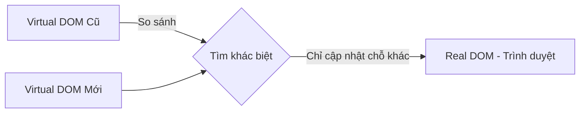
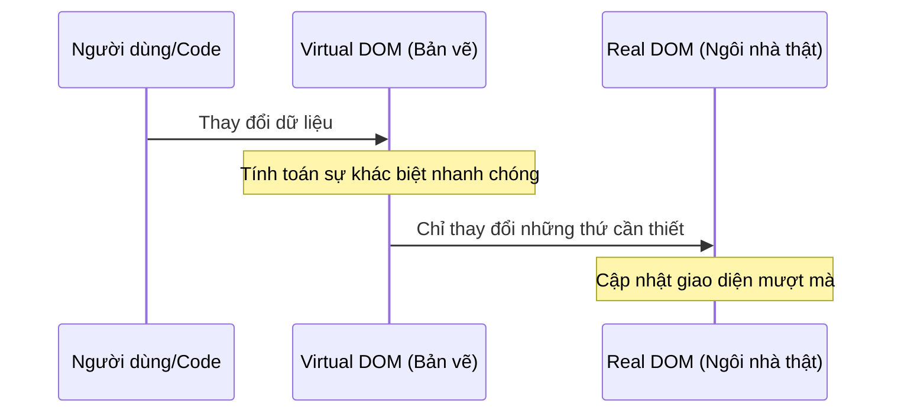

# Virtual DOM: "Bản nháp" thông minh của React 🧠

Nếu coi trình duyệt là một công trường xây dựng, thì Virtual DOM chính là bản thiết kế trên giấy mà React sử dụng để tối ưu hóa công việc. Hãy cùng tìm hiểu nhé!

## 1. DOM là gì? Tại sao nó lại "chậm"?

**DOM (Document Object Model)** là cấu trúc cây của trang web. Mỗi khi bạn thay đổi một cái gì đó (như đổi màu chữ), trình duyệt phải tính toán lại toàn bộ bố cục và vẽ lại trang.

Hãy tưởng tượng DOM như một cái cây thật. Nếu bạn muốn đổi màu một chiếc lá ở ngọn, bạn phải leo lên từ gốc, tìm đến đúng cành và thay thế nó. Nếu bạn thay đổi hàng ngàn lá cùng lúc, việc leo trèo này sẽ cực kỳ tốn sức và chậm chạp.

## 2. Virtual DOM - Vị cứu tinh của hiệu năng

Thay vì tác động trực tiếp vào "cây thật" (Real DOM), React tạo ra một bản sao nhẹ hơn gọi là **Virtual DOM** (bản nháp).

Khi có sự thay đổi:
1. React cập nhật bản nháp (Virtual DOM).
2. React so sánh bản nháp mới với bản nháp cũ (quá trình này gọi là **Diffing**).
3. React tìm ra chính xác những chỗ khác biệt.
4. React chỉ cập nhật đúng những chỗ đó lên trình duyệt (Real DOM).

## 3. Ví dụ dễ hiểu: Sửa nhà

*   **Cách truyền thống (Real DOM):** Bạn muốn đổi vị trí cái tivi. Bạn khuân vác, đập phá tường, lắp đặt lại... và phát hiện ra bạn đặt nhầm chỗ. Bạn lại đập đi làm lại. Rất tốn công!
*   **Cách của React (Virtual DOM):** Bạn lấy bản vẽ ngôi nhà ra. Bạn vẽ thử tivi ở góc này, góc kia trên giấy. Khi thấy ổn nhất, bạn mới thuê thợ đến di chuyển cái tivi ĐÚNG MỘT LẦN duy nhất.

---
**Kết luận:** Virtual DOM giúp React cực kỳ nhanh vì nó tránh được việc phải "đập đi xây lại" toàn bộ giao diện một cách lãng phí. Nó chỉ làm những việc cần thiết nhất!

Hy vọng bạn đã thấy Virtual DOM không hề đáng sợ đúng không nào? 😄
