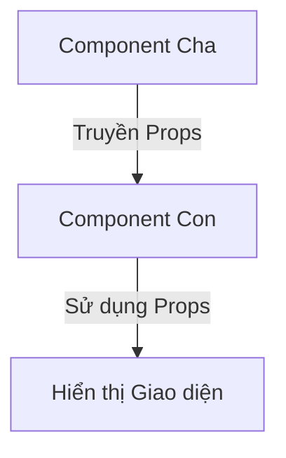
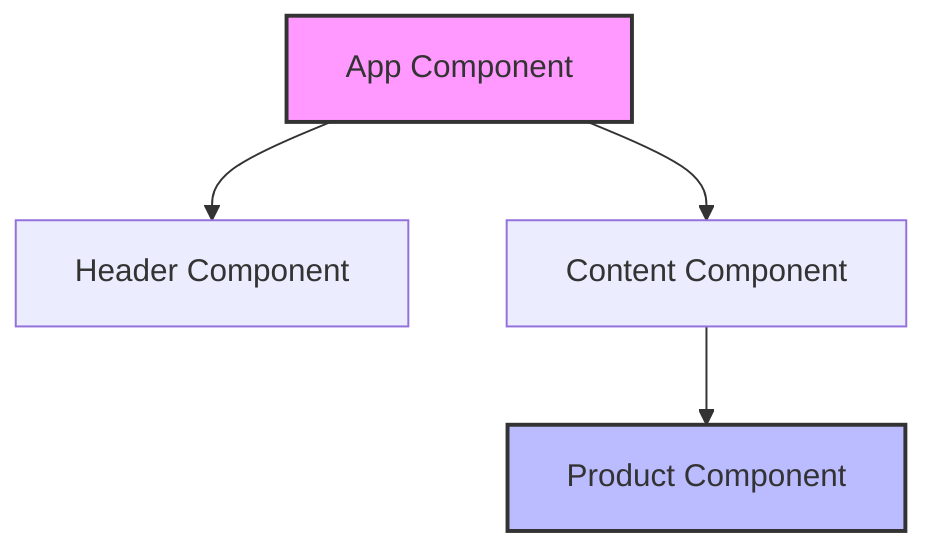

# State và Props: Bộ mã GEN của Component 🧬

Trong React, nếu coi một Component là một con người, thì **State** và **Props** chính là những yếu tố quyết định người đó trông như thế nào và hành động ra sao.

## 1. Props: "Quà tặng" từ bên ngoài

**Props** (viết tắt của Properties) là dữ liệu được truyền từ Component cha xuống Component con.

*   **Đặc điểm:** Props là **bất biến** (read-only). Component con nhận Props và chỉ được sử dụng chứ không được tự ý thay đổi chúng.
*   **Ví dụ:** Bạn nhận được một cái tên từ bố mẹ khi mới sinh ra. Bạn không thể tự đổi tên mình trên giấy khai sinh một cách tùy tiện (trừ khi bố mẹ đổi cho).

## 2. State: "Tâm trạng" bên trong

**State** là dữ liệu nội bộ của một Component. Nó dùng để lưu trữ những thứ có thể thay đổi theo thời gian (như kết quả người dùng nhập, trạng thái bật/tắt của một nút...).

*   **Đặc điểm:** State là **riêng tư**. Chỉ bản thân Component đó mới có quyền thay đổi State của chính mình. Khi State thay đổi, React sẽ tự động vẽ lại (re-render) Component đó.
*   **Ví dụ:** Tâm trạng của bạn. Sáng sớm bạn vui (State = Vui), nhưng nếu bị kẹt xe bạn sẽ buồn (State = Buồn). Chỉ bạn mới biết và tự thay đổi tâm trạng của mình.

## 3. So sánh nhanh State vs Props

| Đặc điểm | Props | State |
| :--- | :--- | :--- |
| **Nguồn gốc** | Nhận từ bên ngoài (Cha) | Khởi tạo bên trong |
| **Thay đổi được không?** | Không (trong Component nhận) | Có |
| **Mục đích** | Cấu hình cho Component | Quản lý dữ liệu thay đổi |

## 4. Luồng dữ liệu một chiều (One-way Data Flow)

Trong React, dữ liệu luôn chảy từ trên xuống dưới (từ Cha đến Con). Điều này giúp chúng ta dễ dàng theo dõi xem dữ liệu đến từ đâu và ai là người kiểm soát nó.

---
**Lời kết:** 
*   Dùng **Props** khi bạn muốn truyền thông tin để "cài đặt" cho Component.
*   Dùng **State** khi bạn muốn Component ghi nhớ và phản hồi lại các hành động của người dùng.

Hiểu rõ hai khái niệm này là bạn đã nắm giữ 50% sức mạnh của React rồi đấy! Cố lên nhé! 💪
