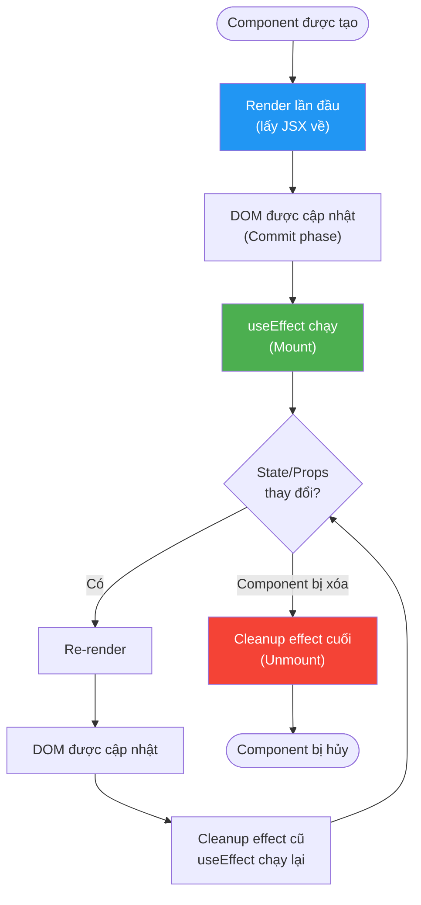
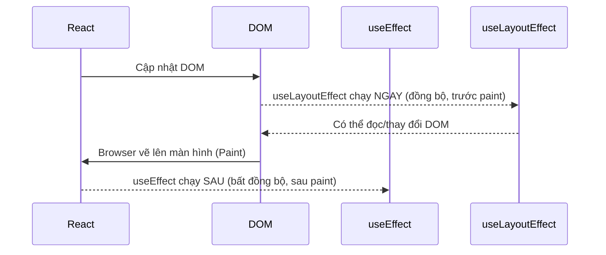

# 05 - Vòng đời Component với Hooks 🔄

Trong React, không có "lifecycle methods" như Angular. Thay vào đó, bạn dùng `useEffect` để mô phỏng tất cả các giai đoạn trong vòng đời của component.

> **Cách nhớ:** `useEffect` là một "trợ lý thông minh" — bạn nói nó cần làm gì *sau khi render*, và nó tự biết khi nào cần làm lại dựa trên danh sách phụ thuộc bạn cung cấp.

---

## 1. Vòng đời Component trong React



---

## 2. `useEffect` — Công cụ vạn năng

### Pattern 1: Chạy một lần khi Mount (tương đương `ngOnInit`)

```jsx
function ContractList() {
  const [contracts, setContracts] = useState([]);
  const [isLoading, setIsLoading] = useState(false);

  useEffect(() => {
    // Chạy một lần duy nhất sau render đầu tiên
    const fetchContracts = async () => {
      setIsLoading(true);
      try {
        const response = await fetch('/api/contracts');
        const data = await response.json();
        setContracts(data);
      } finally {
        setIsLoading(false);
      }
    };

    fetchContracts();
  }, []); // 👈 Mảng rỗng = chỉ chạy một lần khi mount

  if (isLoading) return <div>Đang tải...</div>;
  
  return (
    <ul>
      {contracts.map(c => <li key={c.id}>{c.code} - {c.customerName}</li>)}
    </ul>
  );
}
```

### Pattern 2: Chạy lại khi dependency thay đổi (tương đương `ngOnChanges`)

```jsx
function ContractDetail({ contractId }) { // contractId từ props (parent)
  const [contract, setContract] = useState(null);

  useEffect(() => {
    // Chạy lại mỗi khi contractId thay đổi
    if (!contractId) return;

    fetch(`/api/contracts/${contractId}`)
      .then(res => res.json())
      .then(data => setContract(data));

  }, [contractId]); // 👈 Dependency array

  return contract ? <div>{contract.customerName}</div> : <div>Loading...</div>;
}
```

### Pattern 3: Cleanup khi Unmount (tương đương `ngOnDestroy`)

```jsx
function NotificationBanner() {
  const [notifications, setNotifications] = useState([]);

  useEffect(() => {
    // Thiết lập WebSocket connection
    const ws = new WebSocket('wss://api.bank.com/notifications');
    
    ws.onmessage = (event) => {
      setNotifications(prev => [...prev, JSON.parse(event.data)]);
    };

    const timerId = setInterval(() => {
      fetch('/api/notifications/ping');
    }, 30000);

    // 🔑 Cleanup function — chạy khi component unmount
    return () => {
      ws.close();           // Đóng WebSocket
      clearInterval(timerId); // Xóa timer
      console.log('Cleanup! Component bị xóa');
    };
  }, []);

  return <div>{notifications.length} thông báo mới</div>;
}
```

---

## 3. Các lỗi phổ biến với useEffect

### ❌ Lỗi 1: Quên dependency — dữ liệu không cập nhật

```jsx
// BUG: branchId thay đổi nhưng dữ liệu không reload
function BranchContracts({ branchId }) {
  const [contracts, setContracts] = useState([]);

  useEffect(() => {
    fetch(`/api/branches/${branchId}/contracts`) // Dùng branchId
      .then(r => r.json())
      .then(setContracts);
  }, []); // ❌ Thiếu branchId trong dependency array!

  // ...
}

// ✅ FIX:
useEffect(() => {
  fetch(`/api/branches/${branchId}/contracts`)
    .then(r => r.json())
    .then(setContracts);
}, [branchId]); // ✅ Thêm branchId
```

### ❌ Lỗi 2: Memory Leak — cập nhật state sau khi component unmount

```jsx
// BUG: Nếu component bị xóa khi đang fetch, sẽ báo lỗi
function CustomerProfile({ customerId }) {
  const [profile, setProfile] = useState(null);

  useEffect(() => {
    fetch(`/api/customers/${customerId}`)
      .then(r => r.json())
      .then(data => setProfile(data)); // ❌ Có thể chạy sau khi unmount
  }, [customerId]);
}

// ✅ FIX với AbortController:
useEffect(() => {
  const abortController = new AbortController();

  fetch(`/api/customers/${customerId}`, {
    signal: abortController.signal
  })
    .then(r => r.json())
    .then(data => setProfile(data))
    .catch(err => {
      if (err.name !== 'AbortError') throw err; // Bỏ qua lỗi do cancel
    });

  return () => abortController.abort(); // Hủy request khi unmount
}, [customerId]);
```

### ❌ Lỗi 3: Vòng lặp vô tận

```jsx
// BUG: Object/Array mới được tạo mỗi render → effect chạy mãi
function SearchResults({ filters }) { // filters là object
  useEffect(() => {
    fetchResults(filters);
  }, [filters]); // ❌ filters thay đổi reference mỗi render!
}

// ✅ FIX: Dùng giá trị primitive hoặc useMemo
function SearchResults({ status, keyword }) {
  useEffect(() => {
    fetchResults({ status, keyword });
  }, [status, keyword]); // ✅ Primitive values
}
```

---

## 4. `useLayoutEffect` — Khi nào dùng?



```jsx
// Dùng useLayoutEffect khi cần đọc/thay đổi DOM trước khi user thấy
function Tooltip({ targetRef, content }) {
  const tooltipRef = useRef(null);

  useLayoutEffect(() => {
    // Tính toán vị trí của tooltip dựa trên DOM
    const target = targetRef.current.getBoundingClientRect();
    const tooltip = tooltipRef.current;
    
    // Đặt vị trí để tooltip không bị che khuất
    tooltip.style.top = `${target.bottom + 8}px`;
    tooltip.style.left = `${target.left}px`;
  });

  return <div ref={tooltipRef} className="tooltip">{content}</div>;
}
```

> **Quy tắc:** Dùng `useEffect` trong hầu hết các trường hợp. Chỉ dùng `useLayoutEffect` khi bạn cần đọc layout DOM để tránh nhấp nháy (flicker) giao diện.

---

## 5. Custom Hooks — Tách logic ra khỏi component

Khi useEffect trở nên phức tạp, hãy tách nó thành Custom Hook để tái sử dụng.

```jsx
// hooks/useContractData.js
function useContractData(contractId) {
  const [contract, setContract] = useState(null);
  const [isLoading, setIsLoading] = useState(false);
  const [error, setError] = useState(null);

  useEffect(() => {
    if (!contractId) return;

    const abortController = new AbortController();
    setIsLoading(true);
    setError(null);

    fetch(`/api/contracts/${contractId}`, { signal: abortController.signal })
      .then(res => {
        if (!res.ok) throw new Error(`HTTP ${res.status}`);
        return res.json();
      })
      .then(data => setContract(data))
      .catch(err => {
        if (err.name !== 'AbortError') setError(err.message);
      })
      .finally(() => setIsLoading(false));

    return () => abortController.abort();
  }, [contractId]);

  return { contract, isLoading, error };
}

// Sử dụng trong component — clean và đơn giản
function ContractDetailPage({ contractId }) {
  const { contract, isLoading, error } = useContractData(contractId);

  if (isLoading) return <LoadingSpinner />;
  if (error) return <ErrorMessage message={error} />;
  if (!contract) return null;

  return <ContractDetail contract={contract} />;
}
```

---

**Takeaway:**
- `useEffect(() => ..., [])` = chạy 1 lần khi mount.
- `useEffect(() => ..., [dep])` = chạy lại khi `dep` thay đổi.
- Hàm return trong `useEffect` = cleanup (unmount).
- Luôn dùng **AbortController** khi fetch dữ liệu trong useEffect.
- Tách logic phức tạp vào **Custom Hooks** để tái sử dụng.
