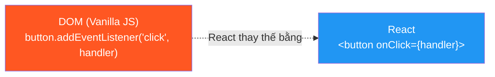
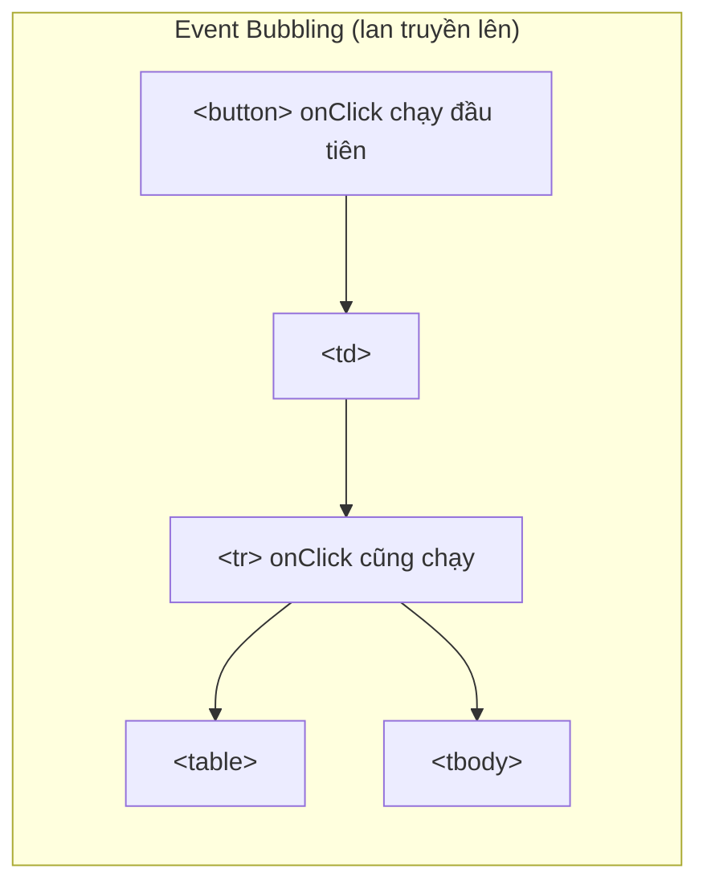

# 06 - Event Handling — Xử lý sự kiện trong React 🖱️

Mọi tương tác của người dùng — nhấn nút, nhập text, submit form — đều là **events**. React xử lý chúng thông qua **Synthetic Events**, một lớp bọc trên native DOM Events để đảm bảo hoạt động nhất quán trên mọi trình duyệt.

---

## 1. Cú pháp cơ bản



```jsx
// ✅ React dùng camelCase cho tên event
// ✅ Truyền function reference, không gọi hàm
function ContractActions({ contract }) {
  const handleApprove = () => {
    console.log('Duyệt hợp đồng:', contract.id);
  };

  const handleReject = (reason) => {
    console.log('Từ chối vì:', reason);
  };

  return (
    <div>
      {/* ✅ Đúng: truyền function reference */}
      <button onClick={handleApprove}>Duyệt</button>

      {/* ✅ Đúng: arrow function để truyền argument */}
      <button onClick={() => handleReject('Thiếu hồ sơ')}>Từ chối</button>

      {/* ❌ Sai: gọi hàm ngay lập tức, không phải pass reference */}
      {/* <button onClick={handleApprove()}>Duyệt</button> */}
    </div>
  );
}
```

---

## 2. Đối tượng Event (`e`)

```jsx
function SearchBox({ onSearch }) {
  const handleInput = (e) => {
    // e là SyntheticEvent, có thuộc tính giống native event
    console.log(e.target.value);    // Giá trị của input
    console.log(e.target.name);     // Name attribute
    console.log(e.type);            // 'input'
  };

  const handleSubmit = (e) => {
    e.preventDefault(); // Ngăn browser reload trang
    e.stopPropagation(); // Ngăn event lan lên element cha
    onSearch(e.target.elements.keyword.value);
  };

  const handleKeyDown = (e) => {
    if (e.key === 'Enter') onSearch(e.target.value);
    if (e.key === 'Escape') e.target.blur();
  };

  return (
    <form onSubmit={handleSubmit}>
      <input
        name="keyword"
        onInput={handleInput}
        onKeyDown={handleKeyDown}
        onChange={(e) => console.log('Thay đổi:', e.target.value)}
      />
    </form>
  );
}
```

---

## 3. Các sự kiện phổ biến trong dự án doanh nghiệp

```jsx
function ContractForm({ onSave, onCancel }) {
  const [formData, setFormData] = useState({
    customerName: '',
    amount: '',
    loanType: 'PERSONAL',
    hasCollateral: false,
  });

  // Universal handler — xử lý mọi loại input
  const handleChange = (e) => {
    const { name, value, type, checked } = e.target;
    setFormData(prev => ({
      ...prev,
      // Checkbox dùng checked, các input khác dùng value
      [name]: type === 'checkbox' ? checked : value
    }));
  };

  return (
    <form onSubmit={(e) => { e.preventDefault(); onSave(formData); }}>
      
      {/* Text Input */}
      <input
        name="customerName"
        value={formData.customerName}
        onChange={handleChange}
        placeholder="Tên khách hàng"
      />

      {/* Number Input */}
      <input
        name="amount"
        type="number"
        value={formData.amount}
        onChange={handleChange}
        onFocus={(e) => e.target.select()} // Chọn tất cả text khi focus
        min={1000000}
      />

      {/* Select Dropdown */}
      <select name="loanType" value={formData.loanType} onChange={handleChange}>
        <option value="PERSONAL">Vay tiêu dùng</option>
        <option value="MORTGAGE">Vay mua nhà</option>
        <option value="BUSINESS">Vay kinh doanh</option>
      </select>

      {/* Checkbox */}
      <label>
        <input
          type="checkbox"
          name="hasCollateral"
          checked={formData.hasCollateral}
          onChange={handleChange}
        />
        Có tài sản đảm bảo
      </label>

      <button type="submit">Lưu</button>
      <button type="button" onClick={onCancel}>Hủy</button>
    </form>
  );
}
```

---

## 4. Event Delegation và Bubbling



```jsx
// Event Delegation — Gắn 1 handler cho container thay vì từng item
function ContractTable({ contracts, onContractClick }) {
  const handleTableClick = (e) => {
    // Tìm hàng tr gần nhất từ element được click
    const row = e.target.closest('tr[data-id]');
    if (!row) return;

    const contractId = row.dataset.id;
    onContractClick(contractId);
  };

  return (
    // Gắn event ở table, không phải từng tr
    <table onClick={handleTableClick}>
      <tbody>
        {contracts.map(c => (
          // data-id để xác định row nào được click
          <tr key={c.id} data-id={c.id} style={{ cursor: 'pointer' }}>
            <td>{c.code}</td>
            <td>{c.customerName}</td>
          </tr>
        ))}
      </tbody>
    </table>
  );
}
```

```jsx
// Ngăn event lan truyền (stopPropagation)
function ContractCard({ contract, onCardClick, onDeleteClick }) {
  return (
    <div onClick={() => onCardClick(contract.id)} className="card">
      <h3>{contract.code}</h3>
      <button
        onClick={(e) => {
          e.stopPropagation(); // Ngăn click lan lên <div> cha
          onDeleteClick(contract.id);
        }}
      >
        🗑️ Xóa
      </button>
    </div>
  );
}
```

---

## 5. Keyboard & Accessibility

```jsx
// Đảm bảo custom elements có thể tương tác bằng bàn phím
function ClickableRow({ onClick, children }) {
  const handleKeyDown = (e) => {
    // Phím Enter hoặc Space = click
    if (e.key === 'Enter' || e.key === ' ') {
      e.preventDefault();
      onClick();
    }
  };

  return (
    <div
      onClick={onClick}
      onKeyDown={handleKeyDown}
      role="button"         // Báo cho screen reader biết đây là nút
      tabIndex={0}          // Cho phép focus bằng Tab
      aria-label="Xem chi tiết"
    >
      {children}
    </div>
  );
}
```

---

**Takeaway:**
- Event names trong React viết **camelCase** (`onClick`, `onChange`, `onSubmit`).
- Truyền **function reference**, không gọi hàm (`onClick={fn}` không phải `onClick={fn()}`).
- Dùng **`e.preventDefault()`** để ngăn reload trang khi submit form.
- **Universal handler** với `e.target.name` giúp xử lý nhiều input với một hàm.
- Luôn thêm `role` và `tabIndex` cho custom interactive elements.
