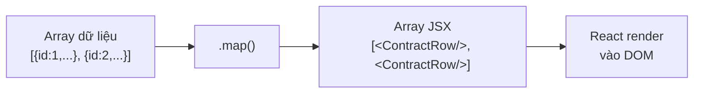
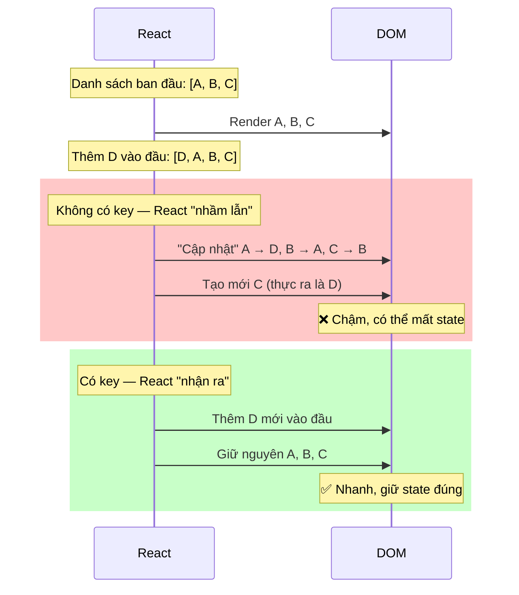

# 07 - Lists, Keys & Conditional Rendering 📋

Hai kỹ năng không thể thiếu khi hiển thị dữ liệu thực tế: **render danh sách** từ API và **hiển thị có điều kiện** dựa trên trạng thái.

---

## 1. Render Danh sách với `.map()`



```jsx
// ✅ Cơ bản
function ContractList({ contracts }) {
  return (
    <ul>
      {contracts.map(contract => (
        <li key={contract.id}>   {/* key bắt buộc phải có! */}
          {contract.code} — {contract.customerName}
        </li>
      ))}
    </ul>
  );
}

// ✅ Với component riêng
function ContractList({ contracts }) {
  return (
    <div className="contract-list">
      {contracts.map(contract => (
        <ContractCard
          key={contract.id}
          contract={contract}
        />
      ))}
    </div>
  );
}
```

---

## 2. `key` — Tại sao quan trọng?



```jsx
// ❌ Sai: Dùng index làm key — gây bug khi thêm/xóa/sắp xếp
{contracts.map((contract, index) => (
  <ContractRow key={index} contract={contract} />
))}

// ✅ Đúng: Dùng ID duy nhất từ database
{contracts.map(contract => (
  <ContractRow key={contract.id} contract={contract} />
))}

// ✅ Đúng: Nếu không có ID, tạo key từ giá trị unique
{statuses.map(status => (
  <option key={status.code} value={status.code}>{status.label}</option>
))}
```

---

## 3. Conditional Rendering — Hiển thị có điều kiện

### Pattern 1: Ternary Operator (`? :`)

```jsx
function ContractStatus({ status, isLoading }) {
  return (
    <div>
      {isLoading
        ? <LoadingSpinner />
        : <span className={`status-${status.toLowerCase()}`}>{status}</span>
      }
    </div>
  );
}
```

### Pattern 2: Short-circuit (`&&`)

```jsx
function ContractCard({ contract }) {
  return (
    <div>
      <h3>{contract.code}</h3>
      
      {/* Chỉ hiện nếu có lỗi */}
      {contract.hasError && (
        <div className="error-banner">⚠️ Hợp đồng có vấn đề cần xử lý</div>
      )}

      {/* Chỉ hiện nút nếu có quyền */}
      {contract.canEdit && (
        <button onClick={() => editContract(contract.id)}>Chỉnh sửa</button>
      )}
    </div>
  );
}
```

> ⚠️ **Cẩn thận với số 0!**  
> `{count && <span>{count}</span>}` — Khi `count = 0`, React sẽ render số `0` thay vì không render gì.  
> Dùng `{count > 0 && <span>{count}</span>}` hoặc `{!!count && ...}` để an toàn.

### Pattern 3: Early Return — Code sạch nhất

```jsx
function ContractDetail({ contractId }) {
  const [contract, setContract] = useState(null);
  const [isLoading, setIsLoading] = useState(true);
  const [error, setError] = useState(null);

  // ... useEffect để load data

  // Early returns — đọc từ trên xuống theo thứ tự ưu tiên
  if (isLoading) return <SkeletonLoader />;
  if (error)     return <ErrorState message={error} onRetry={reload} />;
  if (!contract) return <EmptyState message="Không tìm thấy hợp đồng" />;

  // Happy path — biết chắc contract tồn tại
  return (
    <div className="contract-detail">
      <h1>{contract.code}</h1>
      <CustomerInfo customer={contract.customer} />
      <LoanDetails loan={contract.loan} />
    </div>
  );
}
```

### Pattern 4: Đa điều kiện phức tạp — dùng object map

```jsx
const STATUS_CONFIG = {
  DRAFT:    { label: 'Nháp',       icon: '📝', color: 'gray'   },
  PENDING:  { label: 'Chờ duyệt', icon: '⏳', color: 'orange' },
  ACTIVE:   { label: 'Hiệu lực',  icon: '✅', color: 'green'  },
  OVERDUE:  { label: 'Quá hạn',   icon: '⚠️', color: 'red'    },
  CLOSED:   { label: 'Đã đóng',   icon: '🔒', color: 'blue'   },
};

function StatusBadge({ status }) {
  // Thay vì if-else dài dòng
  const config = STATUS_CONFIG[status] ?? { label: status, icon: '?', color: 'gray' };
  
  return (
    <span style={{ color: config.color }}>
      {config.icon} {config.label}
    </span>
  );
}
```

---

## 4. Kết hợp List + Conditional — Bài toán thực tế

```jsx
function ContractDashboard() {
  const [contracts, setContracts] = useState([]);
  const [filter, setFilter] = useState('ALL');
  const [isLoading, setIsLoading] = useState(true);

  // Filter contracts
  const filteredContracts = filter === 'ALL'
    ? contracts
    : contracts.filter(c => c.status === filter);

  if (isLoading) return <SkeletonTable rows={5} />;

  return (
    <div>
      {/* Filter bar */}
      <div className="filters">
        {['ALL', 'PENDING', 'ACTIVE', 'OVERDUE'].map(status => (
          <button
            key={status}
            className={filter === status ? 'active' : ''}
            onClick={() => setFilter(status)}
          >
            {status === 'ALL' ? 'Tất cả' : STATUS_CONFIG[status]?.label}
            {/* Badge số lượng */}
            <span className="badge">
              {status === 'ALL'
                ? contracts.length
                : contracts.filter(c => c.status === status).length
              }
            </span>
          </button>
        ))}
      </div>

      {/* Contract list */}
      {filteredContracts.length === 0
        ? (
          <EmptyState
            icon="📄"
            message={`Không có hợp đồng ${filter !== 'ALL' ? `trạng thái "${filter}"` : ''}`}
          />
        )
        : (
          <table>
            <thead>
              <tr>
                <th>Mã HĐ</th>
                <th>Khách hàng</th>
                <th>Số tiền</th>
                <th>Trạng thái</th>
                <th>Thao tác</th>
              </tr>
            </thead>
            <tbody>
              {filteredContracts.map(contract => (
                <tr
                  key={contract.id}
                  className={contract.status === 'OVERDUE' ? 'row-danger' : ''}
                >
                  <td>{contract.code}</td>
                  <td>{contract.customerName}</td>
                  <td>{contract.amount.toLocaleString('vi-VN')}đ</td>
                  <td><StatusBadge status={contract.status} /></td>
                  <td>
                    <button onClick={() => viewDetail(contract.id)}>Xem</button>
                    {contract.canEdit && (
                      <button onClick={() => editContract(contract.id)}>Sửa</button>
                    )}
                    {contract.status === 'PENDING' && (
                      <>
                        <button onClick={() => approveContract(contract.id)}>Duyệt</button>
                        <button onClick={() => rejectContract(contract.id)}>Từ chối</button>
                      </>
                    )}
                  </td>
                </tr>
              ))}
            </tbody>
          </table>
        )
      }
    </div>
  );
}
```

---

**Takeaway:**
- Dùng `.map()` để render list, **luôn có `key`** là ID duy nhất từ dữ liệu.
- **Tránh dùng index** làm key nếu list có thể thêm/xóa/sắp xếp.
- **Early return** giúp code dễ đọc hơn nested ternary.
- Object/map config thay thế chuỗi `if-else` khi có nhiều trường hợp.
- Cẩn thận với `{0 && ...}` — dùng `{count > 0 && ...}` để an toàn.
