# Lộ trình React "Zero to Hero" cho Dự án Enterprise 🚀

> Series này đi từ **Newbie đến Enterprise-ready** — bao gồm TypeScript, State Management, Authentication, Advanced Patterns, Performance, và UI Patterns nâng cao. Ví dụ thực tế từ hệ thống PDMS (banking document management).

---

## 🗺️ Bản đồ Lộ trình

```mermaid
graph TD
    Start((Bắt đầu)) --> F1

    subgraph F1["🟢 Phase 1: React Cơ Bản (Bài 01-05)"]
        direction LR
        R01[01. Getting Started]
        R02[02. State Basics]
        R03[03. Events & Lists]
        R04[04. Conditional Rendering]
        R05[05. Hooks & useEffect]
    end

    subgraph F2["🔵 Phase 2: Forms & Navigation (Bài 06-09)"]
        direction LR
        R06[06. Forms — RHF + Zod]
        R07[07. React Router v6]
        R08[08. Advanced Hooks]
        R09[09. Context API]
    end

    subgraph F3["🟡 Phase 3: Data & Performance (Bài 10-15)"]
        direction LR
        R10[10. Data Fetching<br/>TanStack Query]
        R11[11. Performance<br/>Virtualization]
        R12[12. Concurrent Features]
        R13[13. Server Components]
        R14[14. Testing]
        R15[15. Enterprise Best Practices]
    end

    subgraph F4["🔴 Phase 4: Enterprise Level (Bài 16-22)"]
        direction LR
        R16[16. TypeScript với React]
        R17[17. Zustand]
        R18[18. TanStack Query Deep Dive]
        R19[19. Authentication + RBAC]
        R20[20. Advanced Patterns]
        R21[21. Multi-Step Forms]
        R22[22. Portals & Modals]
    end

    F1 --> F2 --> F3 --> F4 --> End((React Hero!))

    style Start fill:#f9f,stroke:#333,stroke-width:4px
    style End fill:#00e676,stroke:#333,stroke-width:4px
```



---

## 📚 Danh sách bài học đầy đủ

### 🟢 Phase 1: React Cơ Bản

| # | Bài | Bạn sẽ biết |
|---|---|---|
| 01 | [[01-Getting-Started-with-React\|Getting Started]] | JSX, Component, Props, Vite setup |
| 02 | [[02-State-Management-Basics\|State Basics]] | useState, Immutability, Lifting state up |
| 03 | [[03-Event-Handling-and-Lists\|Events & Lists]] | Event handlers, .map(), key prop |
| 04 | [[04-Conditional-Rendering\|Conditional Rendering]] | &&, ternary, early return |
| 05 | [[05-Hooks-Lifecycle-and-useEffect\|Hooks & useEffect]] | Lifecycle phases, dependency array, cleanup |

### 🔵 Phase 2: Forms & Navigation

| # | Bài | Bạn sẽ biết |
|---|---|---|
| 06 | [[06-Forms-and-Validation\|Forms & Validation]] | RHF + Zod, FieldArray, cross-field validation, server errors |
| 07 | [[07-React-Router-v6\|React Router v6]] | Routes, Params, Nested routes, Navigate |
| 08 | [[08-Advanced-Hooks\|Advanced Hooks]] | useRef, useMemo, useCallback, useId, useImperativeHandle, useLayoutEffect |
| 09 | [[09-Context-API-and-State-Sharing\|Context API]] | Provider, Consumer, useReducer, Prop drilling |

### 🟡 Phase 3: Data & Performance

| # | Bài | Bạn sẽ biết |
|---|---|---|
| 10 | [[10-Data-Fetching-and-Error-Boundaries\|Data Fetching]] | TanStack Query v5, mutations, optimistic updates, Suspense, Error Boundaries |
| 11 | [[11-Performance-Optimization\|Performance]] | React.memo, useCallback, react-window virtualization, Code splitting |
| 12 | [[12-Concurrent-Features\|Concurrent Features]] | useTransition, useDeferredValue |
| 13 | [[13-React-Server-Components-and-NextJS-Intro\|Server Components]] | RSC, Server vs Client components, Next.js |
| 14 | [[14-Testing-React\|Testing]] | React Testing Library, Vitest, Component tests |
| 15 | [[15-Enterprise-Best-Practices\|Enterprise Best Practices]] | Atomic Design, Folder structure, Custom Hooks |

### 🔴 Phase 4: Enterprise Level

| # | Bài | Bạn sẽ biết |
|---|---|---|
| 16 | [[16-TypeScript-with-React\|TypeScript với React]] | Props typing, Generic components, Utility types |
| 17 | [[17-Zustand-State-Management\|Zustand: Global State]] | Store, Slices, Immer, Persist, DevTools |
| 18 | [[18-TanStack-Query-Server-State\|TanStack Query Deep Dive]] | Cache invalidation, optimistic updates, pagination, prefetch |
| 19 | [[19-Authentication-Protected-Routes\|Authentication & Protected Routes]] | JWT, Axios interceptors, RBAC, Can component |
| 20 | [[20-Advanced-Component-Patterns\|Advanced Component Patterns]] | Compound, Render Props, HOC, Slot pattern |
| 21 | [[21-Multi-Step-Forms-Complex-Validation\|Multi-Step Forms]] | Zod discriminatedUnion, FormProvider, Step logic |
| 22 | [[22-Portals-and-Modals\|Portals & Modals]] | createPortal, focus trap, Modal Manager, Drawer, useConfirm |

---

## 🎯 Learning Path gợi ý theo mục tiêu

| Mục tiêu | Lộ trình | Thời gian |
|---|---|---|
| Chạy được ứng dụng | 01 → 02 → 03 → 05 → 07 → 10 | 1.5 tuần |
| Dự án thực tế | Phase 1 + Phase 2 + 10, 15, 16, 17 | 3-4 tuần |
| Enterprise-ready | Toàn bộ 22 bài | 6-8 tuần |
| Backend dev học thêm FE | 01-05 → 16 → 06 → 17 → 18 → 19 | 4-5 tuần |

---

## 🛠️ Tech Stack được dùng trong series này

```
React 19 + TypeScript + Vite
React Router v6
React Hook Form + Zod + @hookform/resolvers
TanStack Query v5
Zustand v4 + Immer
react-window + react-virtualized-auto-sizer
React Testing Library + Vitest
```

---

## 💡 Lời khuyên

1. **Đừng skip TypeScript** — Bài 16 rất quan trọng cho mọi dự án enterprise
2. **TanStack Query** thay thế 90% `useEffect` + `useState` cho API calls
3. **Zustand** đủ cho hầu hết dự án, chỉ dùng Redux khi cần audit trail
4. **react-window** là bắt buộc khi render danh sách > 200 items
5. **Portal + focus trap** là tiêu chuẩn accessibility cho mọi Modal
6. Tham khảo thêm: [react.dev](https://react.dev), [tanstack.com](https://tanstack.com/query)

---

*Cập nhật: React 19 | TypeScript-first | 22 bài | PDMS domain examples*
