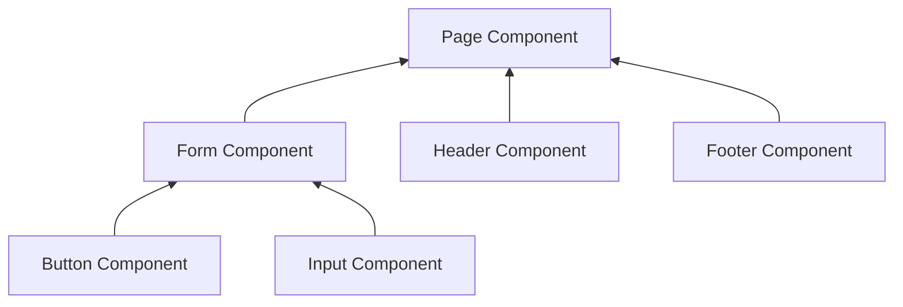
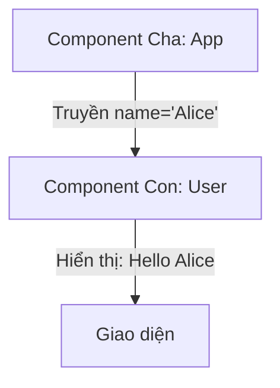

# Bài 01: Bắt đầu với React - JSX, Component và Props 🚀

Chào mừng bạn đến với thế giới của React! Trong bài học đầu tiên này, chúng ta sẽ cùng nhau tìm hiểu về 3 cột trụ chính tạo nên một ứng dụng React.

## 1. JSX: Khi HTML và JavaScript "về chung một nhà" 🏠

Khi mới nhìn vào code React, bạn sẽ thấy thẻ HTML nằm trong JavaScript. Đó chính là **JSX** (JavaScript XML).

### 💡 Ẩn dụ cho Newbie:
Hãy tưởng tượng bạn đang tả một người bạn cho họa sĩ vẽ.
*   **Cách cũ (JS thuần):** "Vẽ một hình tròn cho mặt, sau đó vẽ hai chấm đen cho mắt..." (Dài dòng).
*   **Cách React (JSX):** "Đây là tấm ảnh của bạn tôi, hãy vẽ giống như thế này!" (Trực quan).

### Quy tắc vàng của JSX:
1.  **Chỉ một cha duy nhất:** Phải có một thẻ bao ngoài (hoặc dùng Fragment `<>...</>`).
2.  **Dùng `{}` để viết code JS:** `<h1>{2 + 2}</h1>` sẽ hiện ra `4`.
3.  **className thay cho class:** Vì `class` là từ khóa của JavaScript.

---

## 2. Component: Những mảnh ghép Lego 🧩

React khuyến khích chúng ta chia nhỏ giao diện thành các phần gọi là **Components**.

### 💡 Ẩn dụ cho Newbie:
Thay vì xây một lâu đài khổng lồ từ một khối nhựa duy nhất, bạn xây từng cái tháp, từng bức tường, sau đó lắp ghép chúng lại. Mỗi tháp đó chính là một Component.

### Sơ đồ cấu trúc Component:


---

## 3. Props: "Quà tặng" từ cha xuống con 🎁

**Props** (Properties) là cách chúng ta truyền dữ liệu từ Component cha xuống Component con.

### 💡 Ẩn dụ cho Newbie:
Bạn nhận được một cái tên từ bố mẹ khi mới sinh ra. Bạn dùng cái tên đó nhưng không thể tự ý thay đổi nó trên giấy khai sinh. Props cũng vậy, nó là **bất biến** (read-only) đối với Component con.

### Luồng truyền Props:


### Ví dụ Code:
```jsx
function Welcome(props) {
  return <h1>Chào mừng, {props.name}!</h1>;
}

function App() {
  return <Welcome name="Học viên mới" />;
}
```

---

**Tóm tắt bài học:**
1.  **JSX** giúp viết UI trực quan hơn.
2.  **Component** giúp chia nhỏ và tái sử dụng code.
3.  **Props** giúp truyền dữ liệu từ trên xuống dưới.

Chúc bạn có những trải nghiệm thú vị đầu tiên với React! 🌟
