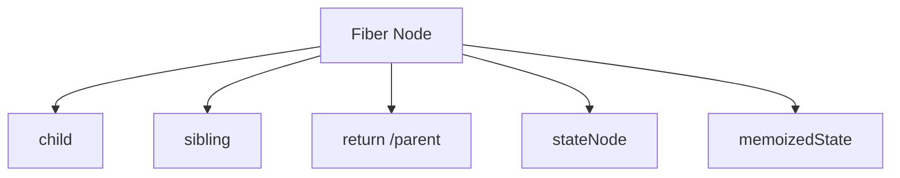
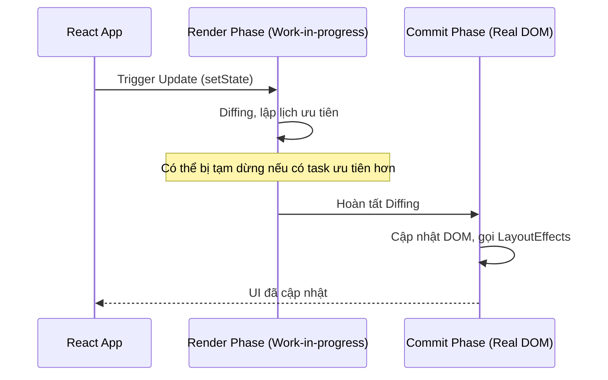

# React Fiber & Reconciliation: Trái tim của React

Để hiểu tại sao React có thể xử lý mượt mà hàng ngàn cập nhật UI, chúng ta cần đi sâu vào **Fiber Architecture**.

## 1. Tại sao cần Fiber?

Trước phiên bản 16, React sử dụng cơ chế "Stack Reconciler". Khi có thay đổi, React sẽ duyệt cây Virtual DOM một cách đệ quy. Vấn đề là:
- Không thể tạm dừng (Interruptible).
- Gây hiện tượng "Jank" (giật lag) nếu cây DOM quá lớn, vì main thread bị chiếm dụng quá lâu.

**Fiber** ra đời để giải quyết điều này bằng cách chia nhỏ công việc thành các đơn vị cực nhỏ (units of work).

## 2. Fiber Node là gì?

Mỗi React Element sẽ có một tương ứng gọi là Fiber Node. Nó là một JavaScript Object chứa thông tin về component, state, và các liên kết:

- **child**: Trỏ đến con đầu tiên.
- **sibling**: Trỏ đến anh em kế tiếp.
- **return**: Trỏ về node cha.

## 3. Luồng làm việc: Render Phase & Commit Phase

React chia quá trình cập nhật thành 2 giai đoạn chính:

### Render Phase (Asynchronous)
- React duyệt cây Fiber và xác định những gì cần thay đổi.
- Giai đoạn này có thể bị tạm dừng, hủy bỏ hoặc ưu tiên lại.
- Kết quả là một cây Fiber mới (Work-in-progress tree).

### Commit Phase (Synchronous)
- React áp dụng các thay đổi vào DOM thật.
- Giai đoạn này diễn ra một lần duy nhất và không thể bị ngắt quãng để đảm bảo tính nhất quán của UI.

## 4. Cơ chế Double Buffering

React duy trì hai cây Fiber cùng lúc:
1. **Current Tree**: Những gì đang hiển thị trên màn hình.
2. **Work-in-progress (WIP) Tree**: Những gì đang được tính toán cho lần render tới.

Khi Commit Phase kết thúc, React chỉ đơn giản là đổi con trỏ từ `Current` sang `WIP`.

## 5. Thuật toán Reconciliation (Diffing)

React tối ưu hóa việc so sánh dựa trên 2 giả định:
1. Hai element khác type sẽ tạo ra các cây khác nhau (React sẽ xóa node cũ và tạo mới).
2. Sử dụng `key` để xác định sự ổn định của các phần tử trong danh sách.

### Ví dụ về Key:
Nếu không có key, React sẽ so sánh theo thứ tự. Nếu bạn chèn một phần tử vào đầu mảng, React sẽ nghĩ tất cả các phần tử đều thay đổi. Với `key`, React biết chính xác phần tử nào chỉ bị dịch chuyển vị trí.

---
**Bài tập:** Hãy thử sử dụng `React.Profiler` để quan sát sự khác biệt giữa các lần render khi thay đổi state ở component cha vs con.
