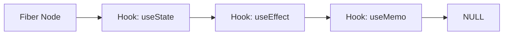

# Hooks Internal Logic: Hiểu để không sai lầm

Nhiều người dùng Hooks nhưng không hiểu tại sao "Hooks must be called at the top level". Bài học này sẽ giải mã cơ chế bên dưới.

## 1. Bản chất của Hooks: Linked List

Bên trong mỗi Fiber Node, có một thuộc tính là `memoizedState`. Đây không phải là một object thông thường, mà là một **Linked List** của các "hook object".



Mỗi khi bạn gọi một Hook, React sẽ di chuyển con trỏ (pointer) đến node tiếp theo trong danh sách này.

**Tại sao thứ tự lại quan trọng?**
Vì React không biết tên của Hook (như `count`), nó chỉ biết: "À, Hook thứ nhất là một state, Hook thứ hai là một effect". Nếu bạn đặt Hook trong câu lệnh `if`, thứ tự sẽ bị đảo lộn và React sẽ đọc sai data từ node kế tiếp.

## 2. useState vs useReducer

Thực tế, `useState` chỉ là một lớp vỏ bọc bên trên `useReducer`.

```javascript
// Minh họa cách React lưu trữ Hook
const hook = {
  memoizedState: initialValue, // Giá trị hiện tại
  queue: [],                   // Các update đang chờ xử lý
  next: null                   // Trỏ đến hook tiếp theo
};
```

Khi bạn gọi `setState(prev => prev + 1)`, React không cập nhật state ngay lập tức mà đẩy update này vào một hàng đợi (`queue`). Trong lần render tiếp theo, React sẽ duyệt qua queue này để tính toán giá trị cuối cùng.

## 3. Vấn đề Closure (Stale Closures)

Đây là lỗi phổ biến nhất khi làm việc với Hooks.

```javascript
function Counter() {
  const [count, setCount] = useState(0);

  useEffect(() => {
    const timer = setInterval(() => {
      console.log(count); // Luôn in ra 0!
    }, 1000); by
    return () => clearInterval(timer);
  }, []); // Dependency array trống

  return <h1>{count}</h1>;
}
```

**Tại sao?**
Hàm bên trong `useEffect` "đóng gói" (closure) biến `count` tại thời điểm nó được tạo ra (lúc count = 0). Vì dependency array là `[]`, hàm này không bao giờ được tạo lại, và nó mãi mãi giữ tham chiếu đến giá trị 0 đó.

**Giải pháp:** Thêm `count` vào dependency array hoặc sử dụng functional update: `setCount(c => c + 1)`.

## 4. Custom Hooks: Tái sử dụng logic, không phải state

Một sai lầm phổ biến là nghĩ rằng gọi Custom Hook sẽ chia sẻ state giữa các component.
**Sự thật:** Mỗi lần bạn gọi một Custom Hook, React tạo ra một bộ lưu trữ Hooks mới trong Fiber Node của component đó. Nó chỉ đơn giản là gom nhóm logic.

## 5. Master useReducer cho logic phức tạp

Khi state của bạn phụ thuộc vào nhau hoặc có logic chuyển đổi phức tạp, hãy dùng `useReducer`.

```javascript
const [state, dispatch] = useReducer(reducer, initialState);
```
`useReducer` giúp tách biệt logic xử lý (Reducer) khỏi UI (Component), làm cho code dễ test và bảo trì hơn.

---
**Gợi ý thực hành:** Hãy thử tự viết một bản rút gọn của `useState` bằng cách sử dụng một mảng toàn cục và một biến chỉ số để hiểu cách React quản lý thứ tự.
