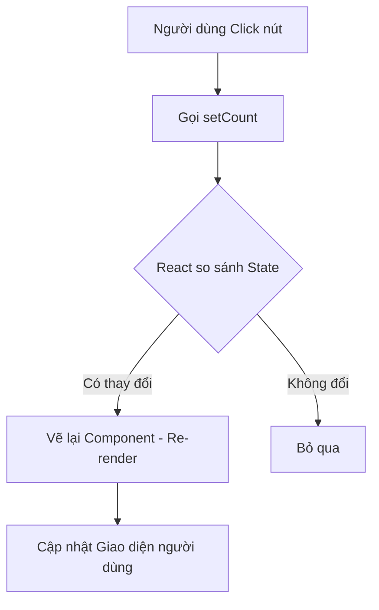

# Bài 02: Quản lý State - "Trí nhớ" của Component 🧠

Trong bài học này, chúng ta sẽ tìm hiểu cách làm cho Component của bạn trở nên "sống động" bằng cách ghi nhớ thông tin.

## 1. useState là gì?

Nếu Props là những món quà từ bên ngoài, thì **State** là những suy nghĩ, trí nhớ bên trong của Component. 

### 💡 Ẩn dụ cho Newbie:
Hãy tưởng tượng Component là một chiếc đồng hồ bấm giờ.
- **Props:** Màu sắc của chiếc đồng hồ (do nhà sản xuất quyết định, bạn không đổi được).
- **State:** Con số đang chạy trên màn hình (thay đổi theo thời gian và do chính chiếc đồng hồ quản lý).

### Cú pháp:
```jsx
const [count, setCount] = useState(0);
```
- `count`: Giá trị hiện tại (đọc dữ liệu).
- `setCount`: Hàm để cập nhật giá trị (thay đổi dữ liệu).
- `0`: Giá trị khởi đầu.

---

## 2. Nguyên tắc Bất biến (Immutability) 🚫✍️

Đây là quy tắc quan trọng nhất trong React: **Không bao giờ được sửa trực tiếp State.**

### 💡 Ẩn dụ cho Newbie:
Hãy tưởng tượng State của bạn là một trang giấy trong cuốn sổ tay.
- **Cách sai (Mutable):** Bạn dùng tẩy xóa đi số cũ và viết đè số mới lên chính trang đó. React sẽ không biết bạn vừa sửa gì vì nó vẫn thấy trang giấy đó.
- **Cách đúng (Immutable):** Bạn lật sang một **trang mới**, chép lại những thứ cần giữ và viết số mới vào. React thấy bạn lật trang mới, nó sẽ biết có thay đổi và vẽ lại giao diện cho bạn.

**Ví dụ code:**
```javascript
// ❌ SAI:
user.name = "John";
setUser(user); // React có thể không nhận ra sự thay đổi

// ✅ ĐÚNG:
setUser({ ...user, name: "John" }); // Tạo một object hoàn toàn mới
```

---

## 3. Quy trình Render khi State thay đổi 🔄

Khi bạn gọi hàm `setCount`, React sẽ thực hiện một chu trình:



---

## 4. Tại sao phải dùng Function khi cập nhật State?

Khi bạn muốn cập nhật State dựa trên giá trị cũ (ví dụ: tăng 1 đơn vị), hãy dùng dạng hàm để đảm bảo dữ liệu luôn mới nhất.

```javascript
// ✅ Cách an toàn nhất
setCount(prevCount => prevCount + 1);
```

**Tóm tắt bài học:**
1.  **useState** giúp Component "ghi nhớ" dữ liệu.
2.  **Luôn tạo bản sao mới** (Spread operator `...`) khi cập nhật Object hoặc Array.
3.  Khi State thay đổi, React sẽ **Re-render** để cập nhật UI.

Hãy thử tạo một nút bấm tăng số để thực hành nhé! 💪
