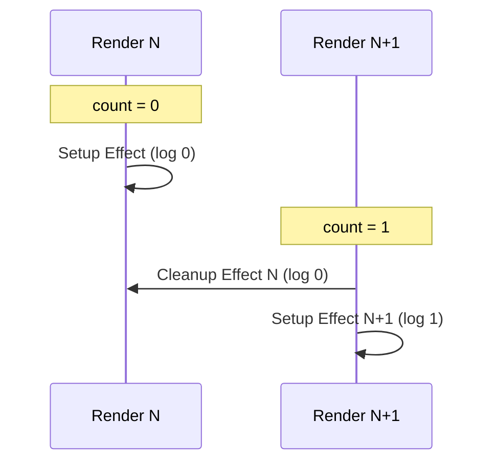
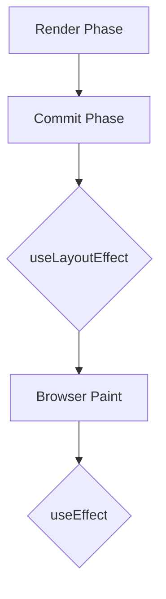

# Effect & Synchronization: Làm chủ thế giới bên ngoài

`useEffect` không phải là một Lifecycle method (như componentDidMount). Nó là một công cụ để **đồng bộ hóa** (synchronization) state của ứng dụng với các hệ thống bên ngoài (DOM, API, Subscriptions).

## 1. Vòng đời của một Effect

Mỗi khi render, React sẽ kiểm tra dependency array. Nếu có ít nhất một giá trị thay đổi, React sẽ:
1. Chạy hàm **Cleanup** của lần render trước (nếu có).
2. Chạy hàm **Setup** của lần render hiện tại.



## 2. useEffect vs useLayoutEffect

Sự khác biệt nằm ở thời điểm thực thi trong Commit Phase:

- **useEffect**: Chạy **sau khi** trình duyệt đã vẽ (paint) xong UI. Điều này giúp ứng dụng không bị chặn (non-blocking).
- **useLayoutEffect**: Chạy **trước khi** trình duyệt paint. Dùng khi bạn cần tính toán vị trí DOM và thay đổi UI ngay lập tức để tránh hiện tượng nháy (flickering).



## 3. Tránh Race Conditions khi Fetch Data

Khi bạn fetch data trong `useEffect`, có nguy cơ kết quả của một yêu cầu cũ ghi đè lên kết quả của yêu cầu mới nếu mạng bị chậm.

```javascript
useEffect(() => {
  let ignore = false;

  async function startFetching() {
    const json = await fetchResults(query);
    if (!ignore) {
      setResults(json);
    }
  }

  startFetching();

  return () => {
    ignore = true; // Cleanup: Đánh dấu yêu cầu này đã lỗi thời
  };
}, [query]);
```

## 4. Đừng lạm dụng Effect để đồng bộ State

Nếu bạn có thể tính toán một giá trị từ props hoặc state hiện có, đừng dùng `useEffect`.
**Sai:**
```javascript
useEffect(() => {
  setFullName(firstName + ' ' + lastName);
}, [firstName, lastName]);
```
**Đúng:**
```javascript
const fullName = firstName + ' ' + lastName; // Tính toán trực tiếp khi render
```

## 5. Khi nào dùng `useEvent` (Sắp ra mắt / Pattern thay thế)

Đôi khi bạn muốn truy cập state mới nhất bên trong Effect mà không muốn Effect đó chạy lại khi state đó thay đổi. Bạn có thể sử dụng `useRef` để giữ tham chiếu đến hàm callback nhằm tránh trigger lại Effect một cách không cần thiết.

---
**Gợi ý thực hành:** Hãy thử tạo một component lắng nghe sự kiện `scroll` và sử dụng `useLayoutEffect` để hiển thị một thanh tiến trình (progress bar) mượt mà nhất có thể.
