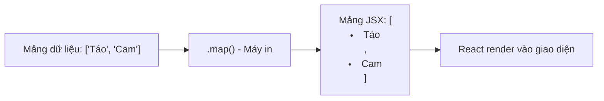

# Bài 03: Xử lý Sự kiện và Hiển thị Danh sách 🖱️📋

Trong bài này, chúng ta sẽ học cách làm cho ứng dụng phản hồi lại người dùng và cách hiển thị một danh sách dữ liệu (ví dụ: danh sách việc cần làm).

## 1. Xử lý Sự kiện (Event Handling)

Bắt sự kiện trong React rất giống với HTML truyền thống, nhưng có một vài khác biệt nhỏ về cú pháp.

### 💡 Ẩn dụ cho Newbie:
Hãy tưởng tượng bạn là một quản gia. Chủ nhà (Người dùng) làm gì đó (Click, Gõ phím), và bạn đã được dặn trước là phải làm gì khi điều đó xảy ra (Hàm xử lý).

### Quy tắc:
1.  **camelCase:** `onClick`, `onChange`, `onSubmit` thay vì `onclick`, `onchange`.
2.  **Truyền hàm, không gọi hàm:** Bạn đưa cho React cái "tên hàm" để nó gọi sau, chứ không tự gọi ngay lập tức.

**Ví dụ:**
```jsx
function App() {
  const handleClick = () => {
    alert("Bạn vừa click vào tôi!");
  };

  return <button onClick={handleClick}>Click me</button>;
}
```

---

## 2. Hiển thị Danh sách với `.map()`

Trong React, chúng ta không dùng vòng lặp `for` hay `while` để hiển thị danh sách trong JSX. Thay vào đó, chúng ta dùng hàm `.map()`.

### 💡 Ẩn dụ cho Newbie:
Hãy tưởng tượng bạn có một danh sách tên các món ăn trên một tờ giấy. Bạn đưa tờ giấy đó vào một chiếc "máy photocopy thần kỳ" (`.map()`). Chiếc máy này sẽ lấy từng cái tên và in nó lên một chiếc đĩa (Component) tương ứng. Cuối cùng, bạn có một bàn đầy các đĩa thức ăn.

### Quy trình Render danh sách:


---

## 3. Tầm quan trọng của `key` 🔑

Khi render danh sách, React yêu cầu mỗi phần tử phải có một thuộc tính `key` duy nhất.

### 💡 Ẩn dụ cho Newbie:
Hãy tưởng tượng một lớp học có 10 học sinh. Nếu mỗi học sinh có một **Mã số học sinh** (key) riêng, giáo viên (React) sẽ dễ dàng biết ai vừa mới vào lớp, ai vừa nghỉ học hoặc ai vừa đổi chỗ. Nếu không có mã số, giáo viên sẽ rất bối rối khi có sự thay đổi.

**Ví dụ Code:**
```jsx
const users = [
  { id: 1, name: "An" },
  { id: 2, name: "Bình" }
];

function UserList() {
  return (
    <ul>
      {users.map(user => (
        <li key={user.id}>{user.name}</li>
      ))}
    </ul>
  );
}
```

---

**Tóm tắt bài học:**
1.  Dùng **camelCase** cho các sự kiện (ví dụ: `onClick`).
2.  Dùng **`.map()`** để chuyển mảng dữ liệu thành mảng các Component.
3.  Luôn cung cấp **`key`** duy nhất cho mỗi phần tử trong danh sách để React làm việc hiệu quả nhất.

Thử tạo một danh sách "Việc cần làm" (Todo List) đơn giản xem sao nhé! 🚀
