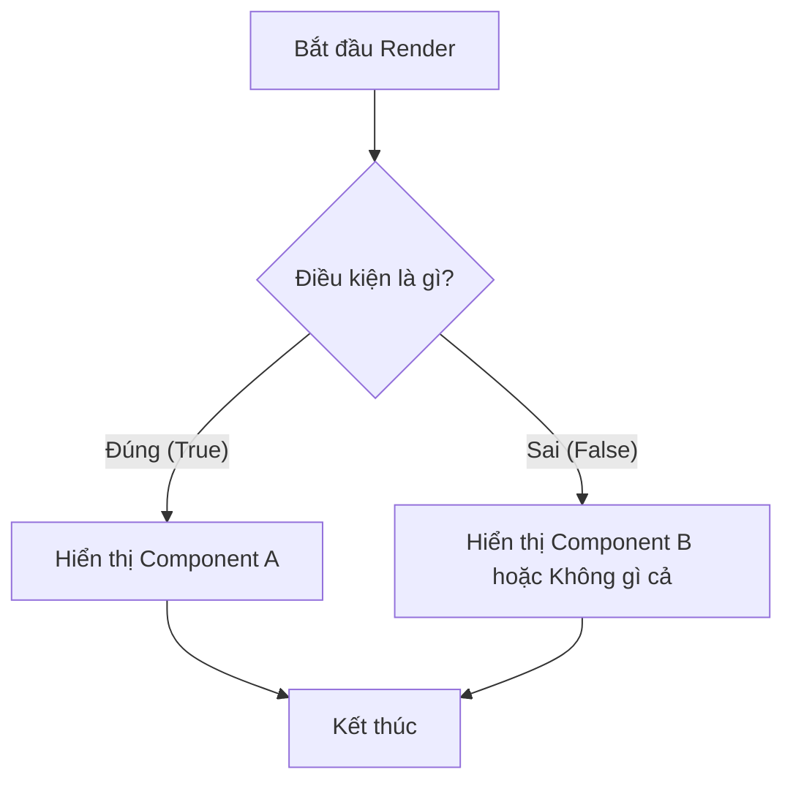

# Bài 04: Render có điều kiện - Cách React "quyết định" hiển thị 💡

Không phải lúc nào chúng ta cũng muốn hiển thị mọi thứ lên màn hình. Đôi khi bạn cần đăng nhập mới thấy được nội dung, hoặc hiển thị thông báo lỗi khi có vấn đề. Đó gọi là **Conditional Rendering**.

## 1. Dùng Ternary Operator (Toán tử 3 ngôi) `? :`

Đây là cách phổ biến nhất khi bạn muốn chọn giữa 2 lựa chọn (Ví dụ: Đăng nhập hay Đăng xuất).

### 💡 Ẩn dụ cho Newbie:
Giống như một cái công tắc đèn. Nếu bật (true) thì đèn sáng, nếu tắt (false) thì đèn tối.

**Ví dụ:**
```jsx
{isLoggedIn ? <LogoutButton /> : <LoginButton />}
```

---

## 2. Dùng Short-circuit (&&)

Dùng khi bạn chỉ muốn hiển thị một thứ nếu điều kiện là đúng, và không hiển thị gì cả nếu điều kiện sai.

### 💡 Ẩn dụ cho Newbie:
Giống như một bác bảo vệ ở cửa rạp phim. **Nếu** bạn có vé **VÀ** (&&) vé hợp lệ, bạn được vào xem phim. Nếu không có vé, bạn đứng ngoài (không có gì hiện ra).

**Ví dụ:**
```jsx
{hasNotifications && <span className="badge">New!</span>}
```

---

## 3. Dùng If/Else (Ngoài JSX)

Đôi khi logic quá phức tạp, chúng ta sẽ dùng `if/else` truyền thống bên trên câu lệnh `return`.

### 💡 Ẩn dụ cho Newbie:
Giống như việc bạn chọn trang phục trước khi ra khỏi nhà. Bạn đứng trước gương, kiểm tra thời tiết rồi mới quyết định mặc gì.

**Ví dụ:**
```jsx
function App() {
  const status = "loading";

  if (status === "loading") {
    return <p>Đang tải dữ liệu...</p>;
  }

  return <div>Nội dung chính của trang web</div>;
}
```

---

## Sơ đồ logic Render có điều kiện:



---

**Tóm tắt bài học:**
1.  Dùng **`? :`** khi có 2 lựa chọn đối lập.
2.  Dùng **`&&`** khi chỉ muốn hiển thị hoặc ẩn một thứ.
3.  Dùng **`if/else`** khi logic phức tạp và muốn code gọn gàng hơn.

**⚠️ Lưu ý:** Cẩn thận khi dùng `&&` với số `0`. Nếu điều kiện là số `0`, React sẽ in số `0` ra màn hình thay vì ẩn nó đi. Hãy dùng `count > 0 && ...` cho chắc chắn nhé!

Hẹn gặp bạn ở bài tiếp theo về Hooks! 🚀
