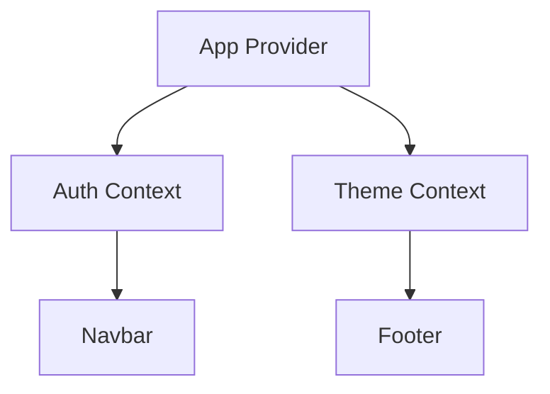

# Context & State Management: Khi nào và Như thế nào?

Quản lý state là một trong những thách thức lớn nhất của React. Chúng ta cần phân loại state để có chiến lược đúng đắn.

## 1. Phân loại State

- **Local State**: `useState`, `useReducer`.
- **Global State**: Chia sẻ giữa nhiều component (Theme, User Auth).
- **Server State**: Dữ liệu từ API (Caching, Loading, Error).

## 2. Context API + useReducer (The Native Way)

Dùng cho Global State không thay đổi quá thường xuyên.
**Vấn đề của Context:** Khi giá trị Context thay đổi, **tất cả** component sử dụng Context đó đều render lại.

**Giải pháp:** Chia nhỏ Context hoặc sử dụng `useMemo` bên trong Provider.



## 3. Zustand: Đơn giản và Mạnh mẽ

Zustand là một thư viện quản lý state cực nhẹ (1KB), không cần Provider bao quanh toàn bộ app, và quan trọng nhất là nó giải quyết vấn đề re-render thừa của Context.

```javascript
import { create } from 'zustand'

const useStore = create((set) => ({
  count: 0,
  inc: () => set((state) => ({ count: state.count + 1 })),
}))
```

## 4. TanStack Query (React Query): Master Server State

Đừng dùng `useEffect` để fetch data nếu bạn muốn làm app chuyên nghiệp. TanStack Query giúp bạn:
- Caching dữ liệu.
- Tự động refetch khi tab được focus.
- Quản lý trạng thái Loading/Error cực dễ.

```javascript
const { data, isLoading } = useQuery({
  queryKey: ['todos'],
  queryFn: fetchTodos,
})
```

## 5. Kiến trúc "Single Source of Truth"

Hãy cố gắng giữ state ở nơi gần nhất có thể với nơi nó được sử dụng. Chỉ đưa lên Global State khi thực sự cần thiết.

---
**Gợi ý thực hành:** Hãy thử build một ứng dụng Todo List sử dụng `useReducer` cho logic thêm/xóa và `Context` để truyền state xuống các component con sâu hơn.
