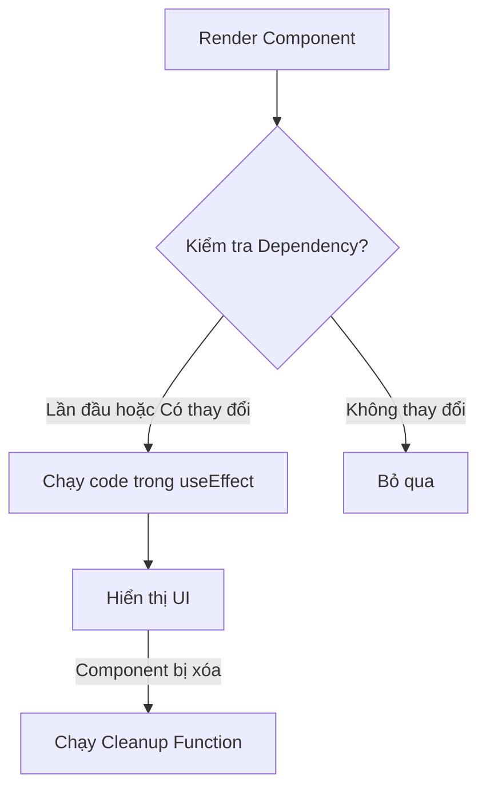

# Bài 05: Hooks, Vòng đời và useEffect - Kết nối với thế giới bên ngoài 🌍

Trong bài này, chúng ta sẽ học cách xử lý các tác vụ bên lề (Side Effects) như gọi API, thiết lập bộ đếm thời gian, hoặc tương tác trực tiếp với DOM thông qua Hook quan trọng: `useEffect`.

## 1. Vòng đời của một Component (Lifecycle)

Mọi Component trong React đều trải qua 3 giai đoạn chính:
1.  **Mounting (Sinh ra):** Khi Component lần đầu tiên xuất hiện trên màn hình.
2.  **Updating (Lớn lên):** Khi State hoặc Props thay đổi, Component vẽ lại (Re-render).
3.  **Unmounting (Mất đi):** Khi Component bị xóa khỏi màn hình.

### 💡 Ẩn dụ cho Newbie:
Hãy tưởng tượng Component là một cửa hàng.
- **Mounting:** Ngày khai trương cửa hàng.
- **Updating:** Nhập thêm hàng mới hoặc đổi bảng hiệu (khi có thay đổi).
- **Unmounting:** Đóng cửa hàng vĩnh viễn.

---

## 2. useEffect - Trợ lý đa năng 🤖

`useEffect` cho phép bạn thực hiện các hành động sau khi Component đã render xong.

### Sơ đồ hoạt động của useEffect:


### Các cách dùng phổ biến:

#### 1. Chạy một lần duy nhất (Khi khai trương)
Dùng khi bạn muốn gọi API lấy dữ liệu ngay khi trang web vừa tải xong.
```javascript
useEffect(() => {
  console.log("Cửa hàng đã khai trương!");
  // Gọi API ở đây
}, []); // 👈 Mảng rỗng [] có nghĩa là chỉ chạy 1 lần
```

#### 2. Chạy khi có thay đổi (Nhập hàng mới)
Dùng khi bạn muốn làm gì đó mỗi khi một biến nào đó thay đổi.
```javascript
useEffect(() => {
  console.log("Số lượng hàng đã thay đổi:", count);
}, [count]); // 👈 Chạy lại mỗi khi 'count' thay đổi
```

#### 3. Cleanup Function (Dọn dẹp trước khi đóng cửa)
Dùng để xóa bỏ các bộ đếm, kết nối WebSocket để tránh rò rỉ bộ nhớ.
```javascript
useEffect(() => {
  const timer = setInterval(() => {
    console.log("Đang đếm...");
  }, 1000);

  // Hàm dọn dẹp (Cleanup)
  return () => {
    clearInterval(timer);
    console.log("Đã dọn dẹp bộ đếm!");
  };
}, []);
```

---

## 3. Những lưu ý "sống còn"

1.  **Đừng quên Dependency Array:** Nếu bạn quên `[]`, effect sẽ chạy lại **mỗi lần** Component render, có thể gây treo máy nếu bạn gọi API trong đó.
2.  **Mỗi Effect một nhiệm vụ:** Đừng nhồi nhét quá nhiều logic vào một `useEffect`. Hãy chia nhỏ chúng ra để dễ quản lý.

---

**Tóm tắt bài học:**
1.  **Mounting:** Chạy 1 lần (`[]`).
2.  **Updating:** Chạy khi biến trong `[...]` thay đổi.
3.  **Unmounting:** Chạy hàm `return () => { ... }`.

Thử dùng `useEffect` để fetch một danh sách từ API công khai (như JSONPlaceholder) xem sao nhé! 🚀
