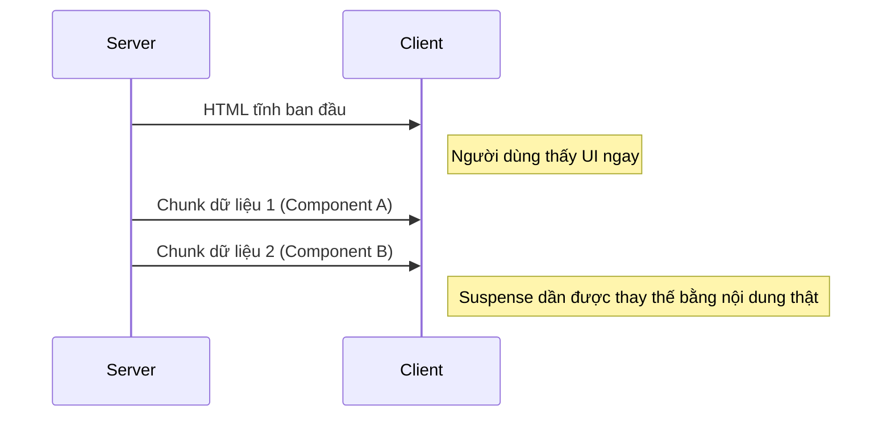

# Concurrent React & Suspense: Tương lai của Async UI

Concurrent React không phải là một tính năng đơn lẻ, mà là một cơ chế cho phép React làm nhiều việc cùng lúc (hoặc xen kẽ).

## 1. Cơ chế "Interruptible Rendering"

Trước đây, khi React bắt đầu render, nó không thể bị dừng lại cho đến khi xong. Với Concurrent Mode, React có thể tạm dừng một quá trình render đang tốn nhiều thời gian để xử lý một sự kiện quan trọng hơn (như click chuột), sau đó quay lại làm tiếp.

## 2. Suspense cho Data Fetching

`Suspense` cho phép bạn "chờ" một cái gì đó và hiển thị một UI thay thế (fallback) trong lúc chờ.

```javascript
<Suspense fallback={<Skeleton />}>
  <UserData />
</Suspense>
```

**Cách hoạt động bên dưới:**
Khi `UserData` cố gắng fetch data, nó sẽ "ném" (throw) một Promise. React bắt được Promise này, hiển thị fallback, và khi Promise hoàn thành, React sẽ render lại component đó.

## 3. `useDeferredValue` chuyên sâu

Hãy tưởng tượng bạn có một ô tìm kiếm. Khi người dùng gõ, bạn muốn cập nhật ô input ngay lập tức, nhưng danh sách kết quả (rất nặng) có thể cập nhật trễ một chút để không gây lag.

```javascript
const [query, setQuery] = useState('');
const deferredQuery = useDeferredValue(query);

return (
  <>
    <input value={query} onChange={e => setQuery(e.target.value)} />
    <SlowList text={deferredQuery} />
  </>
);
```

React sẽ render `SlowList` ở một mức ưu tiên thấp hơn.

## 4. Tương lai: Server Components kết hợp Suspense

Đây là sự kết hợp mạnh mẽ nhất. Server sẽ render HTML cho các phần tĩnh và "stream" các phần động (trong thẻ Suspense) xuống client ngay khi chúng sẵn sàng.



## 5. Transition và Loading State

Dùng `isPending` từ `useTransition` để hiển thị trạng thái đang xử lý mà không làm treo UI.

---
**Gợi ý thực hành:** Hãy thử sử dụng `Suspense` kết hợp với `React.lazy` để code-splitting các trang trong ứng dụng của bạn.
