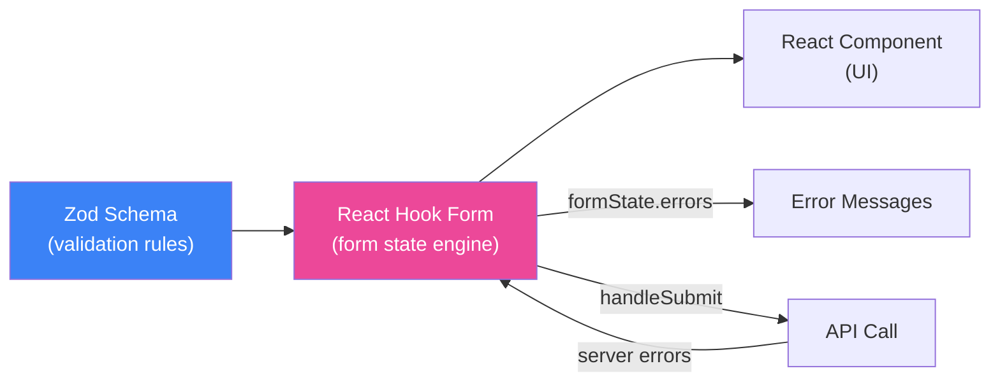

# Bài 06: Forms & Validation — React Hook Form + Zod Mastery 📝

> **Mục tiêu**: Làm chủ hoàn toàn RHF + Zod từ form đơn giản đến enterprise patterns: conditional validation, nested objects, FieldArray, server error mapping, và reusable form components cho PDMS.

---

## 🗺️ Kiến trúc Form Stack



**Phân công rõ ràng:**
- **Zod** — định nghĩa schema + type inference (source of truth)
- **RHF** — quản lý form state, re-render tối thiểu, validation trigger
- **Component** — UI thuần, không business logic

---

## 1. Setup: Zod Schema → TypeScript Type

```typescript
import { z } from 'zod';

// Schema định nghĩa TOÀN BỘ validation rules
const loanApplicationSchema = z.object({
  // Thông tin khách hàng
  borrowerName: z.string()
    .min(2, 'Họ tên ít nhất 2 ký tự')
    .max(100, 'Họ tên không quá 100 ký tự'),

  cifCode: z.string()
    .regex(/^CIF\d{6}$/, 'Mã CIF không đúng định dạng (VD: CIF123456)'),

  phoneNumber: z.string()
    .regex(/^(0|84)\d{9}$/, 'Số điện thoại không hợp lệ'),

  // Thông tin khoản vay
  loanAmount: z.number({
    required_error: 'Vui lòng nhập số tiền vay',
    invalid_type_error: 'Số tiền phải là số'
  })
    .min(10_000_000, 'Số tiền tối thiểu 10 triệu VND')
    .max(50_000_000_000, 'Số tiền tối đa 50 tỷ VND'),

  loanTermMonths: z.number().int().min(1).max(360),

  purpose: z.enum(['MUA_NHA', 'KINH_DOANH', 'TIEU_DUNG', 'KHAC'], {
    errorMap: () => ({ message: 'Vui lòng chọn mục đích vay' })
  }),

  // Địa chỉ (nested object)
  address: z.object({
    province: z.string().min(1, 'Vui lòng chọn tỉnh/thành phố'),
    district: z.string().min(1, 'Vui lòng chọn quận/huyện'),
    detail: z.string().min(5, 'Địa chỉ chi tiết ít nhất 5 ký tự')
  }),

  // Tài sản đảm bảo (array)
  collaterals: z.array(z.object({
    type: z.enum(['REAL_ESTATE', 'VEHICLE', 'SAVINGS']),
    description: z.string().min(1, 'Vui lòng mô tả tài sản'),
    estimatedValue: z.number().min(1_000_000, 'Giá trị tối thiểu 1 triệu')
  })).min(1, 'Cần ít nhất 1 tài sản đảm bảo'),

  agreedToTerms: z.literal(true, {
    errorMap: () => ({ message: 'Bạn phải đồng ý với điều khoản' })
  })
})
// Cross-field validation: refine
.refine(
  data => !(data.loanAmount > 1_000_000_000 && data.loanTermMonths < 12),
  {
    message: 'Vay trên 1 tỷ phải có thời hạn ít nhất 12 tháng',
    path: ['loanTermMonths'] // lỗi sẽ xuất hiện ở field này
  }
);

// Tự động sinh TypeScript type từ schema
type LoanApplicationFormData = z.infer<typeof loanApplicationSchema>;
```

---

## 2. Form Hook cơ bản + RHF patterns

```typescript
import { useForm, Controller } from 'react-hook-form';
import { zodResolver } from '@hookform/resolvers/zod';

function LoanApplicationForm() {
  const {
    register,           // đăng ký input HTML native
    control,            // dùng cho custom/UI library components
    handleSubmit,       // wrap submit handler
    formState: { errors, isSubmitting, isDirty, dirtyFields },
    reset,              // reset form
    setValue,           // set value programmatically
    watch,              // watch field values
    setError,           // set server errors
    getValues,          // lấy giá trị tại thời điểm gọi
    trigger             // validate thủ công
  } = useForm<LoanApplicationFormData>({
    resolver: zodResolver(loanApplicationSchema),
    defaultValues: {
      loanTermMonths: 12,
      purpose: 'TIEU_DUNG',
      collaterals: [],
      agreedToTerms: false
    },
    mode: 'onBlur' // validate khi blur, không validate mỗi keystroke
  });

  // Watch để reactive UI
  const loanAmount = watch('loanAmount');
  const purpose = watch('purpose');

  const onSubmit = async (data: LoanApplicationFormData) => {
    try {
      const result = await loanService.createApplication(data);
      reset(); // clear form sau khi thành công
      router.push(`/cases/${result.caseId}`);
    } catch (err: any) {
      if (err.status === 422 && err.data.fieldErrors) {
        // Map server errors vào form fields
        Object.entries(err.data.fieldErrors).forEach(([field, message]) => {
          setError(field as keyof LoanApplicationFormData, {
            type: 'server',
            message: message as string
          });
        });
      }
    }
  };

  return (
    <form onSubmit={handleSubmit(onSubmit)}>
      {/* Native inputs dùng register */}
      <div>
        <label>Họ tên khách hàng *</label>
        <input {...register('borrowerName')} />
        {errors.borrowerName && <span className="error">{errors.borrowerName.message}</span>}
      </div>

      <div>
        <label>Số tiền vay *</label>
        <input
          type="number"
          {...register('loanAmount', { valueAsNumber: true })}
        />
        {errors.loanAmount && <span className="error">{errors.loanAmount.message}</span>}
      </div>

      {/* Cross-field error */}
      {errors.loanTermMonths && (
        <span className="error">{errors.loanTermMonths.message}</span>
      )}

      {/* Controller cho custom Select component */}
      <Controller
        control={control}
        name="purpose"
        render={({ field, fieldState }) => (
          <CustomSelect
            {...field}
            options={purposeOptions}
            error={fieldState.error?.message}
          />
        )}
      />

      <button type="submit" disabled={isSubmitting}>
        {isSubmitting ? 'Đang gửi...' : 'Nộp hồ sơ'}
      </button>
    </form>
  );
}
```

---

## 3. useFieldArray — Danh sách động

```typescript
import { useFieldArray } from 'react-hook-form';

function CollateralSection({ control, errors }: {
  control: Control<LoanApplicationFormData>;
  errors: FieldErrors<LoanApplicationFormData>;
}) {
  const { fields, append, remove, move } = useFieldArray({
    control,
    name: 'collaterals'
  });

  return (
    <section>
      <h3>Tài sản đảm bảo</h3>

      {fields.map((field, index) => (
        <div key={field.id} className="collateral-row">
          {/* QUAN TRỌNG: dùng field.id làm key, không dùng index */}
          <Controller
            control={control}
            name={`collaterals.${index}.type`}
            render={({ field: typeField }) => (
              <select {...typeField}>
                <option value="REAL_ESTATE">Bất động sản</option>
                <option value="VEHICLE">Phương tiện</option>
                <option value="SAVINGS">Sổ tiết kiệm</option>
              </select>
            )}
          />
          <input
            {...register(`collaterals.${index}.description`)}
            placeholder="Mô tả tài sản"
          />
          <input
            type="number"
            {...register(`collaterals.${index}.estimatedValue`, { valueAsNumber: true })}
            placeholder="Giá trị ước tính"
          />
          {errors.collaterals?.[index]?.estimatedValue && (
            <span className="error">{errors.collaterals[index]!.estimatedValue!.message}</span>
          )}
          <button type="button" onClick={() => remove(index)}>Xóa</button>
        </div>
      ))}

      {errors.collaterals?.root && (
        <span className="error">{errors.collaterals.root.message}</span>
      )}

      <button
        type="button"
        onClick={() => append({ type: 'REAL_ESTATE', description: '', estimatedValue: 0 })}
      >
        + Thêm tài sản đảm bảo
      </button>
    </section>
  );
}
```

---

## 4. Conditional Validation với Zod

```typescript
// Schema thay đổi tùy loại yêu cầu — discriminatedUnion
const documentRequestSchema = z.discriminatedUnion('requestType', [
  z.object({
    requestType: z.literal('NEW_CASE'),
    cifCode: z.string().min(1, 'Bắt buộc nhập CIF'),
    documentList: z.array(z.string()).min(1)
  }),
  z.object({
    requestType: z.literal('SUPPLEMENT'),
    existingCaseId: z.string().min(1, 'Bắt buộc nhập mã hồ sơ'),
    supplementReason: z.string().min(10, 'Lý do bổ sung ít nhất 10 ký tự')
  }),
  z.object({
    requestType: z.literal('AMENDMENT'),
    existingCaseId: z.string().min(1),
    amendmentFields: z.array(z.string()).min(1, 'Chọn ít nhất 1 trường cần sửa')
  })
]);

// Trong component — conditional rendering + validation
function DocumentRequestForm() {
  const { watch, register, control, handleSubmit, formState: { errors } } = useForm({
    resolver: zodResolver(documentRequestSchema),
    defaultValues: { requestType: 'NEW_CASE' }
  });

  const requestType = watch('requestType');

  return (
    <form>
      <Controller
        control={control}
        name="requestType"
        render={({ field }) => (
          <RadioGroup {...field} options={['NEW_CASE', 'SUPPLEMENT', 'AMENDMENT']} />
        )}
      />

      {requestType === 'NEW_CASE' && (
        <input {...register('cifCode')} placeholder="Mã CIF" />
      )}

      {requestType === 'SUPPLEMENT' && (
        <>
          <input {...register('existingCaseId')} placeholder="Mã hồ sơ hiện tại" />
          <textarea {...register('supplementReason')} placeholder="Lý do bổ sung" />
        </>
      )}

      {/* errors tự động đúng với requestType đang chọn */}
    </form>
  );
}
```

---

## 5. Reusable FormField Component

```typescript
// components/FormField.tsx — Component tái sử dụng
import { get } from 'react-hook-form';

interface FormFieldProps {
  label: string;
  name: string;
  errors: FieldErrors;
  required?: boolean;
  children: React.ReactNode;
  hint?: string;
}

function FormField({ label, name, errors, required, children, hint }: FormFieldProps) {
  // get() hỗ trợ nested path: 'address.province'
  const error = get(errors, name);

  return (
    <div className={`form-field ${error ? 'has-error' : ''}`}>
      <label htmlFor={name}>
        {label} {required && <span className="required">*</span>}
      </label>
      {children}
      {hint && !error && <span className="hint">{hint}</span>}
      {error && (
        <span className="error" role="alert" id={`${name}-error`}>
          {error.message as string}
        </span>
      )}
    </div>
  );
}

// Cách dùng
<FormField label="Mã CIF" name="cifCode" errors={errors} required hint="Định dạng: CIF + 6 chữ số">
  <input {...register('cifCode')} id="cifCode" />
</FormField>
```

---

## 6. Form State & UX Patterns

```typescript
function LoanApplicationForm() {
  const { formState: { errors, isSubmitting, isDirty, isValid, touchedFields } } = useForm(/*...*/);

  // isDirty: form đã được chỉnh sửa → confirm khi rời trang
  useEffect(() => {
    const handleBeforeUnload = (e: BeforeUnloadEvent) => {
      if (isDirty) {
        e.preventDefault();
        e.returnValue = '';
      }
    };
    window.addEventListener('beforeunload', handleBeforeUnload);
    return () => window.removeEventListener('beforeunload', handleBeforeUnload);
  }, [isDirty]);

  return (
    <>
      {/* Progress indicator */}
      <div className="form-progress">
        {isDirty && <span>● Có thay đổi chưa lưu</span>}
        {isValid && <span>✅ Form hợp lệ</span>}
      </div>

      {/* Submit button state */}
      <button
        type="submit"
        disabled={isSubmitting || !isValid}
        className={isSubmitting ? 'loading' : ''}
      >
        {isSubmitting ? (
          <><Spinner /> Đang nộp hồ sơ...</>
        ) : (
          'Nộp hồ sơ'
        )}
      </button>
    </>
  );
}
```

---

## 📚 Tóm tắt

| Tính năng | API | Dùng khi |
|---|---|---|
| Đăng ký input | `register()` | Input HTML native |
| Custom component | `Controller` / `control` | UI library, custom inputs |
| Dynamic array | `useFieldArray` | Thêm/xóa rows |
| Cross-field validation | `refine()` trên schema | So sánh 2 fields |
| Conditional schema | `discriminatedUnion` | Form thay đổi theo type |
| Server errors | `setError()` | Map lỗi từ API |
| Watch values | `watch()` | Reactive UI theo input |

> **Bài tiếp theo →** [[07-React-Router-v6]] — Routing SPA với React Router v6
