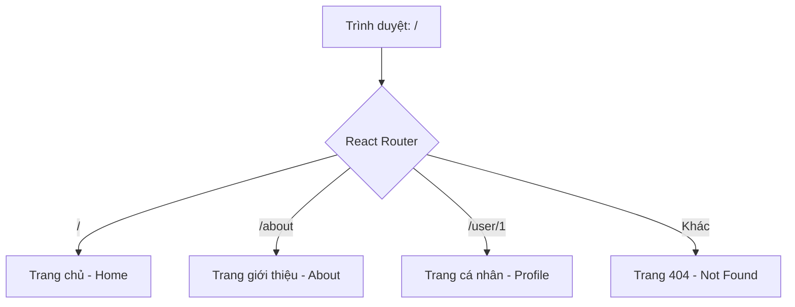

# Bài 07: React Router v6 - Bản đồ điều hướng cho ứng dụng 🗺️

Trong ứng dụng Single Page Application (SPA), chúng ta không thực sự chuyển sang trang HTML khác. Thay vào đó, chúng ta thay đổi Component hiển thị dựa trên đường dẫn (URL). **React Router** là thư viện giúp làm việc này.

## 1. Các thành phần cơ bản

### 💡 Ẩn dụ cho Newbie:
Hãy tưởng tượng ứng dụng của bạn là một tòa nhà lớn.
- **BrowserRouter:** Hệ thống GPS toàn tòa nhà.
- **Routes:** Danh sách tất cả các phòng có trong tòa nhà.
- **Route:** Địa chỉ cụ thể của từng phòng (Ví dụ: Phòng 101, Phòng 102).
- **Link:** Những cánh cửa nối giữa các phòng. Thay vì chạy ra ngoài cổng rồi mới vào phòng khác (reload trang), bạn chỉ cần bước qua cửa.

---

## 2. Thiết lập sơ đồ đường đi



### Ví dụ Code:
```jsx
import { BrowserRouter, Routes, Route, Link } from 'react-router-dom';

function App() {
  return (
    <BrowserRouter>
      <nav>
        <Link to="/">Trang chủ</Link>
        <Link to="/about">Giới thiệu</Link>
      </nav>

      <Routes>
        <Route path="/" element={<Home />} />
        <Route path="/about" element={<About />} />
        <Route path="/user/:id" element={<UserProfile />} />
      </Routes>
    </BrowserRouter>
  );
}
```

---

## 3. Các Hook quan trọng 🛠️

### `useParams`: Lấy thông tin từ URL
Dùng khi bạn muốn biết mình đang xem dữ liệu của ai (ví dụ: ID của người dùng).
```jsx
const { id } = useParams();
return <div>Đang xem hồ sơ của người dùng có ID: {id}</div>;
```

### `useNavigate`: Chuyển trang bằng code
Dùng khi bạn muốn tự động chuyển trang sau khi làm xong việc gì đó (ví dụ: sau khi Đăng nhập thành công).
```jsx
const navigate = useNavigate();

const handleLogin = () => {
  // ... xử lý đăng nhập
  navigate("/dashboard"); // Chuyển sang trang Dashboard
};
```

---

## 4. Link vs Thẻ `<a>` ⚠️

Trong React, **không bao giờ** dùng thẻ `<a>` để chuyển trang nội bộ vì nó sẽ làm trình duyệt tải lại toàn bộ trang web (mất hết State hiện tại). Luôn dùng `<Link>` hoặc `<NavLink>`.

---

**Tóm tắt bài học:**
1.  **BrowserRouter** phải bao bọc toàn bộ ứng dụng.
2.  **Link** dùng để điều hướng mà không reload trang.
3.  **useParams** lấy "biến" từ URL.
4.  **useNavigate** dùng để chuyển trang bằng code.

Hãy thử tạo một trang "Danh sách phim" và khi click vào một phim sẽ chuyển sang trang "Chi tiết phim" nhé! 🎬
