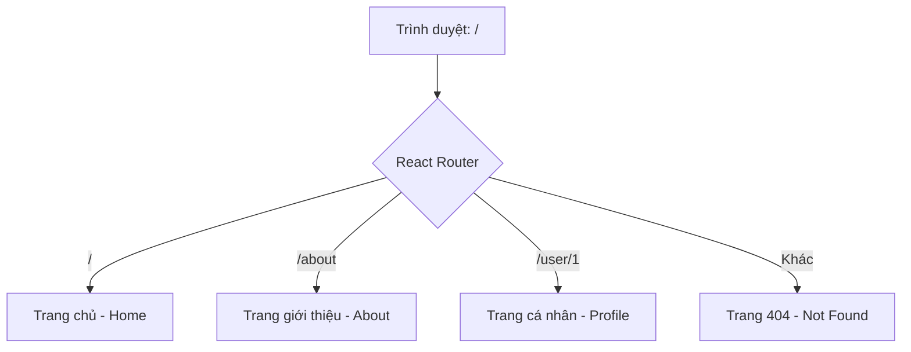

# Bài 07: React Router v6 - Bản đồ điều hướng cho ứng dụng 🗺️

Trong ứng dụng Single Page Application (SPA), chúng ta không thực sự chuyển sang trang HTML khác. Thay vào đó, chúng ta thay đổi Component hiển thị dựa trên đường dẫn (URL). **React Router** là thư viện giúp làm việc này.

## 1. Các thành phần cơ bản

### 💡 Ẩn dụ cho Newbie:
Hãy tưởng tượng ứng dụng của bạn là một tòa nhà lớn.
- **BrowserRouter:** Hệ thống GPS toàn tòa nhà.
- **Routes:** Danh sách tất cả các phòng có trong tòa nhà.
- **Route:** Địa chỉ cụ thể của từng phòng (Ví dụ: Phòng 101, Phòng 102).
- **Link:** Những cánh cửa nối giữa các phòng. Thay vì chạy ra ngoài cổng rồi mới vào phòng khác (reload trang), bạn chỉ cần bước qua cửa.

---

## 2. Thiết lập sơ đồ đường đi


```mermaid
graph TD
    A[Trình duyệt: /] --> B{React Router}
    B -- "/" --> C[Trang chủ - Home]
    B -- "/about" --> D[Trang giới thiệu - About]
    B -- "/user/1" --> E[Trang cá nhân - Profile]
    B -- "Khác" --> F[Trang 404 - Not Found]
```

### Ví dụ Code:
```jsx
import { BrowserRouter, Routes, Route, Link } from 'react-router-dom';

function App() {
  return (
    <BrowserRouter>
      <nav>
        <Link to="/">Trang chủ</Link>
        <Link to="/about">Giới thiệu</Link>
      </nav>

      <Routes>
        <Route path="/" element={<Home />} />
        <Route path="/about" element={<About />} />
        <Route path="/user/:id" element={<UserProfile />} />
      </Routes>
    </BrowserRouter>
  );
}
```

---

## 3. Các Hook quan trọng 🛠️

### `useParams`: Lấy thông tin từ URL
Dùng khi bạn muốn biết mình đang xem dữ liệu của ai (ví dụ: ID của người dùng).
```jsx
const { id } = useParams();
return <div>Đang xem hồ sơ của người dùng có ID: {id}</div>;
```

### `useNavigate`: Chuyển trang bằng code
Dùng khi bạn muốn tự động chuyển trang sau khi làm xong việc gì đó (ví dụ: sau khi Đăng nhập thành công).
```jsx
const navigate = useNavigate();

const handleLogin = () => {
  // ... xử lý đăng nhập
  navigate("/dashboard"); // Chuyển sang trang Dashboard
};
```

---

## 4. Link vs Thẻ `<a>` ⚠️

Trong React, **không bao giờ** dùng thẻ `<a>` để chuyển trang nội bộ vì nó sẽ làm trình duyệt tải lại toàn bộ trang web (mất hết State hiện tại). Luôn dùng `<Link>` hoặc `<NavLink>`.

---

**Tóm tắt bài học:**
1.  **BrowserRouter** phải bao bọc toàn bộ ứng dụng.
2.  **Link** dùng để điều hướng mà không reload trang.
3.  **useParams** lấy "biến" từ URL.
4.  **useNavigate** dùng để chuyển trang bằng code.

Hãy thử tạo một trang "Danh sách phim" và khi click vào một phim sẽ chuyển sang trang "Chi tiết phim" nhé! 🎬

---

## 📢 Cập nhật 26/07/2026 — React Router đã lên v8, v6 đã EOL

Từ khi bài này viết (05/2026), React Router đã có **2 major version mới**:

```
v6 (dạy trong bài này) → v7 (11/2024, merge với Remix) → v8 (17/06/2026, hiện tại)
```

**Tin quan trọng nhất:** kể từ khi v8 ra mắt, **React Router v6 chính thức EOL — không còn nhận security update**. Nếu dự án PDMS hoặc bài tập đang dùng v6, nên lên kế hoạch nâng cấp.

### Điều gì vẫn đúng trong bài này
Tin tốt: **toàn bộ code mẫu ở trên vẫn hoạt động đúng về mặt khái niệm.** `BrowserRouter`, `Routes`, `Route`, `Link`, `useParams`, `useNavigate` vẫn là API cốt lõi ở chế độ "library mode" (dùng React Router như một thư viện định tuyến thuần, không cần framework). Ẩn dụ "tòa nhà - GPS - cửa" vẫn áp dụng được 100%.

### Điều cần sửa ngay
```jsx
// ❌ Cách import trong bài (từ v8 trở đi: package này đã bị XOÁ)
import { BrowserRouter, Routes, Route, Link } from 'react-router-dom';

// ✅ Cách import đúng cho v7/v8
import { BrowserRouter, Routes, Route, Link } from 'react-router';
```
`react-router-dom` chỉ là một package "mirror" giúp chuyển từ v6 lên v7 dễ dàng hơn — sang v8, package này đã bị gỡ bỏ hoàn toàn. Dùng thẳng `react-router` (và `react-router/dom` cho các API riêng của DOM nếu cần).

### Điều mới nên biết (không bắt buộc học ngay ở trình độ newbie)
- **Framework Mode**: React Router giờ không chỉ là thư viện router — nó có thể đóng vai trò framework full-stack (kế thừa toàn bộ Remix), với type-safe Route Module API, code splitting thông minh, SSR/SSG, data loading/mutation tích hợp sẵn. Vẫn có thể dùng React Router "trần" như bài này dạy (Library Mode) khi chưa cần tới mức đó.
- React Router giờ theo **lịch phát hành major hàng năm** và cam kết các bản major "boring" (ít breaking change) — v8 chỉ có vài breaking change nhỏ so với v7.
- Baseline mới của v8: **Node 22.22+, React 19.2.7+, Vite 7+**, publish dạng ESM-only.
- (Unstable) đã có hỗ trợ **React Server Components / Server Actions** — chưa nên dùng cho bài học newbie, nhưng đáng biết khi lên tới Bài 13 (Server Components).

**Khuyến nghị cho series:** giữ nguyên nội dung bài học (đúng về khái niệm), chỉ cần đổi ví dụ import sang `react-router`, và cân nhắc đổi tiêu đề bài từ "React Router v6" thành "React Router" (bỏ số version) hoặc "React Router v7/v8" để không gây hiểu lầm.

*Nguồn: remix.run/blog/react-router-v8, remix.run/blog/react-router-v7 — truy cập 26/07/2026.*
