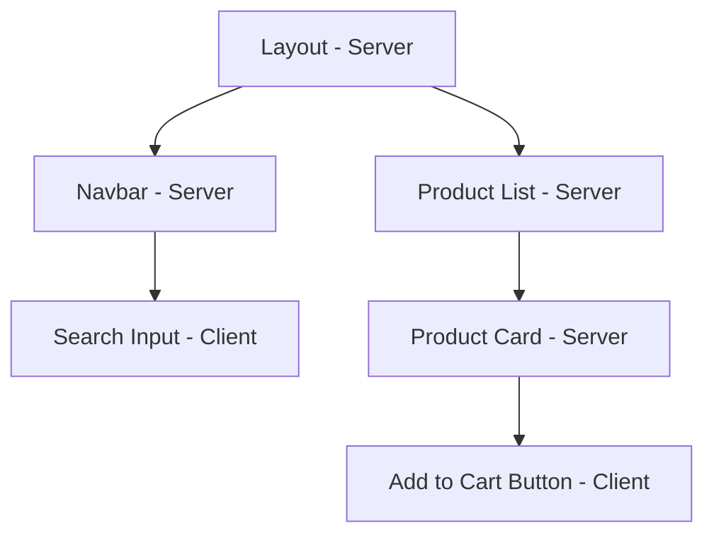

# Server Components & Next.js: Kỷ nguyên mới của React

React Server Components (RSC) là một sự thay đổi tư duy (paradigm shift) lớn nhất kể từ khi Hooks ra đời.

## 1. RSC là gì?

Khác với SSR (Server Side Rendering), RSC không chỉ trả về HTML. Nó cho phép component chạy **chỉ trên server**, truy cập trực tiếp vào Database hoặc File System, và gửi một định dạng nhị phân đặc biệt xuống client mà không cần JavaScript bundle cho component đó.

## 2. RSC vs Client Components

| Tính năng | Server Components | Client Components |
| :--- | :--- | :--- |
| **Môi trường** | Chỉ chạy trên Server | Chạy trên cả Server & Client |
| **Interactivity** | Không (No hooks, no events) | Có (useState, useEffect, onClick) |
| **Data Fetching** | Truy cập DB trực tiếp (async/await) | Qua API (fetch) |
| **Bundle Size** | 0KB (Không gửi JS xuống client) | Có gửi JS xuống client |

## 3. Khi nào dùng cái nào?

- **Dùng Server Components (Mặc định):** Cho các trang tĩnh, lấy dữ liệu, SEO, thành phần UI không tương tác.
- **Dùng Client Components:** Khi cần dùng Hooks (`useState`, `useEffect`), lắng nghe sự kiện, hoặc dùng các thư viện browser-only.

## 4. Hybrid Model & Next.js App Router

Next.js sử dụng App Router để quản lý sự kết hợp này.



**Quy tắc "Lá" (Leaf Components):** Hãy cố gắng đẩy các Client Components xuống mức thấp nhất có thể của cây component để tối ưu hóa hiệu năng.

## 5. Server Actions

Cho phép bạn gọi các hàm chạy trên server trực tiếp từ form hoặc button ở client, xóa bỏ ranh giới giữa Frontend và Backend.

```javascript
// app/actions.js
'use server'
export async function createPost(formData) {
  // Chạy trực tiếp trên server, an toàn với DB
}
```

---
**Gợi ý thực hành:** Hãy tạo một ứng dụng Next.js đơn giản, sử dụng một Server Component để fetch dữ liệu từ một public API và truyền nó xuống một Client Component để hiển thị một biểu đồ tương tác.
