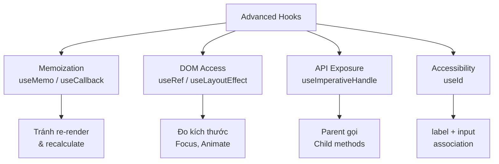
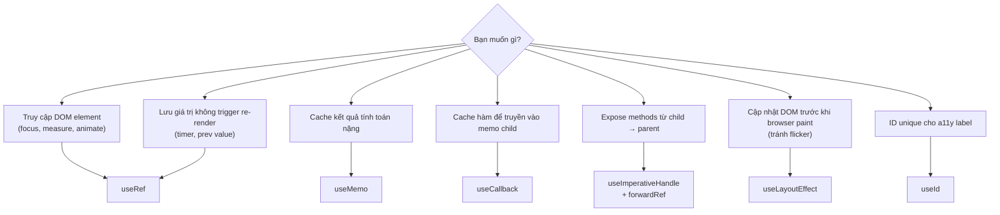

# Bài 08: Advanced Hooks — useRef, useMemo, useCallback, useId, useImperativeHandle, useLayoutEffect ⚡

> **Mục tiêu**: Hiểu sâu cơ chế hoạt động của từng hook nâng cao, biết chính xác khi nào nên/không nên dùng, và áp dụng `useImperativeHandle`, `useLayoutEffect`, `useId` vào UI components enterprise.

---

## 🗺️ Tổng quan



---

## 1. `useRef` — Không chỉ là DOM access

### 1.1 DOM Reference

```typescript
import { useRef, useEffect } from 'react';

function SearchInput({ autoFocus }: { autoFocus?: boolean }) {
  const inputRef = useRef<HTMLInputElement>(null);

  // focus sau khi mount
  useEffect(() => {
    if (autoFocus) {
      inputRef.current?.focus();
    }
  }, [autoFocus]);

  const clearAndFocus = () => {
    if (inputRef.current) {
      inputRef.current.value = '';
      inputRef.current.focus();
    }
  };

  return (
    <div>
      <input ref={inputRef} placeholder="Tìm kiếm hồ sơ..." />
      <button onClick={clearAndFocus}>Xóa</button>
    </div>
  );
}
```

### 1.2 Lưu giá trị không gây re-render — Pattern quan trọng

```typescript
// useRef lưu: interval ID, timeout ID, previous value, abort controller
function CasePollingComponent({ caseId }: { caseId: string }) {
  const [caseData, setCaseData] = useState<CaseDetail | null>(null);
  const intervalRef = useRef<ReturnType<typeof setInterval> | null>(null);
  const abortControllerRef = useRef<AbortController | null>(null);

  // Lưu giá trị TRƯỚC đó để so sánh
  const prevCaseIdRef = useRef<string>(caseId);

  useEffect(() => {
    const fetchCase = async () => {
      abortControllerRef.current?.abort(); // hủy request cũ
      abortControllerRef.current = new AbortController();

      try {
        const data = await caseService.getById(caseId, {
          signal: abortControllerRef.current.signal
        });
        setCaseData(data);
      } catch (err) {
        if ((err as Error).name !== 'AbortError') {
          console.error('Fetch failed:', err);
        }
      }
    };

    fetchCase(); // lần đầu
    intervalRef.current = setInterval(fetchCase, 30_000); // poll 30s

    return () => {
      clearInterval(intervalRef.current!);
      abortControllerRef.current?.abort();
    };
  }, [caseId]);

  useEffect(() => {
    if (prevCaseIdRef.current !== caseId) {
      console.log(`CaseID changed: ${prevCaseIdRef.current} → ${caseId}`);
      prevCaseIdRef.current = caseId;
    }
  });

  return <CaseDetailView data={caseData} />;
}
```

---

## 2. `useMemo` — Cache kết quả tính toán

```typescript
import { useMemo, useState } from 'react';

interface LoanCase {
  id: string;
  status: string;
  loanAmount: number;
  cifCode: string;
  createdAt: string;
}

function CaseListWithFilter({ cases }: { cases: LoanCase[] }) {
  const [statusFilter, setStatusFilter] = useState('ALL');
  const [searchTerm, setSearchTerm] = useState('');
  const [sortOrder, setSortOrder] = useState<'asc' | 'desc'>('desc');

  // useMemo: chỉ tính lại khi cases, statusFilter, searchTerm, sortOrder thay đổi
  const filteredAndSortedCases = useMemo(() => {
    let result = cases;

    if (statusFilter !== 'ALL') {
      result = result.filter(c => c.status === statusFilter);
    }

    if (searchTerm.trim()) {
      const term = searchTerm.toLowerCase();
      result = result.filter(c =>
        c.cifCode.toLowerCase().includes(term) ||
        c.id.toLowerCase().includes(term)
      );
    }

    return [...result].sort((a, b) => {
      const diff = new Date(a.createdAt).getTime() - new Date(b.createdAt).getTime();
      return sortOrder === 'asc' ? diff : -diff;
    });
  }, [cases, statusFilter, searchTerm, sortOrder]);

  // useMemo cho tổng hợp stats
  const stats = useMemo(() => ({
    total: cases.length,
    pending: cases.filter(c => c.status === 'PENDING').length,
    totalAmount: cases.reduce((sum, c) => sum + c.loanAmount, 0)
  }), [cases]);

  return (
    <div>
      <StatsBar stats={stats} />
      {/* filters */}
      <CaseTable cases={filteredAndSortedCases} />
    </div>
  );
}
```

**Khi nào KHÔNG dùng `useMemo`?**
```typescript
// ❌ Không cần — calculation đơn giản
const fullName = useMemo(() => `${firstName} ${lastName}`, [firstName, lastName]);
// ✅ Chỉ cần:
const fullName = `${firstName} ${lastName}`;

// ❌ Không cần — array nhỏ
const doubled = useMemo(() => items.map(i => i * 2), [items]);
// Chỉ dùng useMemo khi items có hàng nghìn phần tử và component re-render thường xuyên
```

---

## 3. `useCallback` — Cache định nghĩa hàm

```typescript
import { useCallback, memo } from 'react';

// Vấn đề: Mỗi lần CaseList re-render → handleApprove là hàm MỚI
// → CaseRow nhận prop mới → re-render dù không cần thiết

const CaseRow = memo(({ caseItem, onApprove }: {
  caseItem: LoanCase;
  onApprove: (id: string) => void;
}) => {
  console.log('CaseRow render:', caseItem.id); // Nếu dùng đúng, chỉ log khi cần
  return (
    <tr>
      <td>{caseItem.cifCode}</td>
      <td>{caseItem.loanAmount.toLocaleString()}</td>
      <td>
        <button onClick={() => onApprove(caseItem.id)}>Phê duyệt</button>
      </td>
    </tr>
  );
});

function CaseList({ cases }: { cases: LoanCase[] }) {
  const [selectedId, setSelectedId] = useState<string | null>(null);

  // useCallback: hàm chỉ được tạo lại khi dependency thay đổi
  const handleApprove = useCallback(async (caseId: string) => {
    await approvalService.approve(caseId);
    // Chỉ tạo lại hàm nếu approvalService thay đổi (thực tế không bao giờ)
  }, []); // dependency array rỗng = hàm bất biến

  const handleSelect = useCallback((id: string) => {
    setSelectedId(id); // setState không cần vào dependency
    // Vì React đảm bảo setState function reference ổn định
  }, []);

  return (
    <table>
      {cases.map(c => (
        <CaseRow key={c.id} caseItem={c} onApprove={handleApprove} />
      ))}
    </table>
  );
}
```

---

## 4. `useLayoutEffect` — Đo DOM trước khi browser vẽ

```typescript
import { useLayoutEffect, useRef, useState } from 'react';

// useEffect: chạy SAU khi browser đã vẽ lên màn hình
// useLayoutEffect: chạy TRƯỚC khi browser vẽ (synchronous)
// Dùng khi: đo DOM và cần update ngay để tránh flicker

function Tooltip({ children, text }: { children: React.ReactNode; text: string }) {
  const triggerRef = useRef<HTMLDivElement>(null);
  const tooltipRef = useRef<HTMLDivElement>(null);
  const [position, setPosition] = useState({ top: 0, left: 0 });
  const [visible, setVisible] = useState(false);

  useLayoutEffect(() => {
    if (!visible || !triggerRef.current || !tooltipRef.current) return;

    const triggerRect = triggerRef.current.getBoundingClientRect();
    const tooltipRect = tooltipRef.current.getBoundingClientRect();

    // Tính toán vị trí để tooltip không bị ra ngoài viewport
    let top = triggerRect.bottom + 8;
    let left = triggerRect.left + (triggerRect.width - tooltipRect.width) / 2;

    // Clamp trong viewport
    left = Math.max(8, Math.min(left, window.innerWidth - tooltipRect.width - 8));
    if (top + tooltipRect.height > window.innerHeight - 8) {
      top = triggerRect.top - tooltipRect.height - 8; // flip lên trên
    }

    setPosition({ top, left });
    // Nếu dùng useEffect thay vì useLayoutEffect,
    // tooltip sẽ hiện ở sai vị trí 1 frame rồi jump → flicker
  }, [visible]);

  return (
    <>
      <div ref={triggerRef}
        onMouseEnter={() => setVisible(true)}
        onMouseLeave={() => setVisible(false)}
      >
        {children}
      </div>
      {visible && (
        <div
          ref={tooltipRef}
          className="tooltip"
          style={{ position: 'fixed', top: position.top, left: position.left }}
        >
          {text}
        </div>
      )}
    </>
  );
}
```

**Quy tắc:** Chỉ dùng `useLayoutEffect` khi cần đọc layout/đo DOM và mutate lại trước khi browser paint. Mọi trường hợp khác → `useEffect`.

---

## 5. `useImperativeHandle` — Expose API từ Child

```typescript
import { useRef, useImperativeHandle, forwardRef } from 'react';

// Khi nào cần: Parent muốn gọi method của Child (focus, submit, reset, scroll)
// mà không muốn lift state lên

// Định nghĩa API mà Parent có thể gọi
interface CaseSearchHandle {
  focus: () => void;
  clear: () => void;
  setValue: (value: string) => void;
}

// Child component expose API qua ref
const CaseSearchInput = forwardRef<CaseSearchHandle, {
  onSearch: (term: string) => void;
  placeholder?: string;
}>(function CaseSearchInput({ onSearch, placeholder }, ref) {
  const inputRef = useRef<HTMLInputElement>(null);
  const [value, setValue] = useState('');

  // Expose chỉ những method cần thiết (không expose toàn bộ DOM element)
  useImperativeHandle(ref, () => ({
    focus: () => inputRef.current?.focus(),
    clear: () => {
      setValue('');
      onSearch('');
      inputRef.current?.focus();
    },
    setValue: (newValue: string) => {
      setValue(newValue);
      onSearch(newValue);
    }
  }), []); // dependency: [] = stable API

  return (
    <input
      ref={inputRef}
      value={value}
      onChange={e => {
        setValue(e.target.value);
        onSearch(e.target.value);
      }}
      placeholder={placeholder}
    />
  );
});

// Parent sử dụng
function CaseManagementPage() {
  const searchRef = useRef<CaseSearchHandle>(null);

  const handleShortcut = (e: KeyboardEvent) => {
    if (e.ctrlKey && e.key === 'f') {
      e.preventDefault();
      searchRef.current?.focus(); // Gọi method của child
    }
    if (e.key === 'Escape') {
      searchRef.current?.clear();
    }
  };

  return (
    <div>
      <CaseSearchInput
        ref={searchRef}
        onSearch={handleSearch}
        placeholder="Ctrl+F để tìm kiếm"
      />
    </div>
  );
}
```

---

## 6. `useId` — ID duy nhất cho Accessibility

```typescript
import { useId } from 'react';

// Vấn đề với id hardcoded: nếu dùng component 2 lần trên 1 trang → duplicate id
// useId: React tự sinh ID unique, ổn định qua server/client (SSR safe)

function FormField({ label, children }: { label: string; children: React.ReactNode }) {
  const id = useId(); // VD: ":r0:", ":r1:", ...

  return (
    <div className="form-field">
      <label htmlFor={id}>{label}</label>
      {/* Dùng React.cloneElement để inject id vào child */}
      {React.cloneElement(children as React.ReactElement, { id })}
    </div>
  );
}

// Pattern phổ biến hơn: truyền xuống qua context hoặc prefix
function CaseFilterPanel() {
  const baseId = useId();

  return (
    <fieldset>
      <div>
        <input type="radio" id={`${baseId}-all`} name="status" value="ALL" />
        <label htmlFor={`${baseId}-all`}>Tất cả</label>
      </div>
      <div>
        <input type="radio" id={`${baseId}-pending`} name="status" value="PENDING" />
        <label htmlFor={`${baseId}-pending`}>Chờ duyệt</label>
      </div>
      {/* Tất cả id đều unique kể cả khi có 2 CaseFilterPanel trên trang */}
    </fieldset>
  );
}
```

---

## 7. Tổng hợp: Khi nào dùng hook nào?



---

## 📚 Tóm tắt

| Hook | Mục đích | Trigger re-render? |
|---|---|---|
| `useRef` | DOM access + stable value storage | ❌ Không |
| `useMemo` | Cache computation result | Không tự mình |
| `useCallback` | Cache function reference | Không tự mình |
| `useLayoutEffect` | DOM measurement → update trước paint | Có (nếu setState) |
| `useImperativeHandle` | Expose child API qua ref | ❌ Không |
| `useId` | Stable unique ID cho a11y | ❌ Không |

> **Bài tiếp theo →** [[09-Context-API-and-State-Sharing]] — Context API và khi nào nên dùng Zustand thay thế
