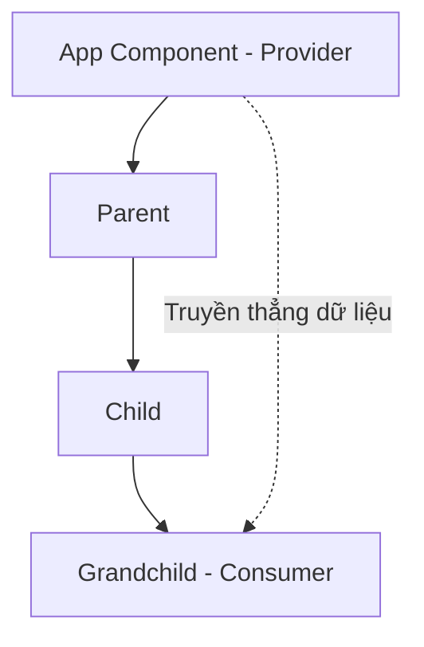

# Bài 09: Context API và Chia sẻ State - Kết nối không giới hạn 🌐

Khi ứng dụng lớn dần, việc truyền dữ liệu qua nhiều tầng Component (Prop Drilling) sẽ trở thành cơn ác mộng. **Context API** sinh ra để giải quyết vấn đề đó bằng cách tạo ra một "kênh truyền hình" mà bất cứ Component nào cũng có thể bật lên xem.

## 1. Context API là gì?

### 💡 Ẩn dụ cho Newbie:
- **Prop Drilling:** Giống như bạn muốn đưa một lá thư từ tầng 1 lên tầng 10, bạn phải nhờ người ở tầng 2, rồi tầng 3... tầng 9 cầm hộ. Rất phiền phức!
- **Context API:** Giống như bạn lắp một cái loa phát thanh toàn tòa nhà. Bạn chỉ cần đứng ở phòng điều khiển phát tin, và bất kỳ ai ở tầng nào cũng có thể nghe thấy ngay lập tức.

### Cách thức hoạt động:


---

## 2. Các bước sử dụng Context

1. **Khởi tạo:** `const MyContext = createContext();`
2. **Cung cấp (Provider):** Bao bọc các Component bằng `<MyContext.Provider value={...}>`.
3. **Tiêu thụ (Consumer):** Dùng Hook `useContext(MyContext)` để lấy dữ liệu.

```jsx
import { createContext, useContext, useState } from 'react';

const ThemeContext = createContext();

function App() {
  const [theme, setTheme] = useState('light');

  return (
    <ThemeContext.Provider value={{ theme, setTheme }}>
      <Toolbar />
    </ThemeContext.Provider>
  );
}

function Toolbar() {
  return <ThemeButton />;
}

function ThemeButton() {
  // Lấy dữ liệu trực tiếp từ Context mà không cần thông qua Toolbar
  const { theme, setTheme } = useContext(ThemeContext);
  return (
    <button onClick={() => setTheme(theme === 'light' ? 'dark' : 'light')}>
      Chế độ: {theme}
    </button>
  );
}
```

---

## 3. Nâng cấp với `useReducer`

Khi State của bạn trở nên phức tạp (ví dụ: một danh sách công việc với các hành động Thêm, Xóa, Sửa), dùng `useState` sẽ rất rối. `useReducer` giúp bạn quản lý logic tập trung hơn.

### 💡 Ẩn dụ cho Newbie:
Hãy tưởng tượng bạn đi ăn nhà hàng:
- **Action:** Tờ thực đơn bạn chọn món (ví dụ: `{ type: 'ORDER_PIZZA' }`).
- **Dispatch:** Bạn đưa thực đơn cho phục vụ.
- **Reducer:** Đầu bếp nhận thực đơn, xem bạn muốn gì và nấu món đó dựa trên nguyên liệu đang có (State cũ).
- **State:** Món ăn cuối cùng được bưng ra bàn.

```jsx
const initialState = { count: 0 };

function reducer(state, action) {
  switch (action.type) {
    case 'increment': return { count: state.count + 1 };
    case 'decrement': return { count: state.count - 1 };
    default: throw new Error();
  }
}

function Counter() {
  const [state, dispatch] = useReducer(reducer, initialState);
  return (
    <>
      Tổng: {state.count}
      <button onClick={() => dispatch({ type: 'increment' })}>+</button>
      <button onClick={() => dispatch({ type: 'decrement' })}>-</button>
    </>
  );
}
```

---

## 4. Kết hợp Context + useReducer = Redux mini
Đây là mô hình phổ biến trong các dự án thực tế để quản lý Global State (như thông tin đăng nhập, giỏ hàng) mà không cần cài thêm thư viện ngoài.

---

**Tóm tắt bài học:**
1.  **Context API**: Truyền dữ liệu xuyên tầng mà không cần qua trung gian.
2.  **Provider**: Người phát sóng dữ liệu.
3.  **useContext**: Người thu sóng dữ liệu.
4.  **useReducer**: Quản lý logic State phức tạp theo kiểu "gửi yêu cầu - xử lý tập trung".

Hãy thử tạo một `UserContext` để lưu tên người dùng sau khi đăng nhập và hiển thị nó ở Header nhé! 👤
