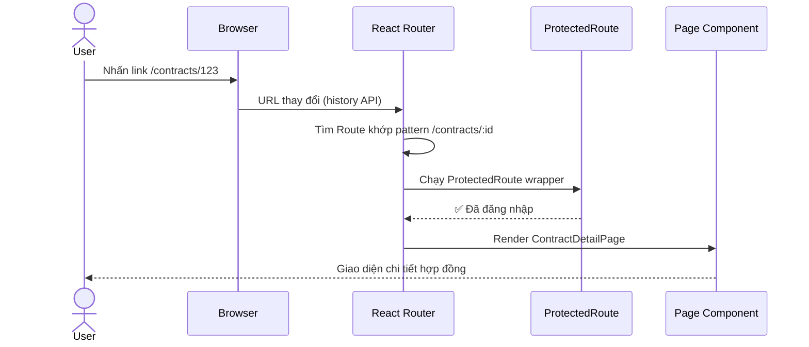
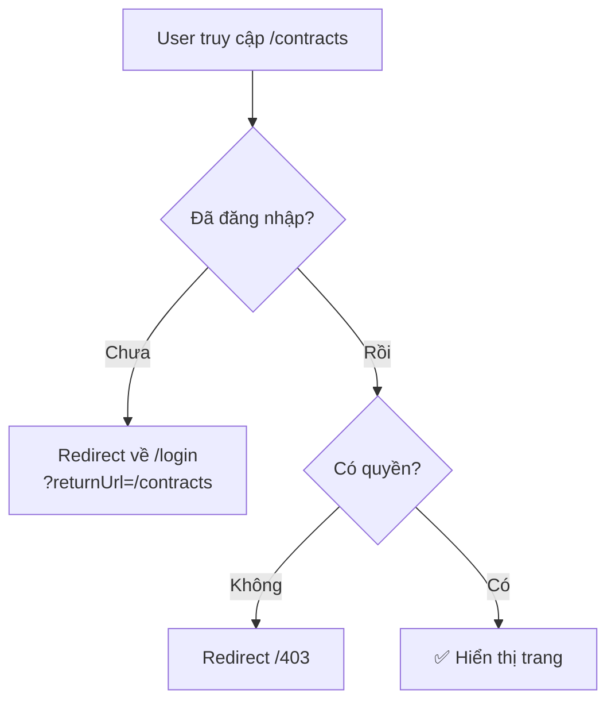

# 09 - React Router v6 — Điều hướng trong SPA 🗺️

Ứng dụng doanh nghiệp có hàng chục màn hình khác nhau. **React Router v6** là thư viện routing tiêu chuẩn để điều hướng giữa các màn hình đó mà không reload trang.

> **Cài đặt:** `npm install react-router-dom`

---

## 1. Cơ chế hoạt động



---

## 2. Setup cơ bản

```jsx
// main.jsx
import { BrowserRouter } from 'react-router-dom';

ReactDOM.createRoot(document.getElementById('root')).render(
  <BrowserRouter>
    <App />
  </BrowserRouter>
);

// App.jsx
import { Routes, Route, Navigate } from 'react-router-dom';

function App() {
  return (
    <Routes>
      {/* Redirect từ / về /dashboard */}
      <Route path="/" element={<Navigate to="/dashboard" replace />} />

      {/* Layout chung với Sidebar + Header */}
      <Route element={<MainLayout />}>
        <Route path="/dashboard"   element={<DashboardPage />} />
        <Route path="/contracts"   element={<ContractListPage />} />
        <Route path="/contracts/:id"      element={<ContractDetailPage />} />
        <Route path="/contracts/:id/edit" element={<ContractEditPage />} />
        <Route path="/customers"   element={<CustomerListPage />} />
      </Route>

      {/* Trang không cần layout (login, register) */}
      <Route path="/login"  element={<LoginPage />} />
      <Route path="/403"    element={<ForbiddenPage />} />

      {/* Trang 404 */}
      <Route path="*" element={<NotFoundPage />} />
    </Routes>
  );
}
```

---

## 3. Layout với `<Outlet>`

```jsx
// layouts/MainLayout.jsx
import { Outlet, NavLink } from 'react-router-dom';

function MainLayout() {
  return (
    <div className="app-layout">
      <aside className="sidebar">
        <nav>
          {/* NavLink tự thêm class "active" khi route khớp */}
          <NavLink to="/dashboard" className={({ isActive }) =>
            isActive ? 'nav-item active' : 'nav-item'
          }>
            📊 Dashboard
          </NavLink>
          <NavLink to="/contracts">📄 Hợp đồng</NavLink>
          <NavLink to="/customers">👥 Khách hàng</NavLink>
          <NavLink to="/reports">📈 Báo cáo</NavLink>
        </nav>
      </aside>

      <main className="main-content">
        {/* 👇 Đây là nơi các child routes được render */}
        <Outlet />
      </main>
    </div>
  );
}
```

---

## 4. Đọc Route Parameters

```jsx
import { useParams, useSearchParams, useLocation } from 'react-router-dom';

// URL: /contracts/HD001?status=ACTIVE&page=2
function ContractDetailPage() {
  // 1. Path params — /contracts/:id
  const { id } = useParams();

  // 2. Query params — ?status=ACTIVE&page=2
  const [searchParams, setSearchParams] = useSearchParams();
  const status = searchParams.get('status') ?? 'ALL';
  const page = Number(searchParams.get('page') ?? 1);

  // 3. Location — toàn bộ thông tin URL
  const location = useLocation();
  console.log(location.pathname); // /contracts/HD001
  console.log(location.search);   // ?status=ACTIVE&page=2

  // Cập nhật query params mà không reload
  const handleStatusChange = (newStatus) => {
    setSearchParams(prev => {
      prev.set('status', newStatus);
      prev.set('page', '1'); // Reset về trang 1
      return prev;
    });
  };

  return <div>Contract ID: {id}, Status: {status}</div>;
}
```

---

## 5. Điều hướng bằng code

```jsx
import { useNavigate } from 'react-router-dom';

function ContractCreatePage() {
  const navigate = useNavigate();

  const handleSubmit = async (formData) => {
    const newContract = await contractService.create(formData);
    
    // Điều hướng và truyền state (không hiện trên URL)
    navigate(`/contracts/${newContract.id}`, {
      replace: true, // Không thêm vào history (không thể back về trang tạo)
      state: { showSuccessMessage: true }
    });
  };

  const handleCancel = () => {
    navigate(-1); // Quay lại trang trước (như browser back)
    // Hoặc:
    navigate('/contracts');
  };

  return (
    <form onSubmit={handleSubmit}>
      {/* ... */}
    </form>
  );
}

// Đọc state trong trang đích
function ContractDetailPage() {
  const location = useLocation();
  const { showSuccessMessage } = location.state ?? {};

  return (
    <div>
      {showSuccessMessage && (
        <div className="success-toast">✅ Tạo hợp đồng thành công!</div>
      )}
      {/* ... */}
    </div>
  );
}
```

---

## 6. Protected Routes — Bảo vệ trang cần đăng nhập



```jsx
// components/ProtectedRoute.jsx
import { Navigate, useLocation } from 'react-router-dom';
import { useAuth } from '../hooks/useAuth';

function ProtectedRoute({ children, requiredRole }) {
  const { user, isAuthenticated } = useAuth();
  const location = useLocation();

  if (!isAuthenticated) {
    // Lưu URL hiện tại để redirect sau khi login
    return <Navigate to="/login" state={{ returnUrl: location.pathname }} replace />;
  }

  if (requiredRole && !user.roles.includes(requiredRole)) {
    return <Navigate to="/403" replace />;
  }

  return children;
}

// App.jsx — Sử dụng ProtectedRoute
<Routes>
  <Route path="/login" element={<LoginPage />} />

  {/* Bọc toàn bộ app bằng auth check */}
  <Route element={<ProtectedRoute><MainLayout /></ProtectedRoute>}>
    <Route path="/dashboard" element={<DashboardPage />} />
    <Route path="/contracts" element={<ContractListPage />} />
    
    {/* Chỉ ADMIN mới vào được */}
    <Route
      path="/admin"
      element={
        <ProtectedRoute requiredRole="ADMIN">
          <AdminPage />
        </ProtectedRoute>
      }
    />
  </Route>
</Routes>

// LoginPage — Redirect về trang muốn vào sau khi login
function LoginPage() {
  const navigate = useNavigate();
  const location = useLocation();
  const returnUrl = location.state?.returnUrl ?? '/dashboard';

  const handleLogin = async (credentials) => {
    await authService.login(credentials);
    navigate(returnUrl, { replace: true });
  };
}
```

---

## 7. Lazy Loading Routes — Tối ưu bundle size

```jsx
import { lazy, Suspense } from 'react';

// Chỉ import khi user thực sự vào trang đó
const ContractListPage  = lazy(() => import('./pages/contracts/ContractListPage'));
const ContractDetailPage = lazy(() => import('./pages/contracts/ContractDetailPage'));
const ReportsPage       = lazy(() => import('./pages/ReportsPage'));
const AdminPage         = lazy(() => import('./pages/admin/AdminPage'));

function App() {
  return (
    <Suspense fallback={<PageLoadingSpinner />}>
      <Routes>
        <Route element={<MainLayout />}>
          <Route path="/contracts"     element={<ContractListPage />} />
          <Route path="/contracts/:id" element={<ContractDetailPage />} />
          <Route path="/reports"       element={<ReportsPage />} />
          <Route path="/admin"         element={<AdminPage />} />
        </Route>
      </Routes>
    </Suspense>
  );
}
```

---

## 8. Cấu trúc thư mục cho Routing

```
src/
├── main.jsx
├── App.jsx                    ← Routes chính
├── layouts/
│   ├── MainLayout.jsx         ← Layout với Outlet
│   └── AuthLayout.jsx
├── pages/                     ← Lazy-loaded page components
│   ├── dashboard/
│   │   └── DashboardPage.jsx
│   ├── contracts/
│   │   ├── ContractListPage.jsx
│   │   ├── ContractDetailPage.jsx
│   │   └── ContractCreatePage.jsx
│   └── admin/
│       └── AdminPage.jsx
├── components/
│   └── ProtectedRoute.jsx
└── hooks/
    └── useAuth.js
```

---

**Takeaway:**
- `<Routes>` + `<Route>` định nghĩa mapping URL → Component.
- `<Outlet>` trong layout component là nơi child routes được render.
- `useParams()` lấy path params, `useSearchParams()` lấy query params.
- `useNavigate()` để điều hướng bằng code (sau submit form, etc.).
- **ProtectedRoute** wrapper bảo vệ trang cần đăng nhập/phân quyền.
- **Lazy loading** với `React.lazy()` giảm bundle size đáng kể.
