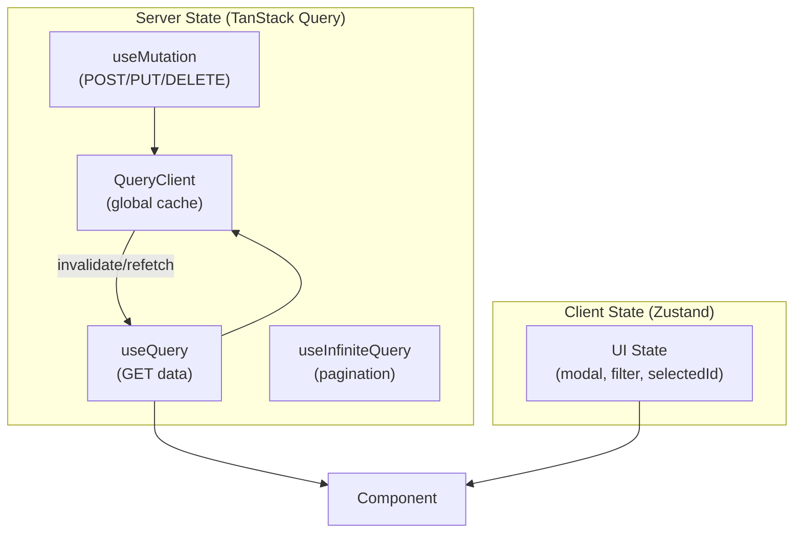

# Bài 10: Data Fetching & Error Boundaries — TanStack Query Integration 📡

> **Mục tiêu**: Xây dựng data fetching layer production-grade với TanStack Query v5: query keys, cache invalidation, optimistic updates, pagination, Suspense integration, và Error Boundaries đúng cách.

---

## 🗺️ Kiến trúc Data Fetching



---

## 1. Setup QueryClient với cấu hình enterprise

```typescript
// lib/query-client.ts
import { QueryClient } from '@tanstack/react-query';

export const queryClient = new QueryClient({
  defaultOptions: {
    queries: {
      // Coi data là fresh trong 2 phút → không refetch trong window
      staleTime: 2 * 60 * 1000,
      // Giữ cache 10 phút sau khi component unmount
      gcTime: 10 * 60 * 1000,
      // Retry 1 lần với delay 1 giây (không retry 401/403/404)
      retry: (failureCount, error: any) => {
        if ([401, 403, 404].includes(error?.status)) return false;
        return failureCount < 1;
      },
      retryDelay: 1000,
      // Refetch khi focus lại tab
      refetchOnWindowFocus: true,
      // Không refetch khi reconnect (data đủ fresh)
      refetchOnReconnect: 'always'
    },
    mutations: {
      retry: 0 // Không retry mutations
    }
  }
});

// main.tsx
import { QueryClientProvider } from '@tanstack/react-query';
import { ReactQueryDevtools } from '@tanstack/react-query-devtools';

function App() {
  return (
    <QueryClientProvider client={queryClient}>
      <RouterProvider router={router} />
      {import.meta.env.DEV && <ReactQueryDevtools />}
    </QueryClientProvider>
  );
}
```

---

## 2. Query Keys — Cấu trúc có tổ chức

```typescript
// lib/query-keys.ts — Single source of truth cho cache keys
export const caseKeys = {
  all: ['cases'] as const,
  lists: () => [...caseKeys.all, 'list'] as const,
  list: (filters: CaseSearchParams) => [...caseKeys.lists(), filters] as const,
  details: () => [...caseKeys.all, 'detail'] as const,
  detail: (id: string) => [...caseKeys.details(), id] as const,
  documents: (caseId: string) => [...caseKeys.detail(caseId), 'documents'] as const,
  history: (caseId: string) => [...caseKeys.detail(caseId), 'history'] as const,
};

// Dùng để invalidate theo nhóm
queryClient.invalidateQueries({ queryKey: caseKeys.lists() });
// invalidate tất cả list cache, không ảnh hưởng detail cache

queryClient.invalidateQueries({ queryKey: caseKeys.all });
// invalidate tất cả cache liên quan đến cases
```

---

## 3. `useQuery` — Patterns thực tế

```typescript
import { useQuery, useSuspenseQuery } from '@tanstack/react-query';

// Pattern 1: Basic query với error/loading handling
function CaseDetail({ caseId }: { caseId: string }) {
  const {
    data: caseDetail,
    isLoading,
    isError,
    error,
    isFetching, // true khi refetch (data cũ vẫn còn)
    refetch
  } = useQuery({
    queryKey: caseKeys.detail(caseId),
    queryFn: () => caseService.getById(caseId),
    enabled: !!caseId, // chỉ fetch khi có caseId
    select: (data) => ({
      ...data,
      // Transform data ngay tại query layer
      formattedAmount: new Intl.NumberFormat('vi-VN').format(data.loanAmount),
      displayStatus: STATUS_LABELS[data.status]
    })
  });

  if (isLoading) return <CaseDetailSkeleton />;
  if (isError) return <ErrorState error={error} onRetry={refetch} />;

  return (
    <div>
      {isFetching && <RefreshIndicator />}
      <h1>{caseDetail.caseCode}</h1>
      <p>{caseDetail.formattedAmount}</p>
    </div>
  );
}

// Pattern 2: Dependent queries — query B phụ thuộc query A
function CaseWithBorrower({ caseId }: { caseId: string }) {
  const { data: caseDetail } = useQuery({
    queryKey: caseKeys.detail(caseId),
    queryFn: () => caseService.getById(caseId)
  });

  const { data: borrowerInfo } = useQuery({
    queryKey: ['cif', caseDetail?.cifCode],
    queryFn: () => cifService.getByCode(caseDetail!.cifCode),
    enabled: !!caseDetail?.cifCode // chỉ chạy khi có cifCode
  });

  return <>{/* render */}</>;
}

// Pattern 3: Parallel queries
function CasePageData({ caseId }: { caseId: string }) {
  const results = useQueries({
    queries: [
      { queryKey: caseKeys.detail(caseId), queryFn: () => caseService.getById(caseId) },
      { queryKey: caseKeys.documents(caseId), queryFn: () => docService.getByCaseId(caseId) },
      { queryKey: caseKeys.history(caseId), queryFn: () => approvalService.getHistory(caseId) }
    ]
  });

  const [caseQuery, documentsQuery, historyQuery] = results;
  // ...
}
```

---

## 4. `useMutation` — Create/Update/Delete với cache sync

```typescript
import { useMutation, useQueryClient } from '@tanstack/react-query';

function ApprovalButton({ caseId }: { caseId: string }) {
  const queryClient = useQueryClient();

  const approveMutation = useMutation({
    mutationFn: (variables: { caseId: string; comment: string }) =>
      approvalService.approve(variables.caseId, variables.comment),

    // Optimistic update — cập nhật UI trước, rollback nếu lỗi
    onMutate: async (variables) => {
      // Hủy refetch đang chạy để tránh conflict
      await queryClient.cancelQueries({ queryKey: caseKeys.detail(variables.caseId) });

      // Snapshot data cũ để rollback
      const previousCase = queryClient.getQueryData<CaseDetail>(
        caseKeys.detail(variables.caseId)
      );

      // Optimistically update
      queryClient.setQueryData<CaseDetail>(
        caseKeys.detail(variables.caseId),
        (old) => old ? { ...old, status: 'APPROVED' } : old
      );

      return { previousCase }; // trả về context để onError dùng
    },

    onError: (err, variables, context) => {
      // Rollback nếu mutation thất bại
      if (context?.previousCase) {
        queryClient.setQueryData(
          caseKeys.detail(variables.caseId),
          context.previousCase
        );
      }
    },

    onSuccess: (data, variables) => {
      // Cập nhật cache với data thật từ server
      queryClient.setQueryData(caseKeys.detail(variables.caseId), data);
      // Invalidate list để reload
      queryClient.invalidateQueries({ queryKey: caseKeys.lists() });
      toast.success('Hồ sơ đã được phê duyệt');
    },

    onSettled: () => {
      // Luôn refetch sau mutation (dù thành công hay thất bại)
      queryClient.invalidateQueries({ queryKey: caseKeys.detail(caseId) });
    }
  });

  return (
    <button
      onClick={() => approveMutation.mutate({ caseId, comment: 'Approved by reviewer' })}
      disabled={approveMutation.isPending}
    >
      {approveMutation.isPending ? 'Đang xử lý...' : 'Phê duyệt'}
    </button>
  );
}
```

---

## 5. Pagination với `keepPreviousData`

```typescript
function CaseList() {
  const [page, setPage] = useState(0);
  const [status, setStatus] = useState('ALL');

  const { data, isPlaceholderData } = useQuery({
    queryKey: caseKeys.list({ page, status, size: 20 }),
    queryFn: () => caseService.search({ page, status, size: 20 }),
    placeholderData: keepPreviousData // Giữ data cũ khi đang load trang mới → không bị flash
  });

  return (
    <div>
      {/* Mờ UI khi đang load trang mới */}
      <div style={{ opacity: isPlaceholderData ? 0.5 : 1 }}>
        {data?.content.map(c => <CaseRow key={c.id} caseItem={c} />)}
      </div>

      <Pagination
        currentPage={page}
        totalPages={data?.totalPages ?? 0}
        onPageChange={setPage}
        disabled={isPlaceholderData}
      />
    </div>
  );
}
```

---

## 6. Error Boundaries — Bắt lỗi render

```typescript
// components/ErrorBoundary.tsx
import { Component, ErrorInfo, ReactNode } from 'react';
import { QueryErrorResetBoundary } from '@tanstack/react-query';

interface Props {
  children: ReactNode;
  fallback?: ReactNode;
  onReset?: () => void;
}

interface State {
  hasError: boolean;
  error: Error | null;
}

// Error Boundary vẫn phải là Class Component (React limitation)
class ErrorBoundary extends Component<Props, State> {
  state: State = { hasError: false, error: null };

  static getDerivedStateFromError(error: Error): State {
    return { hasError: true, error };
  }

  componentDidCatch(error: Error, info: ErrorInfo) {
    // Log tới Sentry, Datadog, ...
    console.error('Error caught by boundary:', error, info.componentStack);
  }

  render() {
    if (this.state.hasError) {
      return this.props.fallback ?? (
        <div className="error-boundary">
          <h3>Có lỗi xảy ra</h3>
          <p>{this.state.error?.message}</p>
          <button onClick={() => {
            this.setState({ hasError: false, error: null });
            this.props.onReset?.();
          }}>
            Thử lại
          </button>
        </div>
      );
    }
    return this.props.children;
  }
}

// Kết hợp với TanStack Query
function CasePage({ caseId }: { caseId: string }) {
  return (
    <QueryErrorResetBoundary>
      {({ reset }) => (
        <ErrorBoundary
          onReset={reset}
          fallback={<CaseErrorFallback />}
        >
          <Suspense fallback={<CaseDetailSkeleton />}>
            {/* useSuspenseQuery: throw Promise khi loading, throw Error khi lỗi */}
            <CaseDetailSuspense caseId={caseId} />
          </Suspense>
        </ErrorBoundary>
      )}
    </QueryErrorResetBoundary>
  );
}

// Dùng useSuspenseQuery thay useQuery khi bọc trong Suspense
function CaseDetailSuspense({ caseId }: { caseId: string }) {
  // Không cần isLoading/isError — Suspense và ErrorBoundary xử lý
  const { data } = useSuspenseQuery({
    queryKey: caseKeys.detail(caseId),
    queryFn: () => caseService.getById(caseId)
  });

  return <CaseDetailView data={data} />;
}
```

---

## 7. Prefetching — Tải trước data

```typescript
// Prefetch khi hover vào link (trước khi navigate)
function CaseListItem({ caseItem }: { caseItem: CaseDetail }) {
  const queryClient = useQueryClient();

  const prefetchCase = () => {
    queryClient.prefetchQuery({
      queryKey: caseKeys.detail(caseItem.id),
      queryFn: () => caseService.getById(caseItem.id),
      staleTime: 5000 // Không prefetch lại nếu data mới hơn 5 giây
    });
  };

  return (
    <tr onMouseEnter={prefetchCase}>
      <td><Link to={`/cases/${caseItem.id}`}>{caseItem.caseCode}</Link></td>
    </tr>
  );
}
```

---

## 📚 Tóm tắt

| Tính năng | API | Dùng khi |
|---|---|---|
| Fetch + cache | `useQuery` | GET data |
| Fetch + Suspense | `useSuspenseQuery` | Bọc trong `<Suspense>` |
| Fetch song song | `useQueries` | Multiple independent queries |
| CUD operations | `useMutation` | POST/PUT/DELETE |
| Infinite scroll | `useInfiniteQuery` | Load more |
| Pagination mượt | `placeholderData: keepPreviousData` | Tránh flash |
| Optimistic update | `onMutate` + `onError` rollback | UX nhanh nhạy |
| Bắt lỗi render | `ErrorBoundary` | Mọi nơi |

> **Bài tiếp theo →** [[11-Performance-Optimization]] — React.memo, virtualization với react-window, profiling
