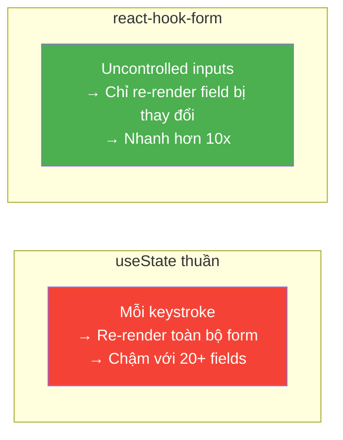

# 10 - Forms & Validation — react-hook-form + Zod 📋

Form trong dự án doanh nghiệp thường phức tạp: validation nhiều tầng, phụ thuộc điều kiện, gọi API kiểm tra async, và form nhiều bước. **react-hook-form** + **Zod** là combo hiện đại nhất để xử lý tất cả vấn đề này với performance tốt nhất.

> **Cài đặt:** `npm install react-hook-form zod @hookform/resolvers`

---

## 1. Tại sao không dùng `useState` thuần?



| Tiêu chí | useState | react-hook-form |
|:---|:---:|:---:|
| Re-renders | Nhiều | **Tối thiểu** |
| Validation | Tự viết | **Built-in + Zod** |
| Error handling | Phức tạp | **Tự động** |
| Async validation | Rất khó | **Dễ** |
| Integration Zod/Yup | Không | **Có** |

---

## 2. Form cơ bản với react-hook-form

```jsx
import { useForm } from 'react-hook-form';

function LoginForm({ onSubmit }) {
  const {
    register,         // Đăng ký field với form
    handleSubmit,     // Wrapper xử lý submit
    formState: { errors, isSubmitting } // State của form
  } = useForm({
    defaultValues: {
      email: '',
      password: ''
    }
  });

  return (
    <form onSubmit={handleSubmit(onSubmit)}>
      <div>
        <label>Email</label>
        <input
          {...register('email', {
            required: 'Email không được để trống',
            pattern: {
              value: /^[^\s@]+@[^\s@]+\.[^\s@]+$/,
              message: 'Email không hợp lệ'
            }
          })}
          type="email"
        />
        {errors.email && <span className="error">{errors.email.message}</span>}
      </div>

      <div>
        <label>Mật khẩu</label>
        <input
          {...register('password', {
            required: 'Mật khẩu không được để trống',
            minLength: { value: 8, message: 'Tối thiểu 8 ký tự' }
          })}
          type="password"
        />
        {errors.password && <span className="error">{errors.password.message}</span>}
      </div>

      <button type="submit" disabled={isSubmitting}>
        {isSubmitting ? 'Đang đăng nhập...' : 'Đăng nhập'}
      </button>
    </form>
  );
}
```

---

## 3. Schema Validation với Zod — Cách chuyên nghiệp

Zod cho phép bạn định nghĩa schema một lần, dùng cho cả **validation** và **TypeScript types**.

```typescript
// schemas/contract-schema.ts
import { z } from 'zod';

// Định nghĩa schema
export const contractSchema = z.object({
  // Thông tin khách hàng
  customer: z.object({
    fullName: z.string()
      .min(3, 'Họ tên phải có ít nhất 3 ký tự')
      .max(100, 'Họ tên không quá 100 ký tự'),
    
    idNumber: z.string()
      .regex(/^\d{12}$/, 'CCCD phải gồm đúng 12 chữ số'),
    
    phoneNumber: z.string()
      .regex(/^0\d{9}$/, 'Số điện thoại không hợp lệ (VD: 0912345678)'),
    
    email: z.string().email('Email không hợp lệ').optional().or(z.literal('')),
  }),

  // Thông tin khoản vay
  loan: z.object({
    amount: z.number({
      required_error: 'Vui lòng nhập số tiền vay',
      invalid_type_error: 'Số tiền phải là số'
    }).min(1_000_000, 'Tối thiểu 1.000.000đ').max(50_000_000_000, 'Tối đa 50 tỷ đồng'),
    
    termMonths: z.number().int().min(1).max(360, 'Tối đa 360 tháng'),
    
    interestRate: z.number().min(0).max(100),
    
    purpose: z.enum(['HOUSE', 'VEHICLE', 'BUSINESS', 'PERSONAL'], {
      errorMap: () => ({ message: 'Vui lòng chọn mục đích vay' })
    }),

    startDate: z.string(),
    endDate: z.string(),
  }).refine(
    // Cross-field validation: ngày kết thúc phải sau ngày bắt đầu
    data => new Date(data.endDate) > new Date(data.startDate),
    {
      message: 'Ngày kết thúc phải sau ngày bắt đầu',
      path: ['endDate'] // Lỗi gắn vào field endDate
    }
  ),
});

// TypeScript type được tự động sinh ra từ schema
export type ContractFormData = z.infer<typeof contractSchema>;
```

---

## 4. Kết hợp react-hook-form + Zod

```tsx
// ContractForm.tsx
import { useForm } from 'react-hook-form';
import { zodResolver } from '@hookform/resolvers/zod';
import { contractSchema, ContractFormData } from './schemas/contract-schema';

function ContractForm({ onSave }: { onSave: (data: ContractFormData) => Promise<void> }) {
  const {
    register,
    handleSubmit,
    watch,        // Xem giá trị field realtime
    setValue,     // Set giá trị programmatically
    setError,     // Set lỗi từ server
    reset,
    formState: { errors, isSubmitting, isDirty, isValid }
  } = useForm<ContractFormData>({
    resolver: zodResolver(contractSchema), // Zod xử lý toàn bộ validation
    defaultValues: {
      customer: { fullName: '', idNumber: '', phoneNumber: '' },
      loan: { amount: 0, termMonths: 12, interestRate: 8.5, purpose: 'PERSONAL' }
    },
    mode: 'onBlur' // Validate khi blur, không phải mỗi keystroke
  });

  // Watch để tính derived values
  const loanAmount = watch('loan.amount');
  const termMonths = watch('loan.termMonths');
  const interestRate = watch('loan.interestRate');
  
  const monthlyPayment = useMemo(() => {
    if (!loanAmount || !termMonths || !interestRate) return 0;
    const r = (interestRate / 100) / 12;
    const n = termMonths;
    return loanAmount * (r * Math.pow(1 + r, n)) / (Math.pow(1 + r, n) - 1);
  }, [loanAmount, termMonths, interestRate]);

  const onSubmit = async (data: ContractFormData) => {
    try {
      await onSave(data);
      reset(); // Reset form sau khi lưu thành công
    } catch (error: any) {
      // Xử lý lỗi từ server
      if (error.field) {
        setError(error.field, { message: error.message });
      }
    }
  };

  return (
    <form onSubmit={handleSubmit(onSubmit)}>
      <fieldset>
        <legend>Thông tin khách hàng</legend>
        
        <div className="form-group">
          <label>Họ và tên *</label>
          <input {...register('customer.fullName')} placeholder="Nguyễn Văn An" />
          {errors.customer?.fullName && (
            <p className="error-msg">❌ {errors.customer.fullName.message}</p>
          )}
        </div>

        <div className="form-group">
          <label>Số CCCD *</label>
          <input {...register('customer.idNumber')} placeholder="123456789012" maxLength={12} />
          {errors.customer?.idNumber && (
            <p className="error-msg">❌ {errors.customer.idNumber.message}</p>
          )}
        </div>
      </fieldset>

      <fieldset>
        <legend>Thông tin khoản vay</legend>

        <div className="form-group">
          <label>Số tiền vay *</label>
          <input
            {...register('loan.amount', { valueAsNumber: true })}
            type="number"
          />
          {errors.loan?.amount && (
            <p className="error-msg">❌ {errors.loan.amount.message}</p>
          )}
        </div>

        <div className="loan-summary">
          💰 Trả hàng tháng: <strong>{monthlyPayment.toLocaleString('vi-VN')}đ</strong>
        </div>
      </fieldset>

      <div className="form-actions">
        <button type="button" onClick={() => reset()} disabled={!isDirty}>
          Hủy thay đổi
        </button>
        <button type="submit" disabled={isSubmitting || !isValid}>
          {isSubmitting ? '⏳ Đang lưu...' : '💾 Lưu hợp đồng'}
        </button>
      </div>
    </form>
  );
}
```

---

## 5. Dynamic Fields với `useFieldArray`

```jsx
import { useForm, useFieldArray } from 'react-hook-form';

function CollateralForm() {
  const { register, control, handleSubmit } = useForm({
    defaultValues: {
      collaterals: [{ type: 'REAL_ESTATE', description: '', value: 0 }]
    }
  });

  // useFieldArray quản lý mảng fields động
  const { fields, append, remove, move } = useFieldArray({
    control,
    name: 'collaterals'
  });

  return (
    <form onSubmit={handleSubmit(console.log)}>
      {fields.map((field, index) => (
        <div key={field.id} className="collateral-row"> {/* field.id là key unique do RHF cấp */}
          <select {...register(`collaterals.${index}.type`)}>
            <option value="REAL_ESTATE">Bất động sản</option>
            <option value="VEHICLE">Phương tiện</option>
            <option value="SAVINGS">Sổ tiết kiệm</option>
          </select>

          <input
            {...register(`collaterals.${index}.description`)}
            placeholder="Mô tả tài sản"
          />

          <input
            {...register(`collaterals.${index}.value`, { valueAsNumber: true })}
            type="number"
            placeholder="Giá trị (VND)"
          />

          <button type="button" onClick={() => remove(index)}
            disabled={fields.length === 1}>
            🗑️
          </button>
        </div>
      ))}

      <button
        type="button"
        onClick={() => append({ type: 'REAL_ESTATE', description: '', value: 0 })}
      >
        ➕ Thêm tài sản đảm bảo
      </button>

      <button type="submit">Lưu</button>
    </form>
  );
}
```

---

## 6. Async Validation — Kiểm tra qua API

```jsx
function CustomerIdField() {
  const { register, formState: { errors } } = useForm();

  return (
    <div>
      <input
        {...register('customerId', {
          required: 'Vui lòng nhập mã khách hàng',
          validate: {
            // Async validator — gọi API kiểm tra
            exists: async (value) => {
              if (!value) return true;
              const response = await fetch(`/api/customers/check/${value}`);
              const { exists } = await response.json();
              return exists || 'Mã khách hàng không tồn tại trong hệ thống';
            }
          }
        })}
      />
      {errors.customerId && (
        <span className="error">{errors.customerId.message}</span>
      )}
    </div>
  );
}
```

---

## 7. Reusable FormField Component

```jsx
// components/FormField.jsx — Tránh lặp lại code error display
function FormField({ label, error, required, children }) {
  return (
    <div className={`form-field ${error ? 'has-error' : ''}`}>
      <label>
        {label}
        {required && <span className="required-mark">*</span>}
      </label>
      {children}
      {error && <p className="error-message">❌ {error}</p>}
    </div>
  );
}

// Sử dụng:
<FormField label="Họ và tên" error={errors.fullName?.message} required>
  <input {...register('fullName')} />
</FormField>
```

---

**Takeaway:**
- **react-hook-form** = performance tốt vì không controlled (không re-render mỗi keystroke).
- **Zod** = định nghĩa schema một lần, dùng cho cả validation và TypeScript types.
- `zodResolver` kết nối hai thư viện — không cần viết validation logic thủ công.
- **`useFieldArray`** cho dynamic list (thêm/xóa dòng).
- `setError` để hiển thị lỗi từ server response.
- Tạo **FormField** component tái sử dụng để tránh lặp code.
