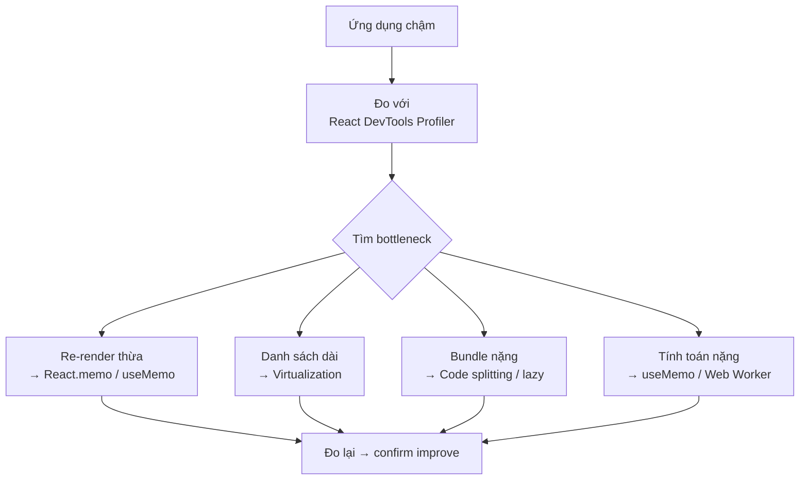
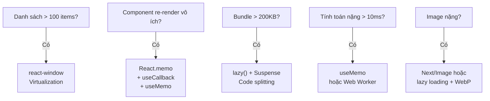

# Bài 11: Performance Optimization — Profiling, Memoization & Virtualization 🚀

> **Mục tiêu**: Đo lường đúng cách trước khi optimize, áp dụng `React.memo` + `useMemo` + `useCallback` chính xác, và virtualize danh sách lớn với `react-window` cho bảng hồ sơ 10k+ records.

---

## 🗺️ Quy trình Optimize đúng



**Quy tắc vàng: Đo trước, optimize sau. Đừng premature optimization.**

---

## 1. React DevTools Profiler — Đo re-renders

```typescript
// Bật Highlight updates trong DevTools:
// Settings → Profiler → "Highlight updates when components render"

// Dùng <Profiler> component để đo programmatic
import { Profiler, ProfilerOnRenderCallback } from 'react';

const onRender: ProfilerOnRenderCallback = (
  id,           // "CaseTable"
  phase,        // "mount" | "update" | "nested-update"
  actualDuration,  // thời gian render thực (ms)
  baseDuration,    // thời gian ước tính nếu không memo
  startTime,
  commitTime
) => {
  if (actualDuration > 16) { // > 1 frame (60fps)
    console.warn(`[Perf] ${id} took ${actualDuration.toFixed(2)}ms (${phase})`);
  }
};

function App() {
  return (
    <Profiler id="CaseTable" onRender={onRender}>
      <CaseTable cases={cases} />
    </Profiler>
  );
}
```

---

## 2. React.memo — Ngăn re-render thừa

```typescript
import { memo, useMemo, useCallback } from 'react';

// ---- Không memo: CaseRow re-render mỗi khi CaseList re-render ----
// Dù props hoàn toàn không thay đổi

// ---- Với React.memo ----
interface CaseRowProps {
  caseItem: LoanCase;
  isSelected: boolean;
  onSelect: (id: string) => void;
  onApprove: (id: string) => void;
}

const CaseRow = memo(function CaseRow({
  caseItem,
  isSelected,
  onSelect,
  onApprove
}: CaseRowProps) {
  console.log('CaseRow render:', caseItem.id); // Nên thấy ít hơn

  return (
    <tr
      className={isSelected ? 'selected' : ''}
      onClick={() => onSelect(caseItem.id)}
    >
      <td>{caseItem.caseCode}</td>
      <td>{caseItem.cifCode}</td>
      <td>{caseItem.loanAmount.toLocaleString('vi-VN')} VND</td>
      <td>
        <button onClick={(e) => { e.stopPropagation(); onApprove(caseItem.id); }}>
          Duyệt
        </button>
      </td>
    </tr>
  );
});

// ---- Parent phải dùng useCallback để không break memo ----
function CaseTable({ cases }: { cases: LoanCase[] }) {
  const [selectedId, setSelectedId] = useState<string | null>(null);
  const [page, setPage] = useState(0);

  // ✅ Stable reference → CaseRow không re-render vì onSelect
  const handleSelect = useCallback((id: string) => {
    setSelectedId(id);
  }, []); // empty dep = stable

  // ✅ Stable reference
  const handleApprove = useCallback(async (id: string) => {
    await approvalService.approve(id);
    queryClient.invalidateQueries({ queryKey: caseKeys.lists() });
  }, []);

  return (
    <table>
      <tbody>
        {cases.map(c => (
          <CaseRow
            key={c.id}
            caseItem={c}
            isSelected={selectedId === c.id}
            onSelect={handleSelect}
            onApprove={handleApprove}
          />
        ))}
      </tbody>
    </table>
  );
}
```

### Khi nào React.memo hiệu quả?

```typescript
// ✅ Có lợi: component re-render nhiều, props ít thay đổi, render nặng
const HeavyChart = memo(({ data, config }: ChartProps) => {
  // Render chart phức tạp với D3 hoặc Chart.js
  return <canvas ref={canvasRef} />;
});

// ❌ Không cần: component đơn giản, render nhanh
const Badge = memo(({ label }: { label: string }) => (
  <span className="badge">{label}</span>
)); // Overhead của memo > lợi ích

// ❌ Không có tác dụng: props là object/array tạo mới mỗi lần
<CaseRow
  style={{ color: 'red' }} // object mới mỗi render → memo vô dụng
  onAction={() => doSomething()} // arrow fn mới mỗi render → cần useCallback
/>
```

---

## 3. Virtualization với `react-window` — Render 10k+ rows

**Vấn đề**: Render 5000 row DOM là thảm họa. Scroll lag, memory spike, crash trên mobile.

**Giải pháp**: Chỉ render những row đang **visible** trong viewport (~10-20 rows).

```bash
npm install react-window
npm install @types/react-window
```

### 3.1 FixedSizeList — Tất cả rows cùng chiều cao

```typescript
import { FixedSizeList as List, ListChildComponentProps } from 'react-window';
import AutoSizer from 'react-virtualized-auto-sizer';

interface CaseVirtualListProps {
  cases: LoanCase[];
  onCaseSelect: (id: string) => void;
}

// Row component — phải dùng style từ props (vị trí tuyệt đối)
const CaseVirtualRow = memo(({ index, style, data }: ListChildComponentProps<{
  cases: LoanCase[];
  onCaseSelect: (id: string) => void;
}>) => {
  const { cases, onCaseSelect } = data;
  const caseItem = cases[index];

  return (
    // QUAN TRỌNG: phải apply style vào root element
    <div style={style} className="case-row" onClick={() => onCaseSelect(caseItem.id)}>
      <span className="case-code">{caseItem.caseCode}</span>
      <span className="cif">{caseItem.cifCode}</span>
      <span className="amount">{caseItem.loanAmount.toLocaleString('vi-VN')}</span>
      <StatusBadge status={caseItem.status} />
    </div>
  );
});

function CaseVirtualList({ cases, onCaseSelect }: CaseVirtualListProps) {
  // itemData: truyền data xuống row component mà không tạo closure mới
  const itemData = useMemo(() => ({ cases, onCaseSelect }), [cases, onCaseSelect]);

  return (
    // AutoSizer: tự động tính width/height của container
    <AutoSizer>
      {({ height, width }) => (
        <List
          height={height}
          width={width}
          itemCount={cases.length}
          itemSize={64}          // chiều cao mỗi row (px) — cố định
          itemData={itemData}
          overscanCount={5}      // render thêm 5 row ngoài viewport để scroll mượt
        >
          {CaseVirtualRow}
        </List>
      )}
    </AutoSizer>
  );
}
```

### 3.2 VariableSizeList — Rows có chiều cao khác nhau

```typescript
import { VariableSizeList as VList } from 'react-window';
import { useRef, useCallback } from 'react';

function CaseExpandableList({ cases }: { cases: LoanCase[] }) {
  const listRef = useRef<VariableSizeList>(null);
  const [expandedIds, setExpandedIds] = useState<Set<string>>(new Set());

  const getItemSize = useCallback((index: number) => {
    const caseItem = cases[index];
    return expandedIds.has(caseItem.id) ? 200 : 64; // expanded: 200px, collapsed: 64px
  }, [cases, expandedIds]);

  const toggleExpand = useCallback((id: string, index: number) => {
    setExpandedIds(prev => {
      const next = new Set(prev);
      if (next.has(id)) next.delete(id);
      else next.add(id);
      return next;
    });
    // QUAN TRỌNG: notify react-window chiều cao đã thay đổi
    listRef.current?.resetAfterIndex(index);
  }, []);

  return (
    <VList
      ref={listRef}
      height={600}
      width="100%"
      itemCount={cases.length}
      itemSize={getItemSize}
      estimatedItemSize={64}
    >
      {({ index, style }) => (
        <div style={style}>
          <div className="case-header" onClick={() => toggleExpand(cases[index].id, index)}>
            {cases[index].caseCode}
          </div>
          {expandedIds.has(cases[index].id) && (
            <div className="case-detail">{/* chi tiết */}</div>
          )}
        </div>
      )}
    </VList>
  );
}
```

### 3.3 FixedSizeGrid — Dạng lưới (Grid)

```typescript
import { FixedSizeGrid as Grid } from 'react-window';

function DocumentGrid({ documents }: { documents: DocumentRef[] }) {
  const COLUMN_COUNT = 4;
  const COLUMN_WIDTH = 200;
  const ROW_HEIGHT = 240;
  const rowCount = Math.ceil(documents.length / COLUMN_COUNT);

  return (
    <Grid
      columnCount={COLUMN_COUNT}
      columnWidth={COLUMN_WIDTH}
      height={600}
      rowCount={rowCount}
      rowHeight={ROW_HEIGHT}
      width={COLUMN_COUNT * COLUMN_WIDTH}
    >
      {({ columnIndex, rowIndex, style }) => {
        const docIndex = rowIndex * COLUMN_COUNT + columnIndex;
        const doc = documents[docIndex];
        if (!doc) return <div style={style} />; // empty cell
        return (
          <div style={style} className="doc-card">
            
            <span>{doc.fileName}</span>
          </div>
        );
      }}
    </Grid>
  );
}
```

---

## 4. Code Splitting với lazy + Suspense

```typescript
import { lazy, Suspense } from 'react';

// Lazy load heavy routes
const CaseDetailPage = lazy(() => import('./pages/CaseDetailPage'));
const AnalyticsPage = lazy(() => import('./pages/AnalyticsPage'));
const AdminPanel = lazy(() => import('./pages/AdminPanel'));

// Skeleton phù hợp với trang đang load
function PageLoader() {
  return (
    <div className="page-skeleton">
      <div className="skeleton-header" />
      <div className="skeleton-content" />
    </div>
  );
}

const router = createBrowserRouter([
  {
    path: '/cases/:id',
    element: (
      <Suspense fallback={<PageLoader />}>
        <CaseDetailPage />
      </Suspense>
    )
  },
  {
    path: '/analytics',
    element: (
      <Suspense fallback={<PageLoader />}>
        <AnalyticsPage />
      </Suspense>
    )
  }
]);
```

---

## 5. Performance Checklist



---

## 📚 Tóm tắt

| Vấn đề | Giải pháp | Impact |
|---|---|---|
| Component re-render thừa | `React.memo` + `useCallback` | Medium |
| Tính toán nặng | `useMemo` | Medium |
| Danh sách dài (>200 items) | `react-window` | **High** |
| Bundle lớn | `lazy()` + `Suspense` | **High** |
| Image | lazy load + WebP | High |
| Network waterfall | TanStack Query prefetch | Medium |

> **Bài tiếp theo →** [[12-Concurrent-Features]] — React 18 Concurrent Mode: `startTransition`, `useDeferredValue`, `useTransition`
