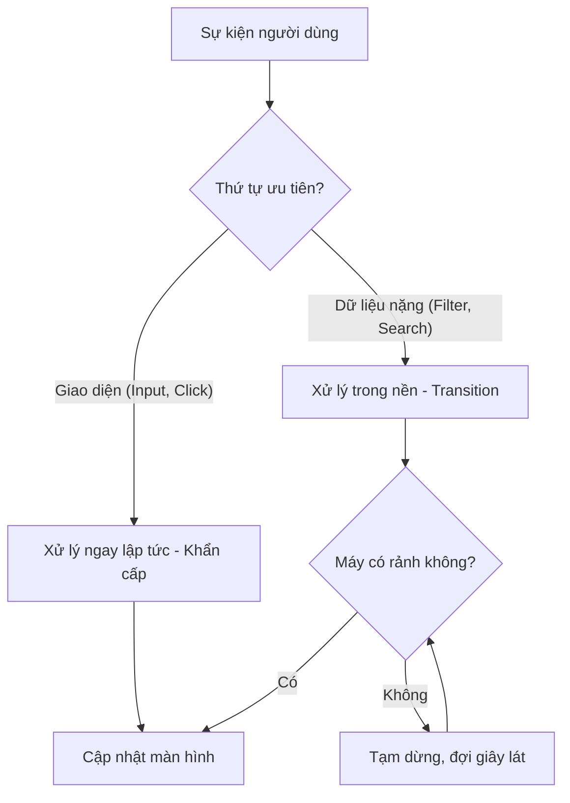

# Bài 12: Tính năng Concurrent - Đa nhiệm thông minh 🧠

Trong các phiên bản React mới (18+), React đã trở nên thông minh hơn trong việc xử lý các tác vụ nặng mà không làm "đứng" giao diện. Đó chính là nhờ các tính năng **Concurrent** (Đồng thời).

## 1. useTransition: Phân chia thứ tự ưu tiên

### 💡 Ẩn dụ cho Newbie:
Hãy tưởng tượng bạn đang nấu ăn và điện thoại reo.
- **Trước đây (Không có transition):** Bạn bắt buộc phải dừng nấu ăn, nghe điện thoại cho xong rồi mới được nấu tiếp. Nếu người gọi nói chuyện quá lâu, món ăn của bạn sẽ bị cháy (Giao diện bị lag).
- **Hiện tại (useTransition):** Bạn coi việc nấu ăn là **Ưu tiên cao** (nhập liệu ô input), và việc nghe điện thoại là **Ưu tiên thấp** (load danh sách kết quả). Bạn vẫn có thể vừa cầm điện thoại vừa đảo chảo. Nếu cuộc gọi làm bạn quá phân tâm, bạn sẽ ưu tiên tập trung vào chảo trước.

```jsx
import { useState, useTransition } from 'react';

function App() {
  const [isPending, startTransition] = useTransition();
  const [input, setInput] = useState("");
  const [list, setList] = useState([]);

  function handleChange(e) {
    // Ưu tiên cao: Cập nhật ô nhập liệu ngay lập tức
    setInput(e.target.value);

    // Ưu tiên thấp: Việc tính toán danh sách dài được đưa vào transition
    startTransition(() => {
      const l = [];
      for (let i = 0; i < 20000; i++) {
        l.push(e.target.value);
      }
      setList(l);
    });
  }

  return (
    <div>
      <input type="text" value={input} onChange={handleChange} />
      {isPending ? <p>Đang xử lý danh sách...</p> : list.map(item => <div>{item}</div>)}
    </div>
  );
}
```

---

## 2. useDeferredValue: "Trì hoãn" sự sung sướng

### 💡 Ẩn dụ cho Newbie:
Bạn đi ăn ở một nhà hàng rất đông khách. Thay vì bắt bạn đứng chờ ở cửa, nhà hàng đưa cho bạn một cái máy báo rung. Bạn có thể đi dạo loanh quanh, khi nào có bàn (dữ liệu đã sẵn sàng), máy sẽ rung để bạn quay lại. `useDeferredValue` giúp giữ lại giá trị cũ "thêm một chút nữa" trong khi giá trị mới đang được chuẩn bị.

---

## 3. Cách React xử lý Concurrent



---

## 4. Tại sao chúng ta cần nó?

Trước đây, nếu bạn có một danh sách 10.000 dòng và muốn lọc dữ liệu khi người dùng gõ vào ô tìm kiếm, ô input sẽ bị khựng lại (không gõ được chữ) vì React mải mê render danh sách. Với `useTransition`, ô input luôn mượt mà, còn danh sách sẽ cập nhật sau một chút.

---

**Tóm tắt bài học:**
1.  **Concurrent**: Khả năng làm nhiều việc cùng lúc của React.
2.  **useTransition**: Đánh dấu một thay đổi State là "không khẩn cấp".
3.  **isPending**: Trạng thái cho biết tác vụ nền đang chạy.
4.  **Trải nghiệm người dùng**: Ưu tiên phản hồi các thao tác trực tiếp của người dùng trước.

Hãy thử áp dụng `useTransition` vào một thanh tìm kiếm xem sự khác biệt nhé! 🔍
