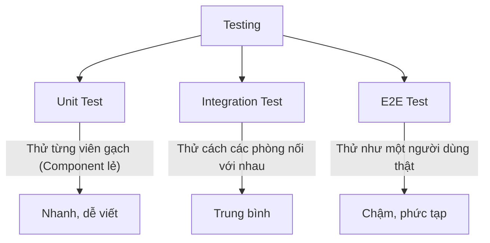

# Bài 14: Testing trong React - Để đêm về ngủ ngon giấc 😴

Viết code mà không có Test giống như bạn xây nhà mà không kiểm tra móng. Có thể bây giờ nó đứng vững, nhưng chỉ cần sửa một viên gạch nhỏ, cả tòa nhà có thể sập. **Testing** giúp bạn tự tin rằng code mình viết ra luôn chạy đúng.

## 1. Tại sao phải Testing?

### 💡 Ẩn dụ cho Newbie:
Tưởng tượng bạn là thợ làm bánh.
- **Không Testing:** Bạn làm 100 cái bánh, mang đi bán luôn. Khách hàng ăn phải cái bánh mặn chát vì bạn quên cho đường. Bạn mất uy tín.
- **Có Testing:** Trước khi bán, bạn có một chiếc máy thử tự động. Nó sẽ nếm thử một miếng nhỏ, kiểm tra xem có đủ đường, đủ bột không. Nếu máy báo "OK", bạn mới mang đi bán. Bạn yên tâm tuyệt đối!

### Các loại Test phổ biến:


---

## 2. Công cụ: Vitest & React Testing Library (RTL)

- **Vitest:** Bộ máy chạy test (thay thế cho Jest trong các dự án hiện đại).
- **React Testing Library:** Giúp bạn tương tác với Component giống như người dùng (ví dụ: tìm cái nút có chữ "Đăng nhập" và click vào nó).

---

## 3. Viết bài Test đầu tiên

Giả sử bạn có một Component hiển thị lời chào:
```jsx
// Greeting.jsx
function Greeting({ name }) {
  return <h1>Xin chào, {name}!</h1>;
}
```

Bài test sẽ trông như thế này:
```jsx
// Greeting.test.jsx
import { render, screen } from '@testing-library/react';
import { expect, test } from 'vitest';
import Greeting from './Greeting';

test('Hiển thị đúng tên người dùng', () => {
  // 1. Render component ra "phòng thí nghiệm"
  render(<Greeting name="An" />);

  // 2. Tìm dòng chữ trên màn hình
  const textElement = screen.getByText(/Xin chào, An!/i);

  // 3. Khẳng định (Expect) là nó phải tồn tại
  expect(textElement).toBeInTheDocument();
});
```

---

## 4. Tư duy Testing đúng đắn 🧠

Đừng cố test những thứ hiển nhiên (như "biến a có bằng 1 không"). Hãy test **hành vi của người dùng**:
- "Nếu tôi bấm nút này, thông báo thành công có hiện ra không?"
- "Nếu tôi nhập sai email, thông báo lỗi có đỏ lên không?"

---

**Tóm tắt bài học:**
1.  **Testing**: Đảm bảo code chạy đúng như mong đợi.
2.  **React Testing Library**: Test theo góc nhìn của người dùng.
3.  **Vitest**: Công cụ thực thi các bài test.
4.  **Tự tin**: Có test, bạn có thể thoải mái refactor code mà không sợ làm hỏng tính năng cũ.

Hãy thử viết một bài test đơn giản cho Component `Button` của bạn nhé! 🧪
