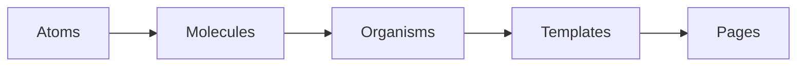

# Bài 15: Best Practices cho Dự án lớn - Chuyên nghiệp hóa 🏢

Chúc mừng bạn đã đi đến chặng đường cuối cùng! Để làm việc trong các công ty lớn (Enterprise), chỉ giỏi code thôi là chưa đủ. Bạn cần biết cách tổ chức code sao cho hàng chục người có thể cùng làm việc mà không dẫm chân lên nhau.

## 1. Atomic Design: Chia nhỏ để thống trị

### 💡 Ẩn dụ cho Newbie:
Hãy tưởng tượng bạn đang xây dựng một thành phố Lego.
- **Atoms (Nguyên tử):** Những viên gạch đơn lẻ (Cái nút, ô nhập liệu, cái nhãn).
- **Molecules (Phân tử):** Kết hợp vài viên gạch lại (Ô tìm kiếm = Input + Button).
- **Organisms (Sinh vật):** Một khu vực hoàn chỉnh (Header = Logo + Menu + SearchBar).
- **Templates:** Khung sườn của trang web.
- **Pages:** Trang web hoàn chỉnh với dữ liệu thật.



---

## 2. Cấu trúc thư mục chuẩn

Một cấu trúc rõ ràng giúp bạn tìm file trong 1 giây thay vì 1 phút.

```text
src/
 ├── assets/          # Ảnh, font, global CSS
 ├── components/      # Các Component dùng chung (UI kit)
 ├── hooks/           # Các Custom Hooks
 ├── layouts/         # Khung sườn trang (MainLayout, AuthLayout)
 ├── pages/           # Các trang chính của ứng dụng
 ├── services/        # Code gọi API (Axios instance)
 ├── store/           # Quản lý Global State (Context/Redux)
 ├── utils/           # Hàm bổ trợ (Format ngày tháng, tiền tệ)
 └── App.jsx
```

---

## 3. Custom Hooks Patterns

Đừng để Component của bạn quá dài. Nếu một logic (ví dụ: lấy dữ liệu, kiểm tra quyền) lặp lại ở 2 nơi, hãy tách nó ra thành **Custom Hook**.

### 💡 Ẩn dụ cho Newbie:
Thay vì mỗi phòng trong nhà đều phải tự lắp đặt hệ thống lọc nước riêng, bạn xây một trạm lọc nước tổng ở ngoài (Custom Hook). Khi phòng nào cần nước sạch, chỉ cần nối ống vào là xong.

```jsx
// hooks/useUser.js
function useUser(userId) {
  const [user, setUser] = useState(null);
  useEffect(() => {
    // Logic fetch user...
  }, [userId]);
  return user;
}
```

---

## 4. Những nguyên tắc "Vàng" 🏆

1. **DRY (Don't Repeat Yourself):** Đừng viết một đoạn code giống hệt nhau ở nhiều nơi.
2. **KISS (Keep It Simple, Stupid):** Đừng làm phức tạp hóa vấn đề. Code dễ đọc quan trọng hơn code "ngầu".
3. **Single Responsibility:** Mỗi Component chỉ nên làm một việc duy nhất và làm thật tốt việc đó.
4. **Viết Document:** Hãy tập thói quen viết chú thích (Comment) cho những đoạn code phức tạp.

---

**Tóm tắt bài học:**
1.  **Tổ chức code**: Là chìa khóa để dự án không trở thành "đống rác" sau 6 tháng.
2.  **Atomic Design**: Tư duy thiết kế hệ thống từ nhỏ đến lớn.
3.  **Custom Hooks**: Tái sử dụng logic một cách thông minh.
4.  **Kỷ luật**: Tuân thủ các nguyên tắc chung của team.

Hành trình "Zero to Hero" của bạn kết thúc tại đây, nhưng hành trình trở thành một Senior Developer mới chỉ bắt đầu. Chúc bạn luôn giữ vững đam mê với React! 🚀🌟
