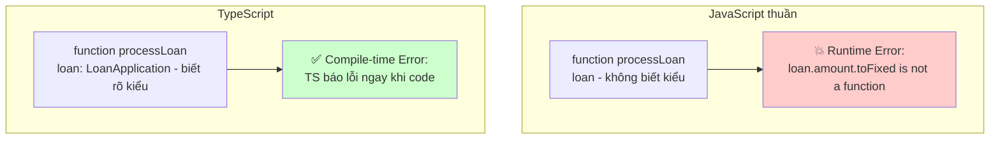

# 16. TypeScript với React: Viết code an toàn hơn 🛡️

> **Tại sao TypeScript quan trọng với React trong enterprise?**
> TypeScript giúp VS Code "thông minh hơn" — tự động gợi ý, phát hiện lỗi ngay khi gõ code thay vì phát hiện lúc production. Dự án có 5+ người làm mà không có TypeScript sẽ rất hỗn loạn.

---

## 🎯 1. Tại sao cần TypeScript?


```mermaid
graph TD
    subgraph JavaScript thuần
        JS[function processLoan<br/>loan - không biết kiểu]
        JS --> Bug[💥 Runtime Error:<br/>loan.amount.toFixed is not a function]
    end
    
    subgraph TypeScript
        TS[function processLoan<br/>loan: LoanApplication - biết rõ kiểu]
        TS --> Safe[✅ Compile-time Error:<br/>TS báo lỗi ngay khi code]
    end
    
    style Bug fill:#ffcccc
    style Safe fill:#ccffcc
```

---

## 📐 2. Khai báo kiểu cho Props

### Dùng interface (khuyến khích cho objects)

```tsx
// types/loan.types.ts — Định nghĩa tập trung
export interface LoanApplication {
  id: string;
  cif: string;
  borrowerName: string;
  loanAmount: number;
  interestRate: number;
  termMonths: number;
  status: LoanStatus;
  purpose: string;
  createdAt: string; // ISO date string
  collateral?: CollateralInfo; // Optional field
}

export type LoanStatus = 
  | 'DRAFT' 
  | 'SUBMITTED' 
  | 'UNDER_REVIEW' 
  | 'APPROVED' 
  | 'REJECTED' 
  | 'DISBURSED';

export interface CollateralInfo {
  type: 'REAL_ESTATE' | 'VEHICLE' | 'SAVINGS';
  estimatedValue: number;
  description: string;
}

// Component Props
interface LoanCardProps {
  loan: LoanApplication;
  onApprove?: (id: string) => void; // Optional callback
  onReject?: (id: string, reason: string) => void;
  showActions?: boolean;
  className?: string;
}
```

```tsx
// loan-card.tsx
const LoanCard: React.FC<LoanCardProps> = ({
  loan,
  onApprove,
  onReject,
  showActions = true,
  className,
}) => {
  return (
    <div className={`loan-card ${className ?? ''}`}>
      <h3>{loan.borrowerName}</h3>
      <p>Số tiền: {loan.loanAmount.toLocaleString('vi-VN')} đ</p>
      <StatusBadge status={loan.status} />
      
      {showActions && (
        <div className="actions">
          {onApprove && (
            <button onClick={() => onApprove(loan.id)}>
              Phê duyệt
            </button>
          )}
        </div>
      )}
    </div>
  );
};
```

---

## 🪝 3. TypeScript với Hooks

### useState với kiểu

```tsx
import { useState } from 'react';

// ✅ TypeScript tự suy luận kiểu từ initial value
const [count, setCount] = useState(0); // count: number
const [name, setName] = useState('');  // name: string

// ✅ Khai báo tường minh khi cần (nhất là object/null)
const [loan, setLoan] = useState<LoanApplication | null>(null);
const [loans, setLoans] = useState<LoanApplication[]>([]);

// ✅ Kiểu phức tạp hơn
type FilterState = {
  status: LoanStatus | 'ALL';
  minAmount: number;
  maxAmount: number;
  startDate: string;
  endDate: string;
};

const [filters, setFilters] = useState<FilterState>({
  status: 'ALL',
  minAmount: 0,
  maxAmount: 1_000_000_000,
  startDate: '',
  endDate: '',
});
```

### useRef với kiểu

```tsx
import { useRef } from 'react';

// DOM elements — bắt đầu với null, phải check null trước khi dùng
const inputRef = useRef<HTMLInputElement>(null);
const tableRef = useRef<HTMLTableElement>(null);

// Giá trị mutable (không phải DOM) — không cần |null
const timerRef = useRef<ReturnType<typeof setTimeout>>();
const prevValueRef = useRef<number>(0);

const focusInput = () => {
  inputRef.current?.focus(); // Optional chaining để an toàn
};
```

### useReducer với kiểu

```tsx
// Định nghĩa State và Actions
interface LoanFormState {
  step: number;
  formData: Partial<LoanApplication>;
  errors: Record<string, string>;
  isSubmitting: boolean;
}

type LoanFormAction =
  | { type: 'NEXT_STEP' }
  | { type: 'PREV_STEP' }
  | { type: 'UPDATE_FIELD'; field: keyof LoanApplication; value: unknown }
  | { type: 'SET_ERROR'; field: string; message: string }
  | { type: 'SUBMIT_START' }
  | { type: 'SUBMIT_SUCCESS' }
  | { type: 'SUBMIT_FAIL'; error: string };

function loanFormReducer(state: LoanFormState, action: LoanFormAction): LoanFormState {
  switch (action.type) {
    case 'NEXT_STEP':
      return { ...state, step: state.step + 1 };
    case 'UPDATE_FIELD':
      return {
        ...state,
        formData: { ...state.formData, [action.field]: action.value }
      };
    case 'SUBMIT_START':
      return { ...state, isSubmitting: true };
    default:
      return state;
  }
}

// Trong component
const [state, dispatch] = useReducer(loanFormReducer, {
  step: 1,
  formData: {},
  errors: {},
  isSubmitting: false,
});
```

---

## 🔧 4. Generic Components

```tsx
// Generic Table — hoạt động với mọi kiểu data
interface Column<T> {
  key: keyof T;
  header: string;
  render?: (value: T[keyof T], row: T) => React.ReactNode;
  sortable?: boolean;
}

interface DataTableProps<T extends { id: string | number }> {
  data: T[];
  columns: Column<T>[];
  onRowClick?: (row: T) => void;
  isLoading?: boolean;
  emptyMessage?: string;
}

function DataTable<T extends { id: string | number }>({
  data,
  columns,
  onRowClick,
  isLoading = false,
  emptyMessage = 'Không có dữ liệu',
}: DataTableProps<T>) {
  if (isLoading) return <TableSkeleton />;
  if (data.length === 0) return <EmptyState message={emptyMessage} />;
  
  return (
    <table>
      <thead>
        <tr>
          {columns.map(col => (
            <th key={String(col.key)}>{col.header}</th>
          ))}
        </tr>
      </thead>
      <tbody>
        {data.map(row => (
          <tr key={row.id} onClick={() => onRowClick?.(row)}>
            {columns.map(col => (
              <td key={String(col.key)}>
                {col.render 
                  ? col.render(row[col.key], row) 
                  : String(row[col.key] ?? '')}
              </td>
            ))}
          </tr>
        ))}
      </tbody>
    </table>
  );
}

// Cách dùng — TypeScript tự suy luận kiểu từ data
const loanColumns: Column<LoanApplication>[] = [
  { key: 'borrowerName', header: 'Người vay' },
  { key: 'loanAmount', header: 'Số tiền', render: (val) => `${val.toLocaleString()} đ` },
  { 
    key: 'status', 
    header: 'Trạng thái', 
    render: (_, row) => <StatusBadge status={row.status} /> // TypeScript biết row là LoanApplication
  },
];

<DataTable data={loans} columns={loanColumns} onRowClick={handleRowClick} />
```

---

## 🎁 5. Utility Types thường dùng

```tsx
// Pick: Chỉ lấy một số field
type LoanSummary = Pick<LoanApplication, 'id' | 'borrowerName' | 'loanAmount' | 'status'>;

// Omit: Bỏ một số field
type CreateLoanDto = Omit<LoanApplication, 'id' | 'createdAt' | 'status'>;

// Partial: Tất cả fields thành optional (dùng cho update)
type UpdateLoanDto = Partial<CreateLoanDto>;

// Required: Tất cả thành bắt buộc
type StrictLoan = Required<LoanApplication>;

// Record: Map từ key đến value
type LoanStatusLabels = Record<LoanStatus, string>;
const STATUS_LABELS: LoanStatusLabels = {
  DRAFT: 'Nháp',
  SUBMITTED: 'Đã nộp',
  UNDER_REVIEW: 'Đang xét',
  APPROVED: 'Đã duyệt',
  REJECTED: 'Từ chối',
  DISBURSED: 'Đã giải ngân',
};

// ReturnType: Lấy kiểu trả về của function
type LoanFormReturn = ReturnType<typeof useLoanForm>;

// Parameters: Lấy kiểu tham số của function
type ApproveParams = Parameters<typeof loanService.approve>;
```

---

## 📂 6. Tổ chức types cho enterprise

```
src/
├── types/
│   ├── api.types.ts      # API response/request shapes
│   ├── domain.types.ts   # Business domain types (Loan, Customer, etc.)
│   ├── ui.types.ts       # UI-specific types (TableColumn, FormField, etc.)
│   └── index.ts          # Re-export tất cả
```

```typescript
// types/api.types.ts
export interface ApiResponse<T> {
  data: T;
  message: string;
  success: boolean;
}

export interface PaginatedResponse<T> {
  data: T[];
  total: number;
  page: number;
  pageSize: number;
  totalPages: number;
}

export interface ApiError {
  status: number;
  message: string;
  errors?: Record<string, string[]>;
}
```

---

**Bài tiếp theo:** [[17-Zustand-State-Management|17. Zustand: Global State Management nhẹ nhàng]] 🐻

---

## 📢 Cập nhật 26/07/2026 — 1 bug thật trong ví dụ + version TypeScript

### ⚠️ Bug trong mục 3 (useRef với kiểu)

Dòng này trong bài:
```tsx
const timerRef = useRef<ReturnType<typeof setTimeout>>();
```
gọi `useRef` **không có argument** — chỉ truyền type parameter. Đây là pattern hợp lệ ở `@types/react` cho React 18, nhưng **React 19 đổi type signature của `useRef` để bắt buộc phải có argument** (mục tiêu: làm mọi ref đều mutable, giống `createContext`). Với `@types/react` cho React 19 (dự án đang dùng React 19.2.7 theo [[00-Roadmap]]), dòng trên sẽ báo lỗi biên dịch: `Expected 1 argument but saw none`.

**Cách sửa:**
```tsx
// ✅ Truyền rõ giá trị khởi tạo — undefined nếu chưa có timer nào
const timerRef = useRef<ReturnType<typeof setTimeout> | undefined>(undefined);
```
`useRef<T>(null)` (như `inputRef`, `tableRef` ở trên) và `useRef<T>(0)` (như `prevValueRef`) trong bài **vẫn đúng, không cần sửa** — chỉ dòng gọi không argument mới bị ảnh hưởng.

**Một điểm liên quan khác (không có trong bài, không cần sửa gì, chỉ nên biết):** mục `useReducer` ở bài này không truyền type argument tường minh cho `useReducer` (`useReducer(loanFormReducer, {...})`) — đây **đúng là best-practice mới của React 19**, vì `useReducer` đổi cách suy luận kiểu và không còn khuyến khích truyền type argument tường minh nữa. Bài này đã viết đúng theo xu hướng mới mà không cần sửa.

### Version TypeScript hiện tại

- **Bản ổn định:** TypeScript **6.0.3** (16/04/2026) — đây là bản **cuối cùng viết bằng chính TypeScript/JavaScript**.
- **Thay đổi lớn nhất đang diễn ra:** **TypeScript 7.0** đã ra **Release Candidate (18/06/2026)** — viết lại hoàn toàn bằng **Go** (dự án "Corsa"), công bố nhanh hơn TS 6.0 khoảng **10 lần** cho build và thao tác trong editor. Đây không phải bản vá nhỏ mà là thay đổi kiến trúc compiler lớn nhất trong lịch sử TypeScript.
- TS 7.0 mang một số breaking change ở tầng cấu hình dự án (không ảnh hưởng cú pháp interface/generic/utility type đã học ở bài này): strict-mode trở thành mặc định, bỏ target ES5, gỡ bỏ AMD/UMD/SystemJS module output, gỡ bỏ classic Node module resolution.
- **Không cần hành động ngay** — các framework lớn (React, Vue, Angular) thường ra bản tương thích TS mới trong vòng khoảng 1 tuần sau khi TS release; nên đợi bản ổn định 7.0 (chưa GA tại thời điểm 26/07/2026) và theo dõi thông báo tương thích của Vite/React trước khi nâng.

*Nguồn: react.dev/blog/2024/04/25/react-19-upgrade-guide, devblogs.microsoft.com/typescript, en.wikipedia.org/wiki/TypeScript — truy cập 26/07/2026.*
