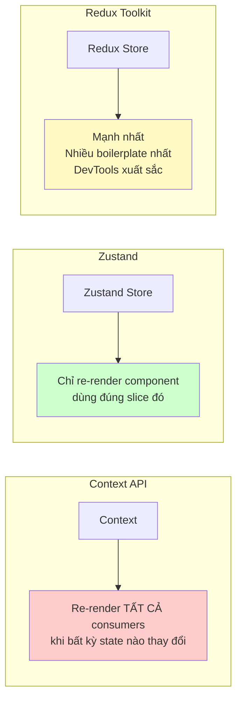

# 17. Zustand: Global State Management nhẹ nhàng 🐻

> **Tại sao Zustand thay vì Redux?**
> Redux rất mạnh nhưng verbose (nhiều boilerplate). Zustand nhẹ hơn, ít code hơn 5-10 lần, phù hợp với hầu hết dự án enterprise mà không cần setup phức tạp. Context API thì quá chậm khi state thay đổi nhiều.

---

## 🔀 1. So sánh: Context API vs Zustand vs Redux



| Tiêu chí | Context | Zustand | Redux |
|---|---|---|---|
| **Setup** | 0 (có sẵn) | Cực nhỏ | Lớn |
| **Performance** | ⚠️ Re-render nhiều | ✅ Tốt | ✅ Tốt |
| **DevTools** | ❌ | ✅ | ✅✅ |
| **Middleware** | ❌ | ✅ | ✅✅ |
| **Phù hợp khi** | Theme, Locale | 90% dự án | Dự án rất lớn |

---

## 🛠️ 2. Setup cơ bản

```bash
npm install zustand
```

```typescript
// stores/loan.store.ts
import { create } from 'zustand';
import { devtools, persist } from 'zustand/middleware';
import { immer } from 'zustand/middleware/immer';

// Kiểu dữ liệu
interface LoanState {
  // Data
  loans: LoanApplication[];
  selectedLoan: LoanApplication | null;
  filters: LoanFilters;
  pagination: PaginationState;
  
  // UI State
  isLoading: boolean;
  error: string | null;
  
  // Actions
  loadLoans: (filters?: LoanFilters) => Promise<void>;
  selectLoan: (id: string) => void;
  approveLoan: (id: string, comment: string) => Promise<void>;
  rejectLoan: (id: string, reason: string) => Promise<void>;
  updateFilters: (filters: Partial<LoanFilters>) => void;
  resetFilters: () => void;
  clearError: () => void;
}

const DEFAULT_FILTERS: LoanFilters = {
  status: 'ALL',
  minAmount: 0,
  maxAmount: 1_000_000_000,
  startDate: '',
  endDate: '',
  page: 1,
  pageSize: 20,
};

// Tạo store
export const useLoanStore = create<LoanState>()(
  devtools( // ← Dev tools browser extension
    immer( // ← Immer cho phép "mutate" trực tiếp (tự convert thành immutable)
      (set, get) => ({
        // Initial state
        loans: [],
        selectedLoan: null,
        filters: DEFAULT_FILTERS,
        pagination: { total: 0, page: 1, totalPages: 0 },
        isLoading: false,
        error: null,

        // Actions
        loadLoans: async (filters) => {
          set({ isLoading: true, error: null });
          try {
            const params = filters ?? get().filters;
            const response = await loanService.getAll(params);
            set({
              loans: response.data,
              pagination: {
                total: response.total,
                page: response.page,
                totalPages: response.totalPages,
              },
              isLoading: false,
            });
          } catch (err) {
            set({ 
              error: err instanceof Error ? err.message : 'Lỗi tải dữ liệu',
              isLoading: false 
            });
          }
        },

        selectLoan: (id) => {
          const loan = get().loans.find(l => l.id === id) ?? null;
          set({ selectedLoan: loan });
        },

        approveLoan: async (id, comment) => {
          set({ isLoading: true });
          try {
            const updated = await loanService.approve(id, comment);
            set(state => {
              // Immer cho phép viết như mutate trực tiếp
              const idx = state.loans.findIndex(l => l.id === id);
              if (idx !== -1) state.loans[idx] = updated;
              if (state.selectedLoan?.id === id) state.selectedLoan = updated;
              state.isLoading = false;
            });
          } catch (err) {
            set({ error: err instanceof Error ? err.message : 'Lỗi phê duyệt', isLoading: false });
          }
        },

        updateFilters: (newFilters) => {
          set(state => {
            Object.assign(state.filters, newFilters);
            state.filters.page = 1; // Reset page khi filter thay đổi
          });
          get().loadLoans(); // Tự động reload
        },

        resetFilters: () => {
          set({ filters: DEFAULT_FILTERS });
          get().loadLoans();
        },
        
        clearError: () => set({ error: null }),
      })
    ),
    { name: 'LoanStore' } // ← Tên hiện trong DevTools
  )
);
```

---

## 🎣 3. Dùng trong Component

### Lấy chỉ những gì cần (tránh re-render thừa)

```tsx
// ✅ ĐÚNG: Chỉ subscribe đúng slice cần dùng
function LoanList() {
  const loans = useLoanStore(state => state.loans);
  const isLoading = useLoanStore(state => state.isLoading);
  const loadLoans = useLoanStore(state => state.loadLoans);
  
  useEffect(() => { loadLoans(); }, [loadLoans]);
  
  if (isLoading) return <Skeleton />;
  return <ul>{loans.map(loan => <LoanItem key={loan.id} loan={loan} />)}</ul>;
}

// ❌ SAI: Subscribe toàn bộ store → re-render khi BẤT KỲ thứ gì thay đổi
function LoanList() {
  const store = useLoanStore(); // Tệ nhất — re-render cực nhiều
}
```

### Dùng selector để tính toán derived state

```tsx
// Tạo selector bên ngoài component để không tạo mới mỗi lần render
const selectPendingLoans = (state: LoanState) => 
  state.loans.filter(l => l.status === 'SUBMITTED');

const selectLoanStats = (state: LoanState) => ({
  total: state.loans.length,
  pending: state.loans.filter(l => l.status === 'SUBMITTED').length,
  approved: state.loans.filter(l => l.status === 'APPROVED').length,
  totalAmount: state.loans.reduce((sum, l) => sum + l.loanAmount, 0),
});

function LoanDashboard() {
  // shallow: chỉ re-render nếu giá trị object thay đổi (không phải reference)
  const stats = useLoanStore(selectLoanStats, shallow);
  
  return (
    <div className="stats-grid">
      <StatCard title="Tổng hồ sơ" value={stats.total} />
      <StatCard title="Chờ duyệt" value={stats.pending} />
      <StatCard title="Đã duyệt" value={stats.approved} />
      <StatCard title="Tổng dư nợ" value={formatCurrency(stats.totalAmount)} />
    </div>
  );
}
```

---

## 🧩 4. Chia Store theo domain (Slice pattern)

```typescript
// Đừng để một store khổng lồ — chia theo domain
stores/
├── auth.store.ts        # User, token, permissions
├── loan.store.ts        # Loan applications
├── notification.store.ts # Toast, alerts
├── ui.store.ts          # Modal, sidebar, theme
└── index.ts             # Re-export

// ui.store.ts — Quản lý UI state toàn cục
interface UIState {
  isSidebarOpen: boolean;
  activeModal: string | null;
  modalData: unknown;
  theme: 'light' | 'dark';
  
  openModal: (name: string, data?: unknown) => void;
  closeModal: () => void;
  toggleSidebar: () => void;
  setTheme: (theme: 'light' | 'dark') => void;
}

export const useUIStore = create<UIState>()((set) => ({
  isSidebarOpen: true,
  activeModal: null,
  modalData: null,
  theme: 'light',
  
  openModal: (name, data) => set({ activeModal: name, modalData: data }),
  closeModal: () => set({ activeModal: null, modalData: null }),
  toggleSidebar: () => set(s => ({ isSidebarOpen: !s.isSidebarOpen })),
  setTheme: (theme) => set({ theme }),
}));

// Dùng modal bất kỳ đâu
function LoanTable() {
  const openModal = useUIStore(s => s.openModal);
  
  return (
    <button onClick={() => openModal('approve-loan', { loanId: '123' })}>
      Phê duyệt
    </button>
  );
}

function ApproveModal() {
  const { activeModal, modalData, closeModal } = useUIStore();
  if (activeModal !== 'approve-loan') return null;
  
  return (
    <Modal onClose={closeModal}>
      <ApproveForm loanId={(modalData as any).loanId} onSuccess={closeModal} />
    </Modal>
  );
}
```

---

## 💾 5. Persist Store (Lưu vào localStorage)

```typescript
// Chỉ persist những gì cần (không persist data API — data sẽ stale)
export const useAuthStore = create<AuthState>()(
  devtools(
    persist(
      (set) => ({
        user: null,
        accessToken: null,
        refreshToken: null,
        permissions: [],
        
        login: async (credentials) => {
          const res = await authService.login(credentials);
          set({ 
            user: res.user, 
            accessToken: res.accessToken,
            refreshToken: res.refreshToken,
            permissions: res.permissions,
          });
        },
        logout: () => set({ user: null, accessToken: null, refreshToken: null }),
        hasPermission: (perm) => get().permissions.includes(perm),
      }),
      {
        name: 'pdms-auth',           // localStorage key
        partialize: (state) => ({    // Chỉ persist những field này
          accessToken: state.accessToken,
          refreshToken: state.refreshToken,
          user: state.user,
        }),
      }
    )
  )
);
```

---

**Bài tiếp theo:** [[18-TanStack-Query-Server-State|18. TanStack Query: Server State Management]] 📡
