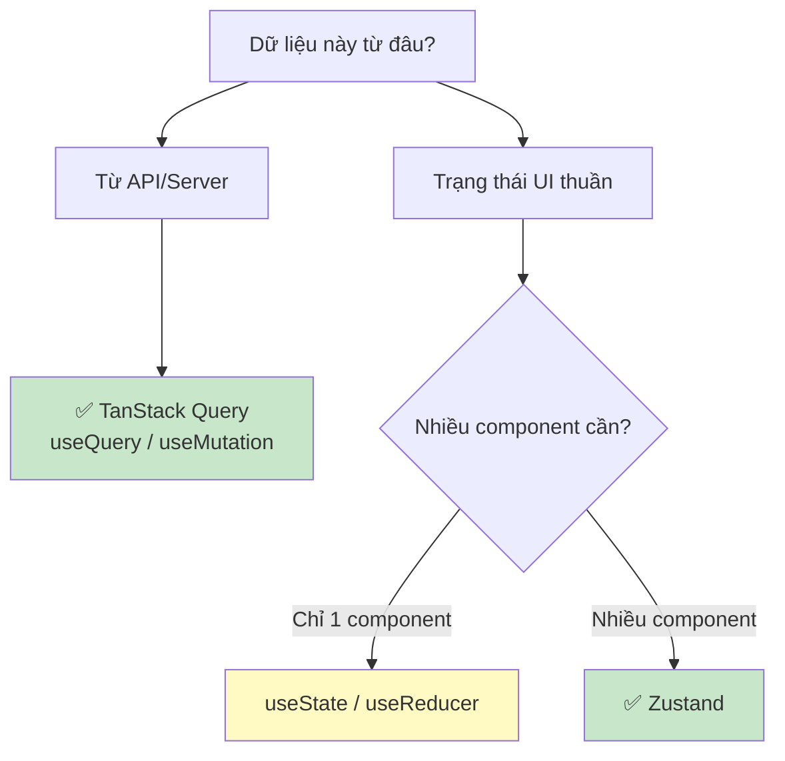

# 18. TanStack Query: Server State Management 📡

> **TanStack Query (React Query) là gì?**
> Đây là thư viện chuyên quản lý **server state** — dữ liệu đến từ API. Nó tự động xử lý loading, error, caching, refetch, pagination, và optimistic updates. Dùng TanStack Query thay thế hầu hết `useEffect + useState` để fetch data.

---

## ❓ 1. Vấn đề với useEffect để fetch data

```tsx
// ❌ Cách cũ với useEffect — rất nhiều vấn đề
function LoanList() {
  const [loans, setLoans] = useState<LoanApplication[]>([]);
  const [isLoading, setIsLoading] = useState(true);
  const [error, setError] = useState<string | null>(null);

  useEffect(() => {
    let isMounted = true; // Tránh memory leak
    
    setIsLoading(true);
    loanService.getAll()
      .then(data => { if (isMounted) setLoans(data); })
      .catch(err => { if (isMounted) setError(err.message); })
      .finally(() => { if (isMounted) setIsLoading(false); });
    
    return () => { isMounted = false; }; // Cleanup
  }, []); // Chỉ fetch một lần, không auto-refetch
  
  // ❌ Không cache — mỗi lần mount đều fetch lại
  // ❌ Không retry khi network lỗi
  // ❌ Không biết data có stale không
  // ❌ Duplicate requests khi nhiều component cùng cần data
}
```

---

## 🚀 2. Setup TanStack Query

```bash
npm install @tanstack/react-query @tanstack/react-query-devtools
```

```tsx
// main.tsx
import { QueryClient, QueryClientProvider } from '@tanstack/react-query';
import { ReactQueryDevtools } from '@tanstack/react-query-devtools';

const queryClient = new QueryClient({
  defaultOptions: {
    queries: {
      staleTime: 5 * 60 * 1000, // Data "tươi" trong 5 phút
      gcTime: 10 * 60 * 1000,   // Cache tồn tại 10 phút (gcTime = cacheTime cũ)
      retry: 2,                  // Retry 2 lần khi fail
      refetchOnWindowFocus: false, // Không refetch khi focus lại window
    },
    mutations: {
      retry: 0, // Không retry mutations (POST/PUT/DELETE)
    },
  },
});

ReactDOM.createRoot(document.getElementById('root')!).render(
  <QueryClientProvider client={queryClient}>
    <App />
    <ReactQueryDevtools initialIsOpen={false} />
  </QueryClientProvider>
);
```

---

## 📥 3. useQuery: Fetch dữ liệu

```tsx
// queries/loan.queries.ts — Tập trung query keys và fetchers
export const loanKeys = {
  all: ['loans'] as const,
  lists: () => [...loanKeys.all, 'list'] as const,
  list: (filters: LoanFilters) => [...loanKeys.lists(), filters] as const,
  details: () => [...loanKeys.all, 'detail'] as const,
  detail: (id: string) => [...loanKeys.details(), id] as const,
};

export const loanQueries = {
  list: (filters: LoanFilters) => ({
    queryKey: loanKeys.list(filters),
    queryFn: () => loanService.getAll(filters),
    staleTime: 2 * 60 * 1000, // Override default: 2 phút
  }),
  
  detail: (id: string) => ({
    queryKey: loanKeys.detail(id),
    queryFn: () => loanService.getById(id),
    enabled: !!id, // Chỉ fetch khi id có giá trị
  }),
};
```

```tsx
// components/LoanList.tsx
function LoanList({ filters }: { filters: LoanFilters }) {
  const { data, isLoading, isError, error, isFetching, refetch } = useQuery({
    ...loanQueries.list(filters),
  });
  
  return (
    <div>
      {/* isFetching = đang refetch background (có data rồi) */}
      {isFetching && <div className="bg-refresh-indicator">Đang cập nhật...</div>}
      
      {isLoading && <Skeleton rows={10} />}
      
      {isError && (
        <ErrorState 
          message={error.message} 
          onRetry={refetch}
        />
      )}
      
      {data?.data.map(loan => (
        <LoanCard key={loan.id} loan={loan} />
      ))}
    </div>
  );
}
```

---

## 📤 4. useMutation: Thay đổi dữ liệu

```tsx
// mutations/loan.mutations.ts
function useApproveLoan() {
  const queryClient = useQueryClient();
  
  return useMutation({
    mutationFn: ({ id, comment }: { id: string; comment: string }) => 
      loanService.approve(id, comment),
    
    // Optimistic Update — cập nhật UI trước, rollback nếu fail
    onMutate: async ({ id }) => {
      // Huỷ các query đang pending để tránh conflict
      await queryClient.cancelQueries({ queryKey: loanKeys.all });
      
      // Lưu state cũ để rollback
      const previousLoans = queryClient.getQueryData(loanKeys.lists());
      
      // Cập nhật cache ngay lập tức
      queryClient.setQueryData(loanKeys.lists(), (old: PaginatedResponse<LoanApplication> | undefined) => {
        if (!old) return old;
        return {
          ...old,
          data: old.data.map(loan => 
            loan.id === id ? { ...loan, status: 'APPROVED' as LoanStatus } : loan
          ),
        };
      });
      
      return { previousLoans }; // Context để rollback
    },
    
    onError: (err, variables, context) => {
      // Rollback khi có lỗi
      if (context?.previousLoans) {
        queryClient.setQueryData(loanKeys.lists(), context.previousLoans);
      }
      toast.error('Phê duyệt thất bại: ' + err.message);
    },
    
    onSuccess: (updatedLoan) => {
      // Cập nhật cache với data thật từ server
      queryClient.setQueryData(
        loanKeys.detail(updatedLoan.id), 
        updatedLoan
      );
      // Invalidate list để refetch (đảm bảo dữ liệu đúng)
      queryClient.invalidateQueries({ queryKey: loanKeys.lists() });
      toast.success('Phê duyệt hồ sơ thành công!');
    },
  });
}

// Dùng trong component
function LoanApproveButton({ loanId }: { loanId: string }) {
  const [comment, setComment] = useState('');
  const approveMutation = useApproveLoan();
  
  const handleApprove = () => {
    approveMutation.mutate({ id: loanId, comment });
  };
  
  return (
    <button 
      onClick={handleApprove}
      disabled={approveMutation.isPending}
    >
      {approveMutation.isPending ? 'Đang xử lý...' : 'Phê duyệt'}
    </button>
  );
}
```

---

## 📄 5. Pagination & Infinite Scroll

```tsx
// Pagination thường (cursor hoặc page-based)
function LoanListWithPagination() {
  const [page, setPage] = useState(1);
  
  const { data, isPlaceholderData } = useQuery({
    queryKey: loanKeys.list({ page, pageSize: 20 }),
    queryFn: () => loanService.getAll({ page, pageSize: 20 }),
    placeholderData: keepPreviousData, // ← Giữ data cũ khi đổi trang (không bị trắng)
  });
  
  // Prefetch trang tiếp theo
  const queryClient = useQueryClient();
  useEffect(() => {
    if (data && page < data.totalPages) {
      queryClient.prefetchQuery({
        queryKey: loanKeys.list({ page: page + 1, pageSize: 20 }),
        queryFn: () => loanService.getAll({ page: page + 1, pageSize: 20 }),
      });
    }
  }, [data, page]);
  
  return (
    <div>
      <LoanTable data={data?.data ?? []} />
      <Pagination 
        currentPage={page}
        totalPages={data?.totalPages ?? 1}
        onPageChange={setPage}
        isDisabled={isPlaceholderData}
      />
    </div>
  );
}

// Infinite Scroll
function LoanInfiniteList() {
  const {
    data,
    fetchNextPage,
    hasNextPage,
    isFetchingNextPage,
  } = useInfiniteQuery({
    queryKey: loanKeys.all,
    queryFn: ({ pageParam = 1 }) => loanService.getAll({ page: pageParam }),
    initialPageParam: 1,
    getNextPageParam: (lastPage) => 
      lastPage.page < lastPage.totalPages ? lastPage.page + 1 : undefined,
  });
  
  const allLoans = data?.pages.flatMap(p => p.data) ?? [];
  
  return (
    <div>
      {allLoans.map(loan => <LoanCard key={loan.id} loan={loan} />)}
      {hasNextPage && (
        <button onClick={() => fetchNextPage()} disabled={isFetchingNextPage}>
          {isFetchingNextPage ? 'Đang tải...' : 'Tải thêm'}
        </button>
      )}
    </div>
  );
}
```

---

## 🔍 6. Dependent & Parallel Queries

```tsx
// Dependent Query: Query B phụ thuộc vào kết quả Query A
function LoanDetailWithHistory({ loanId }: { loanId: string }) {
  // Query 1: Lấy thông tin hồ sơ
  const loanQuery = useQuery(loanQueries.detail(loanId));
  
  // Query 2: Chỉ chạy khi loanQuery thành công
  const historyQuery = useQuery({
    queryKey: ['loan-history', loanQuery.data?.cif],
    queryFn: () => customerService.getLoanHistory(loanQuery.data!.cif),
    enabled: !!loanQuery.data?.cif, // ← Bật khi có CIF
  });
  
  return (
    <div>
      {loanQuery.isLoading && <Skeleton />}
      {loanQuery.data && <LoanInfo loan={loanQuery.data} />}
      {historyQuery.data && <LoanHistory history={historyQuery.data} />}
    </div>
  );
}

// Parallel Queries: Chạy đồng thời
function DashboardPage() {
  const [loansQuery, statsQuery, notificationsQuery] = useQueries({
    queries: [
      loanQueries.list({ status: 'SUBMITTED', page: 1, pageSize: 10 }),
      { queryKey: ['stats'], queryFn: () => reportService.getStats() },
      { queryKey: ['notifications'], queryFn: () => notificationService.getAll() },
    ],
  });
  
  return (
    <div className="dashboard-grid">
      <StatsPanel data={statsQuery.data} isLoading={statsQuery.isLoading} />
      <PendingLoans data={loansQuery.data} />
      <NotificationPanel data={notificationsQuery.data} />
    </div>
  );
}
```

---

## 📊 7. Tóm tắt: Khi nào dùng gì?



| Dùng | Khi |
|---|---|
| `useQuery` | Lấy dữ liệu từ API (GET) |
| `useMutation` | Thay đổi dữ liệu (POST/PUT/DELETE) |
| `useInfiniteQuery` | Infinite scroll |
| `queryClient.invalidateQueries` | Force refetch sau mutation |
| `queryClient.setQueryData` | Cập nhật cache manually (optimistic) |
| `placeholderData: keepPreviousData` | Pagination mượt |

---

**Bài tiếp theo:** [[19-Authentication-Protected-Routes|19. Authentication & Protected Routes]] 🔐
