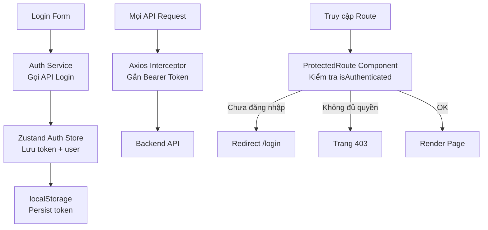

# 19. Authentication & Protected Routes 🔐

> **Tại sao đây là chủ đề quan trọng trong enterprise?**
> Mọi ứng dụng banking đều cần: đăng nhập, phân quyền theo vai trò, bảo vệ routes, tự động refresh token, và đăng xuất an toàn. Bài này xây dựng hệ thống Auth hoàn chỉnh với JWT + React.

---

## 🏛️ 1. Kiến trúc Auth System



---

## 🔑 2. Auth Store với Zustand

```typescript
// stores/auth.store.ts
import { create } from 'zustand';
import { persist } from 'zustand/middleware';

interface User {
  id: string;
  username: string;
  fullName: string;
  email: string;
  roles: string[];
  permissions: string[];
  branchCode: string;
}

interface AuthState {
  user: User | null;
  accessToken: string | null;
  refreshToken: string | null;
  isAuthenticated: boolean;
  
  login: (credentials: LoginDto) => Promise<void>;
  logout: () => void;
  refreshAccessToken: () => Promise<string>;
  hasRole: (role: string) => boolean;
  hasPermission: (permission: string) => boolean;
  hasAnyPermission: (permissions: string[]) => boolean;
  hasAllPermissions: (permissions: string[]) => boolean;
}

export const useAuthStore = create<AuthState>()(
  persist(
    (set, get) => ({
      user: null,
      accessToken: null,
      refreshToken: null,
      isAuthenticated: false,

      login: async (credentials) => {
        const response = await authService.login(credentials);
        set({
          user: response.user,
          accessToken: response.accessToken,
          refreshToken: response.refreshToken,
          isAuthenticated: true,
        });
        // Setup axios interceptor với token mới
        setupAxiosInterceptors(response.accessToken);
      },

      logout: () => {
        set({ user: null, accessToken: null, refreshToken: null, isAuthenticated: false });
        localStorage.clear(); // Xoá hết
        window.location.href = '/login'; // Hard redirect
      },

      refreshAccessToken: async () => {
        const { refreshToken } = get();
        if (!refreshToken) throw new Error('No refresh token');
        
        const response = await authService.refreshToken(refreshToken);
        set({ accessToken: response.accessToken });
        return response.accessToken;
      },

      // Permission helpers
      hasRole: (role) => get().user?.roles.includes(role) ?? false,
      hasPermission: (perm) => get().user?.permissions.includes(perm) ?? false,
      hasAnyPermission: (perms) => perms.some(p => get().user?.permissions.includes(p) ?? false),
      hasAllPermissions: (perms) => perms.every(p => get().user?.permissions.includes(p) ?? false),
    }),
    {
      name: 'auth-storage',
      partialize: (state) => ({
        user: state.user,
        accessToken: state.accessToken,
        refreshToken: state.refreshToken,
        isAuthenticated: state.isAuthenticated,
      }),
    }
  )
);
```

---

## 🔄 3. Axios Interceptor với Auto Token Refresh

```typescript
// lib/axios.ts
import axios, { AxiosError } from 'axios';

export const apiClient = axios.create({
  baseURL: import.meta.env.VITE_API_URL,
  timeout: 30000,
  headers: { 'Content-Type': 'application/json' },
});

let isRefreshing = false;
let failedQueue: Array<{ resolve: Function; reject: Function }> = [];

const processQueue = (error: Error | null, token: string | null = null) => {
  failedQueue.forEach(prom => {
    error ? prom.reject(error) : prom.resolve(token);
  });
  failedQueue = [];
};

// Request interceptor — gắn token
apiClient.interceptors.request.use((config) => {
  const token = useAuthStore.getState().accessToken;
  if (token) {
    config.headers.Authorization = `Bearer ${token}`;
  }
  return config;
});

// Response interceptor — xử lý 401
apiClient.interceptors.response.use(
  (response) => response,
  async (error: AxiosError) => {
    const originalRequest = error.config as any;

    if (error.response?.status === 401 && !originalRequest._retry) {
      if (isRefreshing) {
        // Có request khác đang refresh — queue lại
        return new Promise((resolve, reject) => {
          failedQueue.push({ resolve, reject });
        }).then(token => {
          originalRequest.headers.Authorization = `Bearer ${token}`;
          return apiClient(originalRequest);
        });
      }

      originalRequest._retry = true;
      isRefreshing = true;

      try {
        const newToken = await useAuthStore.getState().refreshAccessToken();
        processQueue(null, newToken);
        originalRequest.headers.Authorization = `Bearer ${newToken}`;
        return apiClient(originalRequest);
      } catch (refreshError) {
        processQueue(refreshError as Error, null);
        useAuthStore.getState().logout();
        return Promise.reject(refreshError);
      } finally {
        isRefreshing = false;
      }
    }

    return Promise.reject(error);
  }
);
```

---

## 🛡️ 4. Protected Route Component

```tsx
// components/ProtectedRoute.tsx
interface ProtectedRouteProps {
  children: React.ReactNode;
  requiredPermissions?: string[];
  requiredRoles?: string[];
  requireAll?: boolean; // true = cần tất cả permissions, false = cần ít nhất 1
}

export function ProtectedRoute({
  children,
  requiredPermissions = [],
  requiredRoles = [],
  requireAll = false,
}: ProtectedRouteProps) {
  const location = useLocation();
  const { isAuthenticated, hasRole, hasAnyPermission, hasAllPermissions } = useAuthStore();

  // Chưa đăng nhập
  if (!isAuthenticated) {
    return (
      <Navigate 
        to="/login" 
        state={{ from: location }} // Lưu URL để redirect sau khi login
        replace 
      />
    );
  }

  // Kiểm tra role
  if (requiredRoles.length > 0) {
    const hasRequiredRole = requiredRoles.some(role => hasRole(role));
    if (!hasRequiredRole) {
      return <Navigate to="/forbidden" replace />;
    }
  }

  // Kiểm tra permissions
  if (requiredPermissions.length > 0) {
    const hasRequired = requireAll
      ? hasAllPermissions(requiredPermissions)
      : hasAnyPermission(requiredPermissions);
      
    if (!hasRequired) {
      return <Navigate to="/forbidden" replace />;
    }
  }

  return <>{children}</>;
}

// Component hiển thị/ẩn theo permission (không redirect)
export function Can({
  perform,
  children,
  fallback = null,
}: {
  perform: string | string[];
  children: React.ReactNode;
  fallback?: React.ReactNode;
}) {
  const hasAnyPermission = useAuthStore(s => s.hasAnyPermission);
  const perms = Array.isArray(perform) ? perform : [perform];
  
  return hasAnyPermission(perms) ? <>{children}</> : <>{fallback}</>;
}
```

---

## 🗺️ 5. Router Setup với Protected Routes

```tsx
// App.tsx
import { createBrowserRouter, RouterProvider } from 'react-router-dom';

const router = createBrowserRouter([
  // Public routes
  {
    path: '/login',
    element: <LoginPage />,
  },
  {
    path: '/forbidden',
    element: <ForbiddenPage />,
  },
  
  // Protected layout
  {
    path: '/',
    element: (
      <ProtectedRoute>
        <MainLayout />
      </ProtectedRoute>
    ),
    children: [
      {
        path: 'dashboard',
        element: <DashboardPage />,
      },
      
      // Role-based routes
      {
        path: 'loans',
        element: (
          <ProtectedRoute requiredPermissions={['LOAN_VIEW']}>
            <LoanListPage />
          </ProtectedRoute>
        ),
      },
      {
        path: 'loans/:id/approve',
        element: (
          <ProtectedRoute 
            requiredPermissions={['LOAN_APPROVE']}
            requiredRoles={['APPROVER', 'MANAGER']}
          >
            <LoanApprovePage />
          </ProtectedRoute>
        ),
      },
      
      // Admin only
      {
        path: 'admin',
        element: (
          <ProtectedRoute requiredRoles={['ADMIN']}>
            <AdminPage />
          </ProtectedRoute>
        ),
      },
    ],
  },
]);

export default function App() {
  return <RouterProvider router={router} />;
}
```

---

## 📝 6. Login Page hoàn chỉnh

```tsx
// pages/LoginPage.tsx
function LoginPage() {
  const navigate = useNavigate();
  const location = useLocation();
  const login = useAuthStore(s => s.login);
  
  const from = (location.state as any)?.from?.pathname ?? '/dashboard';
  
  const {
    register,
    handleSubmit,
    formState: { errors, isSubmitting },
    setError,
  } = useForm<LoginDto>({
    resolver: zodResolver(loginSchema),
  });

  const onSubmit = async (data: LoginDto) => {
    try {
      await login(data);
      navigate(from, { replace: true }); // Redirect về trang ban đầu
    } catch (err) {
      // Gán lỗi từ server vào form
      setError('root', {
        message: err instanceof Error ? err.message : 'Đăng nhập thất bại',
      });
    }
  };

  return (
    <div className="login-container">
      <form onSubmit={handleSubmit(onSubmit)}>
        <h1>PDMS - Đăng nhập</h1>
        
        {errors.root && (
          <div className="error-banner">{errors.root.message}</div>
        )}
        
        <div className="field">
          <label>Tên đăng nhập</label>
          <input {...register('username')} autoFocus />
          {errors.username && <span className="error">{errors.username.message}</span>}
        </div>
        
        <div className="field">
          <label>Mật khẩu</label>
          <input type="password" {...register('password')} />
          {errors.password && <span className="error">{errors.password.message}</span>}
        </div>
        
        <button type="submit" disabled={isSubmitting}>
          {isSubmitting ? 'Đang đăng nhập...' : 'Đăng nhập'}
        </button>
      </form>
    </div>
  );
}

const loginSchema = z.object({
  username: z.string().min(1, 'Tên đăng nhập không được để trống'),
  password: z.string().min(6, 'Mật khẩu tối thiểu 6 ký tự'),
});
type LoginDto = z.infer<typeof loginSchema>;
```

---

## 🔒 7. Permission-based UI

```tsx
// Dùng Can component để show/hide UI elements
function LoanDetailActions({ loanId }: { loanId: string }) {
  return (
    <div className="actions">
      {/* Mọi người có LOAN_VIEW đều thấy */}
      <button onClick={() => navigate(`/loans/${loanId}`)}>Xem chi tiết</button>
      
      {/* Chỉ LOAN_EDIT thấy */}
      <Can perform="LOAN_EDIT">
        <button onClick={() => navigate(`/loans/${loanId}/edit`)}>Chỉnh sửa</button>
      </Can>
      
      {/* Chỉ APPROVER/MANAGER thấy */}
      <Can perform={['LOAN_APPROVE']}>
        <button className="primary" onClick={() => openModal('approve', loanId)}>
          Phê duyệt
        </button>
        <button className="danger" onClick={() => openModal('reject', loanId)}>
          Từ chối
        </button>
      </Can>
    </div>
  );
}
```

---

**Bài tiếp theo:** [[20-Advanced-Component-Patterns|20. Advanced Component Patterns]] 🎨
