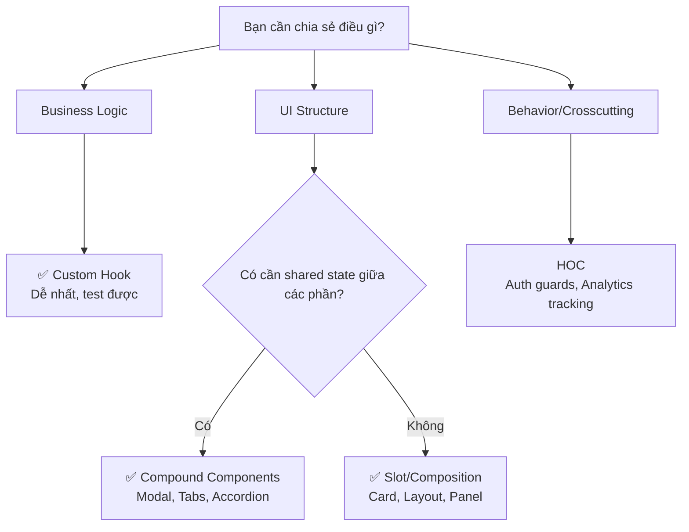

# 20. Advanced Component Patterns: Viết component như Senior 🎨

> **Tại sao cần biết patterns này?**
> Trong dự án enterprise, bạn sẽ xây dựng Design System — bộ component tái sử dụng cho toàn team. Compound Components, Render Props, và Composition patterns là các kỹ thuật giúp component của bạn **linh hoạt mà không phức tạp**.

---

## 🧩 1. Compound Components: Components "nói chuyện" với nhau

### Ẩn dụ: Bộ bài Uno

Thay vì một component `<Modal>` có 50 props, bạn tạo các component con phối hợp với nhau:

```tsx
// ❌ Cách cũ — props địa ngục
<Modal
  title="Phê duyệt hồ sơ"
  subtitle="Xác nhận"
  showCloseButton={true}
  footerButtons={[{ label: 'Huỷ', onClick: () => {} }, { label: 'Xác nhận', onClick: () => {} }]}
  bodyContent={<div>...</div>}
  onClose={() => {}}
/>

// ✅ Compound Components — rõ ràng, linh hoạt
<Modal isOpen={isOpen} onClose={handleClose}>
  <Modal.Header>
    <Modal.Title>Phê duyệt hồ sơ</Modal.Title>
    <Modal.CloseButton />
  </Modal.Header>
  <Modal.Body>
    <LoanSummary loan={selectedLoan} />
    <CommentInput onChange={setComment} />
  </Modal.Body>
  <Modal.Footer>
    <Button variant="ghost" onClick={handleClose}>Huỷ</Button>
    <Button variant="primary" onClick={handleApprove} loading={isPending}>
      Phê duyệt
    </Button>
  </Modal.Footer>
</Modal>
```

### Cách build Compound Components

```tsx
// components/Modal/Modal.tsx
interface ModalContextValue {
  isOpen: boolean;
  onClose: () => void;
}

const ModalContext = createContext<ModalContextValue | null>(null);

const useModalContext = () => {
  const ctx = useContext(ModalContext);
  if (!ctx) throw new Error('Modal components must be used within <Modal>');
  return ctx;
};

// Root Component
function Modal({ isOpen, onClose, children }: {
  isOpen: boolean;
  onClose: () => void;
  children: React.ReactNode;
}) {
  if (!isOpen) return null;
  
  return (
    <ModalContext.Provider value={{ isOpen, onClose }}>
      <div className="modal-overlay" onClick={onClose}>
        <div className="modal-container" onClick={e => e.stopPropagation()}>
          {children}
        </div>
      </div>
    </ModalContext.Provider>
  );
}

// Sub-components
Modal.Header = function ModalHeader({ children }: { children: React.ReactNode }) {
  return <div className="modal-header">{children}</div>;
};

Modal.Title = function ModalTitle({ children }: { children: React.ReactNode }) {
  return <h2 className="modal-title">{children}</h2>;
};

Modal.CloseButton = function ModalCloseButton() {
  const { onClose } = useModalContext();
  return <button className="modal-close" onClick={onClose}>✕</button>;
};

Modal.Body = function ModalBody({ children }: { children: React.ReactNode }) {
  return <div className="modal-body">{children}</div>;
};

Modal.Footer = function ModalFooter({ children }: { children: React.ReactNode }) {
  return <div className="modal-footer">{children}</div>;
};

export { Modal };
```

---

## 🎨 2. Render Props Pattern

Cho phép chia sẻ logic và nhường việc render cho bên ngoài:

```tsx
// Ví dụ: Component quản lý dropdown state
interface DropdownRenderProps {
  isOpen: boolean;
  toggle: () => void;
  close: () => void;
  selectedValue: string | null;
  select: (value: string) => void;
}

function Dropdown({
  children,
  defaultValue,
}: {
  children: (props: DropdownRenderProps) => React.ReactNode;
  defaultValue?: string;
}) {
  const [isOpen, setIsOpen] = useState(false);
  const [selectedValue, setSelectedValue] = useState<string | null>(defaultValue ?? null);
  const ref = useRef<HTMLDivElement>(null);
  
  // Click outside để đóng
  useEffect(() => {
    const handler = (e: MouseEvent) => {
      if (ref.current && !ref.current.contains(e.target as Node)) {
        setIsOpen(false);
      }
    };
    document.addEventListener('mousedown', handler);
    return () => document.removeEventListener('mousedown', handler);
  }, []);
  
  return (
    <div ref={ref}>
      {children({
        isOpen,
        toggle: () => setIsOpen(v => !v),
        close: () => setIsOpen(false),
        selectedValue,
        select: (val) => { setSelectedValue(val); setIsOpen(false); },
      })}
    </div>
  );
}

// Dùng — tự quyết định UI
<Dropdown>
  {({ isOpen, toggle, selectedValue, select }) => (
    <>
      <button onClick={toggle}>
        {selectedValue ?? 'Chọn trạng thái'} {isOpen ? '▲' : '▼'}
      </button>
      {isOpen && (
        <ul className="dropdown-list">
          {LOAN_STATUSES.map(status => (
            <li key={status.value} onClick={() => select(status.value)}>
              {status.label}
            </li>
          ))}
        </ul>
      )}
    </>
  )}
</Dropdown>
```

---

## 🪝 3. Custom Hooks: Tách logic ra khỏi UI

Pattern quan trọng nhất cho enterprise — mọi business logic nên sống trong Custom Hook:

```tsx
// hooks/useLoanApproval.ts
export function useLoanApproval(loanId: string) {
  const [comment, setComment] = useState('');
  const [confirmOpen, setConfirmOpen] = useState(false);
  
  const approveMutation = useMutation({
    mutationFn: () => loanService.approve(loanId, comment),
    onSuccess: () => {
      toast.success('Phê duyệt thành công');
      setConfirmOpen(false);
      queryClient.invalidateQueries({ queryKey: ['loans'] });
    },
    onError: (err) => toast.error(err.message),
  });

  const rejectMutation = useMutation({
    mutationFn: (reason: string) => loanService.reject(loanId, reason),
    onSuccess: () => toast.success('Đã từ chối hồ sơ'),
  });

  const handleApproveClick = () => setConfirmOpen(true);
  
  const handleConfirmApprove = () => {
    if (!comment.trim()) {
      toast.warning('Vui lòng nhập nhận xét');
      return;
    }
    approveMutation.mutate();
  };

  return {
    // State
    comment,
    confirmOpen,
    isApproving: approveMutation.isPending,
    isRejecting: rejectMutation.isPending,
    
    // Actions
    setComment,
    handleApproveClick,
    handleConfirmApprove,
    handleReject: rejectMutation.mutate,
    closeConfirm: () => setConfirmOpen(false),
  };
}

// Component rất sạch — chỉ lo UI
function LoanApprovalPanel({ loanId }: { loanId: string }) {
  const {
    comment, setComment,
    confirmOpen, closeConfirm,
    isApproving,
    handleApproveClick, handleConfirmApprove,
    handleReject,
  } = useLoanApproval(loanId);

  return (
    <>
      <textarea value={comment} onChange={e => setComment(e.target.value)} />
      <Button onClick={handleApproveClick} loading={isApproving}>Phê duyệt</Button>
      
      <ConfirmDialog
        isOpen={confirmOpen}
        onConfirm={handleConfirmApprove}
        onCancel={closeConfirm}
        title="Xác nhận phê duyệt?"
      />
    </>
  );
}
```

---

## 🔧 4. HOC (Higher Order Component) — Khi nào còn dùng

HOC là function nhận component và trả về component mới. Ít phổ biến hơn Custom Hooks nhưng hữu ích cho cross-cutting concerns:

```tsx
// Ví dụ: HOC thêm permission check
function withPermission<P extends object>(
  Component: React.ComponentType<P>,
  requiredPermission: string
) {
  return function PermissionGuarded(props: P) {
    const hasPermission = useAuthStore(s => s.hasPermission);
    
    if (!hasPermission(requiredPermission)) {
      return null; // Hoặc return <Tooltip>Không có quyền</Tooltip>
    }
    
    return <Component {...props} />;
  };
}

// Dùng
const ApproveButton = withPermission(Button, 'LOAN_APPROVE');
// <ApproveButton onClick={...}>Phê duyệt</ApproveButton>
// → Tự động ẩn nếu không có quyền LOAN_APPROVE
```

---

## 🏗️ 5. Slot Pattern (Composition thuần)

Đơn giản hơn Compound Components, dùng `children` và named slots:

```tsx
// Card component với slots
interface CardProps {
  header?: React.ReactNode;
  footer?: React.ReactNode;
  actions?: React.ReactNode;
  children: React.ReactNode;
  className?: string;
  variant?: 'default' | 'outlined' | 'elevated';
}

function Card({ header, footer, actions, children, className, variant = 'default' }: CardProps) {
  return (
    <div className={`card card--${variant} ${className ?? ''}`}>
      {header && <div className="card__header">{header}</div>}
      <div className="card__body">{children}</div>
      {actions && <div className="card__actions">{actions}</div>}
      {footer && <div className="card__footer">{footer}</div>}
    </div>
  );
}

// Linh hoạt khi dùng
<Card
  variant="outlined"
  header={<h3>Hồ sơ #{loan.id}</h3>}
  actions={
    <Can perform="LOAN_APPROVE">
      <Button onClick={handleApprove}>Phê duyệt</Button>
    </Can>
  }
  footer={<small>Tạo lúc: {formatDate(loan.createdAt)}</small>}
>
  <LoanInfo loan={loan} />
</Card>
```

---

## 📊 6. Tổng kết: Khi nào dùng pattern nào?



| Pattern | Dùng khi | Ví dụ |
|---|---|---|
| **Custom Hook** | Chia sẻ stateful logic | `useLoanApproval`, `useDebounce` |
| **Compound Component** | Components con cần share state | `<Modal>`, `<Tabs>`, `<Form>` |
| **Render Props** | Chia sẻ logic, delegate UI | `<Dropdown>`, `<DataFetcher>` |
| **HOC** | Cross-cutting concerns | `withPermission`, `withAnalytics` |
| **Slot/Composition** | Flexible layout | `<Card>`, `<PageLayout>` |

---

**Bài tiếp theo:** [[21-Multi-Step-Forms-Complex-Validation|21. Multi-Step Forms & Complex Validation]] 📋
