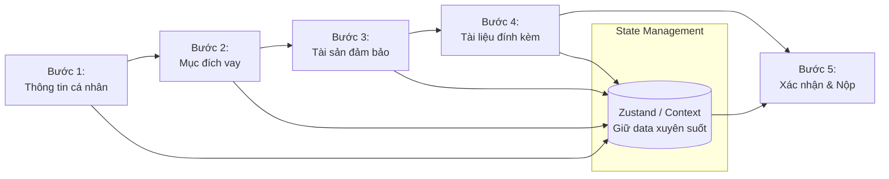
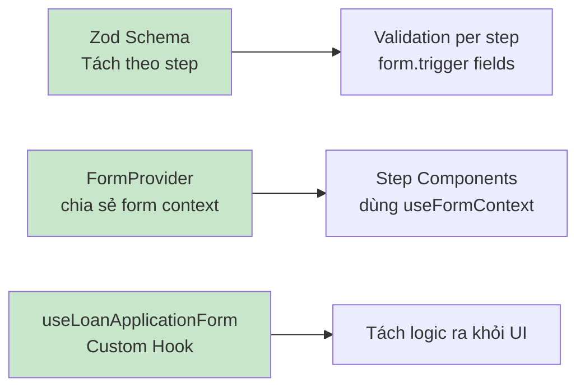

# 21. Multi-Step Forms & Complex Validation 📋

> **Tại sao quan trọng với banking/enterprise?**
> Nghiệp vụ ngân hàng thường có forms rất phức tạp: đơn vay vốn 5 bước, KYC với nhiều trường liên quan, điều kiện validation phụ thuộc nhau. Bài này dạy cách xây dựng multi-step form chuyên nghiệp với React Hook Form + Zod.

---

## 🧩 1. Kiến trúc Multi-Step Form



---

## 🔧 2. Schema Validation với Zod

### Tách schema theo từng step

```typescript
// schemas/loan-application.schema.ts
import { z } from 'zod';

// Step 1: Thông tin cá nhân
export const personalInfoSchema = z.object({
  fullName: z.string()
    .min(2, 'Họ tên tối thiểu 2 ký tự')
    .max(100, 'Họ tên tối đa 100 ký tự'),
  idNumber: z.string()
    .regex(/^[0-9]{9,12}$/, 'CMND/CCCD phải là 9-12 chữ số'),
  dateOfBirth: z.string()
    .refine(val => {
      const dob = new Date(val);
      const age = new Date().getFullYear() - dob.getFullYear();
      return age >= 18 && age <= 70;
    }, 'Tuổi phải từ 18 đến 70'),
  phone: z.string().regex(/^(0[3|5|7|8|9])+([0-9]{8})$/, 'Số điện thoại không hợp lệ'),
  email: z.string().email('Email không hợp lệ').optional(),
  address: z.string().min(10, 'Địa chỉ tối thiểu 10 ký tự'),
  occupation: z.enum(['EMPLOYEE', 'SELF_EMPLOYED', 'BUSINESS_OWNER', 'RETIRED'], {
    errorMap: () => ({ message: 'Vui lòng chọn nghề nghiệp' })
  }),
  monthlyIncome: z.number()
    .min(5_000_000, 'Thu nhập tối thiểu 5 triệu đồng/tháng'),
});

// Step 2: Thông tin khoản vay
export const loanInfoSchema = z.object({
  loanAmount: z.number()
    .min(10_000_000, 'Số tiền vay tối thiểu 10 triệu')
    .max(5_000_000_000, 'Số tiền vay tối đa 5 tỷ'),
  loanTermMonths: z.number()
    .min(6, 'Kỳ hạn tối thiểu 6 tháng')
    .max(360, 'Kỳ hạn tối đa 360 tháng'),
  loanPurpose: z.enum(['HOME_PURCHASE', 'CAR_PURCHASE', 'BUSINESS', 'EDUCATION', 'MEDICAL', 'OTHER']),
  loanPurposeDetail: z.string().min(20, 'Mô tả mục đích tối thiểu 20 ký tự'),
}).refine(data => {
  // Cross-field validation: Tỷ lệ nợ/thu nhập
  // Lấy từ form parent context (sẽ xử lý bên dưới)
  return true;
}, 'Số tiền vay không phù hợp với thu nhập');

// Step 3: Tài sản đảm bảo (conditional)
export const collateralSchema = z.discriminatedUnion('hasCollateral', [
  z.object({
    hasCollateral: z.literal(false),
    // Không cần thêm field
  }),
  z.object({
    hasCollateral: z.literal(true),
    collateralType: z.enum(['REAL_ESTATE', 'VEHICLE', 'SAVINGS']),
    collateralValue: z.number().min(1, 'Giá trị tài sản phải lớn hơn 0'),
    collateralDescription: z.string().min(10, 'Mô tả tài sản tối thiểu 10 ký tự'),
    ownerName: z.string().min(2, 'Tên chủ sở hữu tối thiểu 2 ký tự'),
  }),
]);

// Full schema kết hợp
export const fullLoanSchema = personalInfoSchema.merge(loanInfoSchema).and(collateralSchema);
export type LoanApplicationForm = z.infer<typeof fullLoanSchema>;
```

---

## 🏗️ 3. Multi-Step Form với Custom Hook

```tsx
// hooks/useLoanApplicationForm.ts
import { useCallback, useState } from 'react';
import { useForm, UseFormReturn } from 'react-hook-form';
import { zodResolver } from '@hookform/resolvers/zod';

const STEPS = [
  { id: 1, label: 'Thông tin cá nhân', schema: personalInfoSchema },
  { id: 2, label: 'Thông tin khoản vay', schema: loanInfoSchema },
  { id: 3, label: 'Tài sản đảm bảo', schema: collateralSchema },
  { id: 4, label: 'Tài liệu đính kèm', schema: z.object({}) },
  { id: 5, label: 'Xác nhận', schema: z.object({}) },
];

export function useLoanApplicationForm() {
  const [currentStep, setCurrentStep] = useState(1);
  const [isSubmitting, setIsSubmitting] = useState(false);

  // Một form duy nhất quản lý toàn bộ data
  const form = useForm<LoanApplicationForm>({
    resolver: zodResolver(fullLoanSchema),
    defaultValues: {
      hasCollateral: false,
      // ...other defaults
    },
    mode: 'onChange', // Validate khi thay đổi field
  });

  const currentStepDef = STEPS[currentStep - 1];

  const nextStep = async () => {
    // Validate chỉ các fields của step hiện tại
    const stepFields = getFieldsForStep(currentStep);
    const isValid = await form.trigger(stepFields as any);
    if (isValid) setCurrentStep(s => s + 1);
  };

  const prevStep = () => setCurrentStep(s => Math.max(1, s - 1));

  const goToStep = (step: number) => {
    // Chỉ cho phép quay lại step đã hoàn thành
    if (step < currentStep) setCurrentStep(step);
  };

  const submitForm = form.handleSubmit(async (data) => {
    setIsSubmitting(true);
    try {
      await loanService.submit(data);
      toast.success('Nộp hồ sơ thành công!');
      // Redirect hoặc reset
    } catch (err) {
      toast.error('Nộp hồ sơ thất bại: ' + err.message);
    } finally {
      setIsSubmitting(false);
    }
  });

  return {
    form,
    currentStep,
    totalSteps: STEPS.length,
    steps: STEPS,
    currentStepDef,
    isFirstStep: currentStep === 1,
    isLastStep: currentStep === STEPS.length,
    isSubmitting,
    nextStep,
    prevStep,
    goToStep,
    submitForm,
  };
}

function getFieldsForStep(step: number): (keyof LoanApplicationForm)[] {
  const fieldMap: Record<number, (keyof LoanApplicationForm)[]> = {
    1: ['fullName', 'idNumber', 'dateOfBirth', 'phone', 'address', 'occupation', 'monthlyIncome'],
    2: ['loanAmount', 'loanTermMonths', 'loanPurpose', 'loanPurposeDetail'],
    3: ['hasCollateral', 'collateralType', 'collateralValue', 'collateralDescription'],
  };
  return fieldMap[step] ?? [];
}
```

---

## 🎨 4. Step Progress Indicator

```tsx
// components/StepProgressBar.tsx
function StepProgressBar({
  steps,
  currentStep,
  onStepClick,
}: {
  steps: { id: number; label: string }[];
  currentStep: number;
  onStepClick?: (step: number) => void;
}) {
  return (
    <div className="step-progress">
      {steps.map((step, index) => {
        const isCompleted = step.id < currentStep;
        const isCurrent = step.id === currentStep;
        
        return (
          <React.Fragment key={step.id}>
            <div
              className={`step ${isCompleted ? 'completed' : ''} ${isCurrent ? 'current' : ''}`}
              onClick={() => isCompleted && onStepClick?.(step.id)}
              style={{ cursor: isCompleted ? 'pointer' : 'default' }}
            >
              <div className="step-circle">
                {isCompleted ? '✓' : step.id}
              </div>
              <span className="step-label">{step.label}</span>
            </div>
            {index < steps.length - 1 && (
              <div className={`step-connector ${isCompleted ? 'completed' : ''}`} />
            )}
          </React.Fragment>
        );
      })}
    </div>
  );
}
```

---

## 📋 5. Step Components với FormProvider

```tsx
// pages/LoanApplicationPage.tsx
function LoanApplicationPage() {
  const { form, currentStep, steps, isLastStep, nextStep, prevStep, submitForm } = 
    useLoanApplicationForm();

  return (
    // FormProvider chia sẻ form context xuống các child components
    <FormProvider {...form}>
      <div className="loan-form-page">
        <StepProgressBar steps={steps} currentStep={currentStep} />
        
        <form>
          {currentStep === 1 && <Step1PersonalInfo />}
          {currentStep === 2 && <Step2LoanInfo />}
          {currentStep === 3 && <Step3Collateral />}
          {currentStep === 4 && <Step4Documents />}
          {currentStep === 5 && <Step5Confirmation />}
        </form>
        
        <div className="form-navigation">
          {currentStep > 1 && (
            <button type="button" onClick={prevStep}>← Quay lại</button>
          )}
          {!isLastStep ? (
            <button type="button" onClick={nextStep}>Tiếp theo →</button>
          ) : (
            <button type="submit" onClick={submitForm}>
              Nộp hồ sơ ✓
            </button>
          )}
        </div>
      </div>
    </FormProvider>
  );
}

// Step component dùng useFormContext để access form
function Step1PersonalInfo() {
  const { register, formState: { errors } } = useFormContext<LoanApplicationForm>();
  
  return (
    <div className="form-step">
      <h2>Bước 1: Thông tin cá nhân</h2>
      
      <div className="field">
        <label>Họ và tên *</label>
        <input {...register('fullName')} />
        {errors.fullName && <span className="error">{errors.fullName.message}</span>}
      </div>
      
      <div className="field">
        <label>Thu nhập hàng tháng (VNĐ) *</label>
        <input 
          type="number" 
          {...register('monthlyIncome', { valueAsNumber: true })} 
        />
        {errors.monthlyIncome && <span className="error">{errors.monthlyIncome.message}</span>}
      </div>
      {/* ... các field khác */}
    </div>
  );
}

// Step với conditional fields
function Step3Collateral() {
  const { register, watch, formState: { errors } } = useFormContext<LoanApplicationForm>();
  const hasCollateral = watch('hasCollateral');
  
  return (
    <div className="form-step">
      <h2>Bước 3: Tài sản đảm bảo</h2>
      
      <div className="field">
        <label>
          <input type="checkbox" {...register('hasCollateral')} />
          Có tài sản đảm bảo
        </label>
      </div>
      
      {/* Conditional fields — chỉ hiện khi hasCollateral = true */}
      {hasCollateral && (
        <>
          <div className="field">
            <label>Loại tài sản *</label>
            <select {...register('collateralType')}>
              <option value="">-- Chọn --</option>
              <option value="REAL_ESTATE">Bất động sản</option>
              <option value="VEHICLE">Xe cộ</option>
              <option value="SAVINGS">Sổ tiết kiệm</option>
            </select>
            {errors.collateralType && <span className="error">{errors.collateralType?.message}</span>}
          </div>
          
          <div className="field">
            <label>Giá trị ước tính (VNĐ) *</label>
            <input type="number" {...register('collateralValue', { valueAsNumber: true })} />
          </div>
        </>
      )}
    </div>
  );
}
```

---

## 📊 6. Tổng kết Best Practices



| Kỹ thuật | Mục đích |
|---|---|
| `z.discriminatedUnion` | Conditional validation |
| `form.trigger(fields)` | Validate chỉ step hiện tại |
| `FormProvider` | Chia sẻ form xuống component tree |
| `useFormContext` | Dùng form trong child component |
| `watch('field')` | Conditional rendering dựa trên field value |
| Custom Hook | Tách step logic ra khỏi UI |

---

**Bài tiếp theo:** [[22-Portals-and-Modals|22. Portals & Modal Patterns]] 🪟
