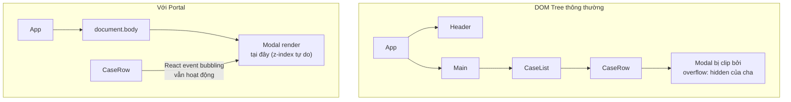

# Bài 22: Portals & Modals — Render ngoài DOM tree 🪟

> **Mục tiêu**: Hiểu React Portals, xây dựng Modal/Dialog enterprise-grade với focus trap, keyboard navigation, animation, và Modal Manager pattern để quản lý nhiều modal đồng thời trong PDMS.

---

## 🗺️ Vấn đề Portal giải quyết



**Portal cho phép:**
- Render component vào **bất kỳ node DOM nào** (thường là `document.body`)
- Thoát khỏi `overflow: hidden`, `z-index stacking context` của parent
- React event bubbling vẫn đúng theo **cây component** (không theo DOM tree)

---

## 1. Portal cơ bản

```typescript
import { createPortal } from 'react-dom';

// Portal đơn giản nhất
function Portal({ children }: { children: React.ReactNode }) {
  return createPortal(children, document.body);
}

// Dùng container riêng (best practice)
const modalRoot = document.getElementById('modal-root') ?? (() => {
  const div = document.createElement('div');
  div.id = 'modal-root';
  document.body.appendChild(div);
  return div;
})();

function ModalPortal({ children }: { children: React.ReactNode }) {
  return createPortal(children, modalRoot);
}
```

```html
<!-- index.html — thêm container -->
<body>
  <div id="root"></div>
  <div id="modal-root"></div>  <!-- Modals render ở đây -->
</body>
```

---

## 2. Modal Component Enterprise-grade

```typescript
import { createPortal } from 'react-dom';
import { useEffect, useRef, useCallback, ReactNode } from 'react';

interface ModalProps {
  isOpen: boolean;
  onClose: () => void;
  title: string;
  children: ReactNode;
  footer?: ReactNode;
  size?: 'sm' | 'md' | 'lg' | 'xl' | 'full';
  closeOnOverlayClick?: boolean;
  closeOnEscape?: boolean;
  preventClose?: boolean; // khi đang submit form
}

function Modal({
  isOpen,
  onClose,
  title,
  children,
  footer,
  size = 'md',
  closeOnOverlayClick = true,
  closeOnEscape = true,
  preventClose = false
}: ModalProps) {
  const dialogRef = useRef<HTMLDivElement>(null);
  const previousFocusRef = useRef<HTMLElement | null>(null);

  // ---- Focus Management ----
  useEffect(() => {
    if (isOpen) {
      // Lưu element đang focus trước khi mở modal
      previousFocusRef.current = document.activeElement as HTMLElement;

      // Focus vào modal sau khi render
      requestAnimationFrame(() => {
        const firstFocusable = dialogRef.current?.querySelector<HTMLElement>(
          'button, [href], input, select, textarea, [tabindex]:not([tabindex="-1"])'
        );
        firstFocusable?.focus();
      });
    } else {
      // Trả focus về khi đóng modal
      previousFocusRef.current?.focus();
    }
  }, [isOpen]);

  // ---- Keyboard Navigation ----
  const handleKeyDown = useCallback((e: React.KeyboardEvent) => {
    if (e.key === 'Escape' && closeOnEscape && !preventClose) {
      onClose();
      return;
    }

    // Focus Trap: Tab / Shift+Tab phải giữ trong modal
    if (e.key === 'Tab' && dialogRef.current) {
      const focusable = dialogRef.current.querySelectorAll<HTMLElement>(
        'button:not([disabled]), [href], input:not([disabled]), select:not([disabled]), textarea:not([disabled]), [tabindex]:not([tabindex="-1"])'
      );
      const first = focusable[0];
      const last = focusable[focusable.length - 1];

      if (e.shiftKey) {
        // Shift+Tab: nếu đang ở đầu → jump xuống cuối
        if (document.activeElement === first) {
          e.preventDefault();
          last?.focus();
        }
      } else {
        // Tab: nếu đang ở cuối → jump lên đầu
        if (document.activeElement === last) {
          e.preventDefault();
          first?.focus();
        }
      }
    }
  }, [closeOnEscape, preventClose, onClose]);

  // ---- Body Scroll Lock ----
  useEffect(() => {
    if (isOpen) {
      const scrollY = window.scrollY;
      document.body.style.cssText = `
        overflow: hidden;
        position: fixed;
        top: -${scrollY}px;
        width: 100%;
      `;
      return () => {
        document.body.style.cssText = '';
        window.scrollTo(0, scrollY);
      };
    }
  }, [isOpen]);

  if (!isOpen) return null;

  const sizeClasses = {
    sm: 'max-w-sm',
    md: 'max-w-lg',
    lg: 'max-w-2xl',
    xl: 'max-w-4xl',
    full: 'max-w-[95vw]'
  };

  return createPortal(
    // Overlay
    <div
      className="modal-overlay"
      role="presentation"
      onClick={closeOnOverlayClick && !preventClose ? onClose : undefined}
      style={{
        position: 'fixed', inset: 0,
        background: 'rgba(0,0,0,0.5)',
        display: 'flex', alignItems: 'center', justifyContent: 'center',
        zIndex: 1000
      }}
    >
      {/* Dialog */}
      <div
        ref={dialogRef}
        role="dialog"
        aria-modal="true"
        aria-labelledby="modal-title"
        className={`modal-content ${sizeClasses[size]}`}
        onClick={e => e.stopPropagation()} // Không bubble lên overlay
        onKeyDown={handleKeyDown}
        tabIndex={-1}
        style={{
          background: 'white',
          borderRadius: 8,
          width: '100%',
          maxHeight: '90vh',
          display: 'flex',
          flexDirection: 'column'
        }}
      >
        {/* Header */}
        <div className="modal-header" style={{ padding: '16px 24px', borderBottom: '1px solid #e5e7eb', display: 'flex', justifyContent: 'space-between', alignItems: 'center' }}>
          <h2 id="modal-title" style={{ margin: 0, fontSize: '1.125rem', fontWeight: 600 }}>
            {title}
          </h2>
          <button
            onClick={onClose}
            disabled={preventClose}
            aria-label="Đóng"
            className="close-btn"
          >
            ✕
          </button>
        </div>

        {/* Body — scrollable */}
        <div className="modal-body" style={{ padding: '24px', overflowY: 'auto', flex: 1 }}>
          {children}
        </div>

        {/* Footer */}
        {footer && (
          <div className="modal-footer" style={{ padding: '16px 24px', borderTop: '1px solid #e5e7eb' }}>
            {footer}
          </div>
        )}
      </div>
    </div>,
    document.getElementById('modal-root') ?? document.body
  );
}
```

---

## 3. useModal Hook — Quản lý state

```typescript
import { useState, useCallback } from 'react';

interface UseModalReturn {
  isOpen: boolean;
  open: () => void;
  close: () => void;
  toggle: () => void;
}

function useModal(initialState = false): UseModalReturn {
  const [isOpen, setIsOpen] = useState(initialState);

  return {
    isOpen,
    open: useCallback(() => setIsOpen(true), []),
    close: useCallback(() => setIsOpen(false), []),
    toggle: useCallback(() => setIsOpen(prev => !prev), [])
  };
}

// Cách dùng cơ bản
function CaseListPage() {
  const approveModal = useModal();
  const [selectedCaseId, setSelectedCaseId] = useState<string | null>(null);

  const openApproveModal = useCallback((caseId: string) => {
    setSelectedCaseId(caseId);
    approveModal.open();
  }, [approveModal]);

  return (
    <>
      <CaseTable onApprove={openApproveModal} />

      <Modal
        isOpen={approveModal.isOpen}
        onClose={approveModal.close}
        title="Xác nhận phê duyệt hồ sơ"
        size="md"
        footer={
          <div style={{ display: 'flex', gap: 8, justifyContent: 'flex-end' }}>
            <button onClick={approveModal.close}>Hủy</button>
            <button onClick={() => { /* approve */ approveModal.close(); }}>
              Xác nhận
            </button>
          </div>
        }
      >
        <p>Bạn có chắc muốn phê duyệt hồ sơ <strong>{selectedCaseId}</strong>?</p>
      </Modal>
    </>
  );
}
```

---

## 4. Modal Manager — Nhiều modal, một provider

Pattern này tránh phải quản lý `useState` riêng cho từng modal:

```typescript
// context/ModalManager.tsx
import { createContext, useContext, useState, useCallback, ReactNode } from 'react';

type ModalId = string;

interface ModalConfig {
  id: ModalId;
  component: ReactNode;
}

interface ModalContextValue {
  openModal: (id: ModalId, component: ReactNode) => void;
  closeModal: (id: ModalId) => void;
  closeAll: () => void;
}

const ModalContext = createContext<ModalContextValue | null>(null);

export function ModalProvider({ children }: { children: ReactNode }) {
  const [modals, setModals] = useState<ModalConfig[]>([]);

  const openModal = useCallback((id: ModalId, component: ReactNode) => {
    setModals(prev => {
      const exists = prev.find(m => m.id === id);
      if (exists) return prev; // tránh duplicate
      return [...prev, { id, component }];
    });
  }, []);

  const closeModal = useCallback((id: ModalId) => {
    setModals(prev => prev.filter(m => m.id !== id));
  }, []);

  const closeAll = useCallback(() => setModals([]), []);

  return (
    <ModalContext.Provider value={{ openModal, closeModal, closeAll }}>
      {children}
      {/* Render tất cả active modals */}
      {modals.map(modal => (
        <div key={modal.id}>{modal.component}</div>
      ))}
    </ModalContext.Provider>
  );
}

export function useModalManager(): ModalContextValue {
  const ctx = useContext(ModalContext);
  if (!ctx) throw new Error('useModalManager must be used within ModalProvider');
  return ctx;
}

// Cách dùng — không cần useState trong component
function CaseRow({ caseItem }: { caseItem: LoanCase }) {
  const { openModal, closeModal } = useModalManager();

  const showApproveConfirm = () => {
    openModal(
      `approve-${caseItem.id}`,
      <Modal
        isOpen={true}
        onClose={() => closeModal(`approve-${caseItem.id}`)}
        title="Xác nhận phê duyệt"
      >
        <ApproveConfirmContent
          caseItem={caseItem}
          onSuccess={() => closeModal(`approve-${caseItem.id}`)}
        />
      </Modal>
    );
  };

  return (
    <tr>
      <td>{caseItem.caseCode}</td>
      <td><button onClick={showApproveConfirm}>Phê duyệt</button></td>
    </tr>
  );
}
```

---

## 5. Drawer Component — Side panel variant

```typescript
interface DrawerProps {
  isOpen: boolean;
  onClose: () => void;
  title: string;
  children: ReactNode;
  position?: 'left' | 'right';
  width?: string;
}

function Drawer({ isOpen, onClose, title, children, position = 'right', width = '480px' }: DrawerProps) {
  return createPortal(
    <>
      {/* Backdrop */}
      {isOpen && (
        <div
          className="drawer-backdrop"
          onClick={onClose}
          style={{ position: 'fixed', inset: 0, background: 'rgba(0,0,0,0.3)', zIndex: 999 }}
        />
      )}

      {/* Drawer Panel — luôn render, chỉ translate */}
      <div
        role="dialog"
        aria-label={title}
        style={{
          position: 'fixed',
          top: 0,
          [position]: 0,
          width,
          height: '100vh',
          background: 'white',
          zIndex: 1000,
          display: 'flex',
          flexDirection: 'column',
          transform: isOpen
            ? 'translateX(0)'
            : `translateX(${position === 'right' ? '100%' : '-100%'})`,
          transition: 'transform 300ms ease-in-out',
          boxShadow: '-4px 0 20px rgba(0,0,0,0.15)'
        }}
      >
        <div className="drawer-header" style={{ padding: '16px 24px', borderBottom: '1px solid #e5e7eb', display: 'flex', justifyContent: 'space-between' }}>
          <h3 style={{ margin: 0 }}>{title}</h3>
          <button onClick={onClose} aria-label="Đóng">✕</button>
        </div>
        <div className="drawer-body" style={{ flex: 1, overflowY: 'auto', padding: '24px' }}>
          {children}
        </div>
      </div>
    </>,
    document.body
  );
}

// Dùng trong PDMS — xem chi tiết hồ sơ
function CaseManagementPage() {
  const [selectedCase, setSelectedCase] = useState<LoanCase | null>(null);

  return (
    <>
      <CaseTable onRowClick={setSelectedCase} />

      <Drawer
        isOpen={!!selectedCase}
        onClose={() => setSelectedCase(null)}
        title={`Hồ sơ: ${selectedCase?.caseCode}`}
      >
        {selectedCase && <CaseDetailPanel caseId={selectedCase.id} />}
      </Drawer>
    </>
  );
}
```

---

## 6. Confirm Dialog — Reusable pattern

```typescript
// hooks/useConfirm.tsx
import { useState, useCallback } from 'react';

interface ConfirmOptions {
  title: string;
  message: string;
  confirmLabel?: string;
  cancelLabel?: string;
  variant?: 'danger' | 'warning' | 'info';
}

function useConfirm() {
  const [isOpen, setIsOpen] = useState(false);
  const [options, setOptions] = useState<ConfirmOptions | null>(null);
  const resolveRef = useRef<(value: boolean) => void>();

  const confirm = useCallback((opts: ConfirmOptions): Promise<boolean> => {
    setOptions(opts);
    setIsOpen(true);
    return new Promise(resolve => { resolveRef.current = resolve; });
  }, []);

  const handleConfirm = () => { setIsOpen(false); resolveRef.current?.(true); };
  const handleCancel = () => { setIsOpen(false); resolveRef.current?.(false); };

  const ConfirmDialog = () => options ? (
    <Modal
      isOpen={isOpen}
      onClose={handleCancel}
      title={options.title}
      size="sm"
      footer={
        <div style={{ display: 'flex', gap: 8, justifyContent: 'flex-end' }}>
          <button onClick={handleCancel}>{options.cancelLabel ?? 'Hủy'}</button>
          <button
            onClick={handleConfirm}
            className={options.variant === 'danger' ? 'btn-danger' : 'btn-primary'}
          >
            {options.confirmLabel ?? 'Xác nhận'}
          </button>
        </div>
      }
    >
      <p>{options.message}</p>
    </Modal>
  ) : null;

  return { confirm, ConfirmDialog };
}

// Cách dùng — clean và reusable
function CaseActions({ caseId }: { caseId: string }) {
  const { confirm, ConfirmDialog } = useConfirm();
  const deleteMutation = useDeleteCase();

  const handleDelete = async () => {
    const ok = await confirm({
      title: 'Xóa hồ sơ',
      message: `Bạn có chắc muốn xóa hồ sơ ${caseId}? Thao tác này không thể hoàn tác.`,
      confirmLabel: 'Xóa',
      variant: 'danger'
    });

    if (ok) {
      deleteMutation.mutate(caseId);
    }
  };

  return (
    <>
      <button onClick={handleDelete} className="btn-danger">Xóa hồ sơ</button>
      <ConfirmDialog />
    </>
  );
}
```

---

## 📚 Tóm tắt

| Pattern | Dùng khi |
|---|---|
| `createPortal` | Bất kỳ khi cần thoát khỏi DOM stacking context |
| `Modal` + focus trap | Dialog xác nhận, form trong modal |
| `useModal` hook | Quản lý open/close state đơn giản |
| `ModalProvider` | Nhiều modal, quản lý tập trung |
| `Drawer` | Side panel, chi tiết record |
| `useConfirm` | Delete confirmation, warning |

> **Đây là bài cuối của React-Latest-Series!**
> 
> Xem lại **[[00-Roadmap]]** để có lộ trình tổng quan và tiếp tục với các series nâng cao.
