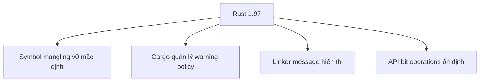
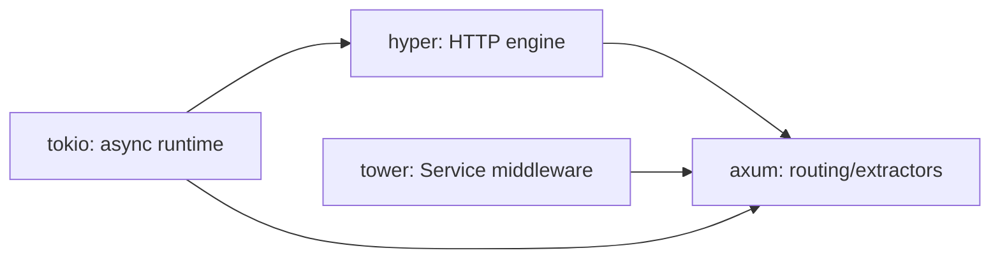

# Rust 1.97 — Technology Update

Rust stable mới nhất tại thời điểm kiểm tra là **1.97.1**; 1.97.0 phát hành ngày 09/07/2026 và 1.97.1 ngày 16/07/2026.

## Bức tranh tổng thể



## 1. Symbol mangling v0 bật mặc định

Compiler phải biến tên function/type thành symbol duy nhất trong binary. Scheme v0 giữ thông tin generic rõ hơn và thống nhất cách demangle.

Tác động chính không nằm ở source code mà ở hệ sinh thái tooling:

- Profiler và flame graph cần demangler hỗ trợ v0.
- Symbol-based allowlist/monitoring có thể đổi output.
- Native integration và crash-report pipeline nên được test.
- Không dựa vào mangled symbol như một public contract.

## 2. Deny warnings không còn cần phá build cache

Trước đây CI thường dùng:

```bash
RUSTFLAGS="-Dwarnings" cargo check
```

Thay đổi `RUSTFLAGS` có thể làm cache key khác và rebuild tốn thời gian. Rust 1.97 cho phép:

```bash
CARGO_BUILD_WARNINGS=deny cargo check --keep-going
```

Local có thể tạm giảm noise:

```bash
CARGO_BUILD_WARNINGS=allow cargo check
```

Đây là cải tiến nhỏ nhưng có giá trị rõ với monorepo/workspace lớn.

## 3. Linker output được nhìn thấy

`rustc` không còn mặc định giấu linker message khi link thành công. Điều này giúp phát hiện deprecated linker flags hoặc cấu hình native bất thường.

Không nên bật `-D warnings` cho `linker_messages` một cách máy móc trên mọi platform: linker output có thể khác giữa Linux, macOS và Windows.

## 4. Framework radar

### Axum

Dòng Axum 0.8 tiếp tục ổn định; repository chính thức ghi nhận 0.8.9 vào tháng 4/2026 và MSRV 1.80. Kiến trúc vẫn dựa trên Tower middleware, vì vậy migration cần kiểm tra đồng bộ bộ version `axum`, `tower`, `tower-http`, `hyper`.

### Tokio

Tokio vẫn ở dòng 1.x; repository chính thức ghi nhận 1.52.3 vào tháng 5/2026. Không nâng Tokio chỉ vì version mới: xem feature flags, MSRV, scheduler behavior và dependency graph.



## Checklist nâng Rust service

1. `rustup update stable`
2. Chạy `cargo update` trong branch riêng.
3. `cargo check --all-targets --all-features`.
4. CI dùng `CARGO_BUILD_WARNINGS=deny`.
5. Test profiler, symbolization và native linker.
6. Chạy `cargo clippy` và test integration.
7. Với Axum/Tokio, test graceful shutdown, timeout, WebSocket/SSE và load.

## Article nên bổ sung tiếp

- `Bai-49-Rust-Symbol-Mangling-and-Profiling.md`
- `Bai-50-Cargo-CI-Cache-and-Warning-Policy.md`
- `Bai-51-Axum-0.8-Production-Migration.md`
- `Bai-52-Tokio-1.52-Scheduler-and-Cancellation.md`
- `Bai-53-Tower-Middleware-Architecture.md`
- `Bai-54-Rust-Native-Linking-and-FFI-Diagnostics.md`
- `Bai-55-Leptos-Dioxus-2026-Framework-Radar.md`

## Liên kết trong Vault

- [[Bai-9-Async-Tokio|Async Tokio]]
- [[Bai-10-Axum-Core|Axum Core]]
- [[Bai-19-Unsafe-FFI|Unsafe và FFI]]
- [[Performance-Pitfalls-Rust|Rust Performance Pitfalls]]

## Nguồn chính thức

- [Rust 1.97.0 announcement](https://blog.rust-lang.org/2026/07/09/Rust-1.97.0/)
- [Rust release announcements](https://blog.rust-lang.org/releases/)
- [Axum repository and releases](https://github.com/tokio-rs/axum)
- [Tokio repository and releases](https://github.com/tokio-rs/tokio)

