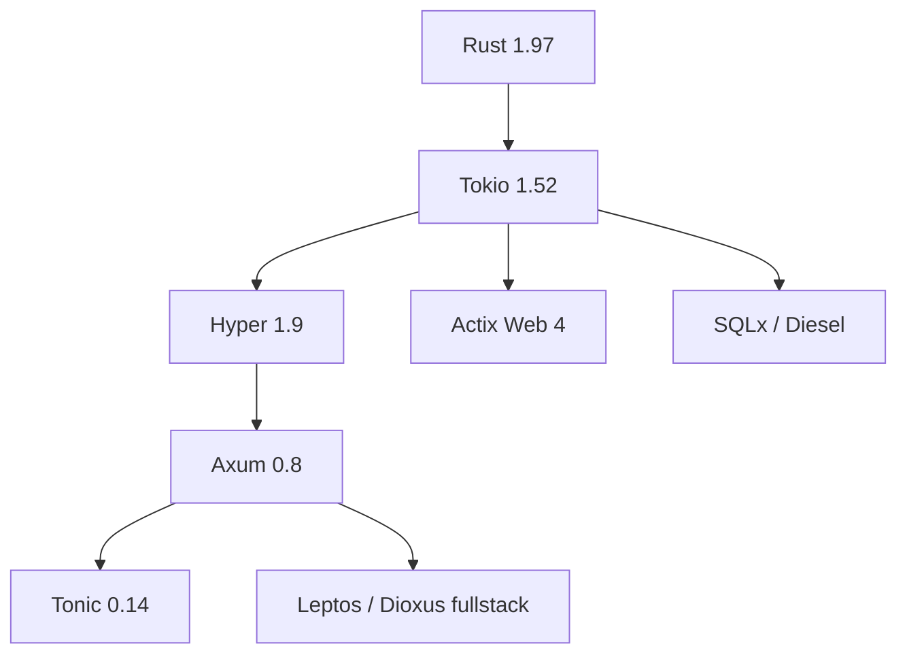

# Bài 49 — Rust Framework Radar 2026

## Bản đồ stack

## Learning track

| Layer | Bài |
|---|---|
| Runtime | [[Rust-Zero-To-Hero/Bai-50-Tokio-1.52-Runtime-Update]] |
| HTTP | [[Rust-Zero-To-Hero/Bai-51-Axum-0.8.9-Production-Update]] |
| Alternative server | [[Rust-Zero-To-Hero/Bai-52-Actix-Web-2026-Update]] |
| Database | [[Rust-Zero-To-Hero/Bai-53-SQLx-0.8-Diesel-2.3-Update]] |
| gRPC | [[Rust-Zero-To-Hero/Bai-54-Tonic-0.14-Production-gRPC]] |
| Fullstack | [[Rust-Zero-To-Hero/Bai-55-Leptos-0.8-Migration]], [[Rust-Zero-To-Hero/Bai-56-Dioxus-0.7-to-0.8-Watchlist]] |

## Cách học

Mỗi framework được nhìn qua:

1. Abstraction nằm trên crate nào.
2. Resource nào được sở hữu bởi runtime.
3. Future có cancellation-safe không.
4. Backpressure nằm ở đâu.
5. MSRV và feature flags ảnh hưởng build thế nào.

> [!warning] Gap cần tránh
> `async` và memory safety không tự động tạo ra service đúng. Deadlock logic, unbounded channel, retry storm và cancellation làm mất protocol state vẫn có thể xảy ra.

## Capstone

Service Rust gồm Axum + SQLx + Tonic + Kafka, có:

- Bounded concurrency.
- Graceful shutdown.
- Trace propagation.
- Timeout budget.
- Load/fault test.
- Miri/Loom cho phần concurrency quan trọng.

## Nguồn

- [Tokio](https://github.com/tokio-rs/tokio/releases)
- [Axum](https://github.com/tokio-rs/axum/releases)
- [Actix Web](https://github.com/actix/actix-web)
- [SQLx](https://github.com/launchbadge/sqlx)

