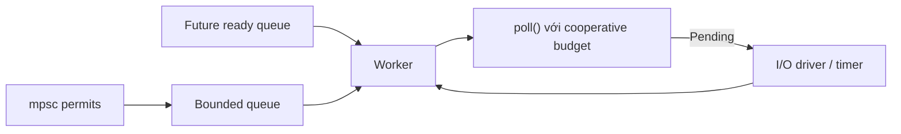

# Bài 50 — Tokio 1.52 Runtime Update

## Mental model



Tokio 1.52.3 sửa các edge case của `mpsc` permit, channel close và `RwLock`. Đây là lời nhắc rằng channel API có protocol, không chỉ là “gửi/nhận”.

## Permit và backpressure

`reserve()` giữ chỗ trong bounded channel. Outstanding permit có thể khiến cách hiểu “channel đã rỗng/đóng” khác trực giác.

```rust
let permit = tx.reserve().await?;
permit.send(job);
```

Dùng permit khi cần đảm bảo capacity trước khi chuẩn bị payload tốn kém. Không giữ permit qua một await dài không cần thiết.

## Cancellation

Future bị drop khi `select!` chọn nhánh khác. Hãy hỏi:

- Operation đã mutate state chưa?
- Có giữ permit/lock không?
- Có thể retry an toàn không?
- Protocol frame có bị đọc một phần không?

## Lab

1. Bounded `mpsc` size 10.
2. 100 producer.
3. Consumer cố tình chậm.
4. Cancel một nửa producer.
5. Quan sát queue length, permit và shutdown.

## Gap cần tránh

- `spawn` không giới hạn.
- Channel unbounded cho traffic bên ngoài.
- Giữ `MutexGuard` qua `.await`.
- Dùng `select!` mà không audit cancellation safety.
- Shutdown chỉ abort task.

## Liên kết

- [[Rust-Zero-To-Hero/Bai-9-Async-Tokio|Tokio nền tảng]]
- [[Rust-Zero-To-Hero/Bai-9b-Tokio-Advanced|Tokio Advanced]]
- [[Rust-Zero-To-Hero/Bai-22-Advanced-Concurrency|Advanced Concurrency]]
- [[concepts/backpressure-explained|Backpressure]]

## Nguồn

- [Tokio 1.52.3](https://github.com/tokio-rs/tokio/releases/tag/tokio-1.52.3)

