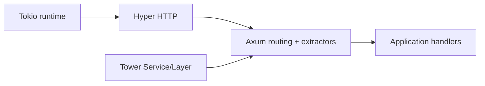
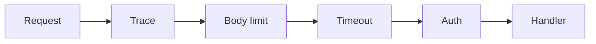

# Bài 51 — Axum 0.8.9 Production Update

## Stack thực sự

Axum không sở hữu middleware model riêng; `tower::Service` là abstraction cốt lõi. Vì vậy cần hiểu load, readiness, timeout và backpressure ở Tower.

## Update đáng chú ý

- JSON có trailing content bị reject.
- Multipart hỗ trợ optional extraction tốt hơn.
- SSE hỗ trợ arbitrary binary data.
- WebSocket implements `FusedStream`.
- Invalid redirect không panic khi tạo; response thành lỗi.
- Axum repository công bố MSRV 1.80.

## Extractor boundary

Extractor nên:

- Parse transport input.
- Validate syntax và size.
- Chuyển thành application command.

Không đặt business transaction trong custom extractor.

## Middleware order

Layer order trong Tower dễ gây nhầm vì cách wrap service. Viết test cho thứ tự thay vì chỉ nhìn code.

## SSE/WebSocket lab

- Bounded outbound channel.
- Heartbeat.
- Client disconnect cancellation.
- Slow-consumer policy.
- Graceful server shutdown.

> [!danger] Gap cần tránh
> Không gửi vào unbounded channel cho mỗi WebSocket client. Một client chậm có thể giữ memory vô hạn dù server vẫn “async”.

## Liên kết

- [[Bai-10-Axum-Core|Axum Core]]
- [[Bai-11-Axum-Middleware-Error|Middleware và Error]]
- [[Bai-24-Axum-Advanced|Axum Advanced]]
- [[Bai-50-Tokio-1.52-Runtime-Update|Tokio 1.52]]

## Nguồn

- [Axum repository](https://github.com/tokio-rs/axum)
- [Axum releases](https://github.com/tokio-rs/axum/releases)

