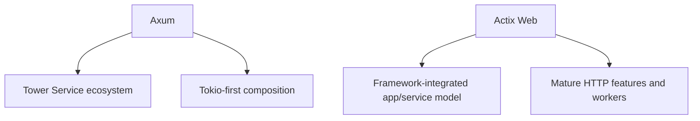

# Bài 52 — Actix Web 2026 Update

## Axum và Actix khác ở đâu?

Actix Web vẫn ở dòng 4.x; ecosystem HTTP đã cập nhật `actix-http` 3.12.x và yêu cầu stable Rust mới hơn. Không cần migrate chỉ vì version, nhưng cần audit MSRV và dependency graph.

## Nội dung cần nắm

- Worker lifecycle và app factory.
- `web::Data` ownership.
- Extractor limits.
- Streaming body và backpressure.
- Rustls/OpenSSL selection.
- Graceful shutdown.
- Experimental route introspection không nên trở thành contract production.

## Shared state

State immutable/config nên share bằng `web::Data<T>`. State mutable phải có concurrency primitive phù hợp. Không mặc định bọc mọi thứ bằng `Mutex`.

## Lab

Triển khai cùng endpoint bằng Axum và Actix:

- JSON validation.
- PostgreSQL pool.
- Timeout.
- Streaming download.
- Graceful shutdown.

So sánh ergonomics, allocation, p99 và behavior khi client chậm.

## Gap cần tránh

- Đánh giá framework chỉ bằng raw throughput.
- Block worker bằng synchronous I/O.
- Shared mutable state quá rộng.
- Không đặt body/stream limit.
- Trộn runtime assumptions của tutorial cũ với Tokio hiện tại.

## Liên kết

- [[Rust-Zero-To-Hero/Bai-25-ActixWeb|Actix Web course]]
- [[Rust-Zero-To-Hero/Bai-51-Axum-0.8.9-Production-Update|Axum 0.8.9]]
- [[Rust-Zero-To-Hero/Performance-Pitfalls-Rust|Performance Pitfalls]]

## Nguồn

- [Actix Web repository](https://github.com/actix/actix-web)

