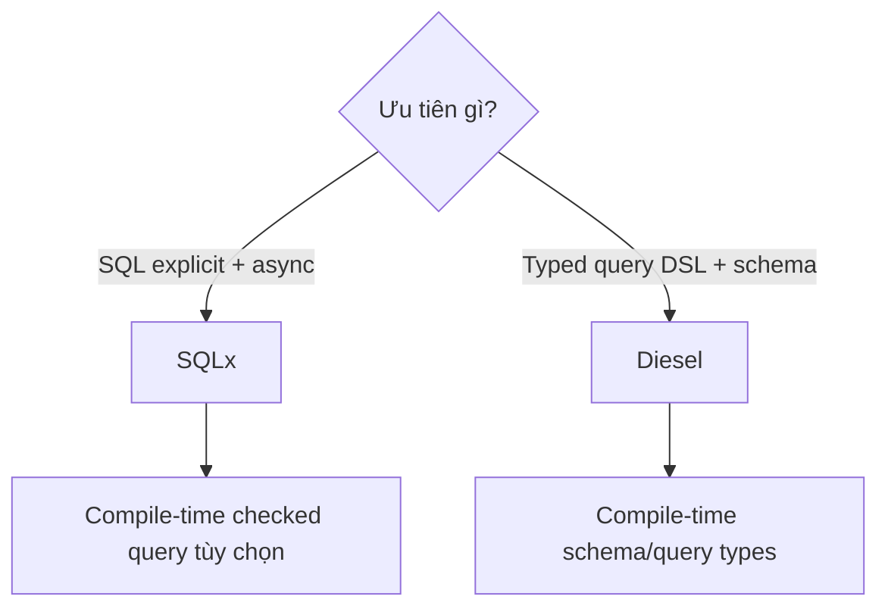

# Bài 53 — SQLx 0.8 và Diesel 2.3 Update

## Decision model



## SQLx 0.8

Các điểm cần cập nhật:

- Database traits sử dụng GAT.
- Offline query metadata tách theo invocation.
- Query nullability inference có thể thay đổi.
- MSSQL driver không còn trong open-source set.
- `PgListener` có các sửa lỗi cancellation.
- MSRV theo policy release cycle.

### Offline CI

```bash
cargo sqlx prepare --workspace -- --all-targets
cargo check --workspace --all-targets
```

CI phải kiểm tra metadata không stale sau khi SQL thay đổi.

## Diesel 2.3

Khi nâng:

- Chạy migration test trên database thật.
- Audit derive/macro errors.
- Kiểm tra insert/returning khác biệt theo backend.
- Không giả định Diesel sync có thể chạy trực tiếp trên async worker.
- Dùng blocking pool hoặc integration phù hợp.

## Transaction và cancellation

Future bị cancel không đồng nghĩa database operation chắc chắn “chưa chạy”. Thiết kế idempotency và transaction boundary theo database guarantee, không theo cảm giác của async call site.

## Lab

Triển khai cùng use case bằng SQLx và Diesel:

- Optimistic locking.
- Transaction rollback.
- Batch insert.
- Query pagination.
- Pool saturation test.

## Gap cần tránh

- Tin compile-time SQL check thay thế integration test.
- Giữ transaction qua remote RPC.
- Pool size lớn hơn khả năng database.
- Gọi blocking Diesel trên Tokio core thread.
- Auto migration không có review/governance.

## Liên kết

- [[Rust-Zero-To-Hero/Bai-12-SQLx-Database|SQLx foundation]]
- [[Rust-Zero-To-Hero/Bai-26-SQLx-Advanced|SQLx Advanced]]
- [[Rust-Zero-To-Hero/Bai-27-Diesel|Diesel]]
- [[concepts/connection-pooling-pgbouncer|Connection Pooling]]

## Nguồn

- [SQLx changelog](https://github.com/launchbadge/sqlx/blob/main/CHANGELOG.md)
- [Diesel 2.3.7](https://github.com/diesel-rs/diesel/releases/tag/v2.3.7)


## Cập nhật 26/07/2026 — thay đổi governance quan trọng

- **SQLx đã lên v0.9.0** (phát hành 06/05/2026) — vượt qua phạm vi "SQLx 0.8" của tiêu đề bài này. Đáng chú ý hơn cả version: **repository đã chuyển từ `launchbadge/sqlx` sang `transact-rs/sqlx`**, vì SQLx thực tế không còn được LaunchBadge, LLC. duy trì từ vài năm nay — việc chuyển tổ chức chỉ chính thức hoá quyền sở hữu tập thể của các tác giả chính. Link cũ (`github.com/launchbadge/sqlx`) vẫn hoạt động (redirect) nhưng nên cập nhật bookmark/CI script trỏ sang `transact-rs/sqlx`. Về mặt kỹ thuật, 0.9.0 đáng chú ý: `Cargo.lock` không còn track trong git (CI luôn test với dependency mới nhất theo mặc định), và `cargo install --locked sqlx-cli` không còn hoạt động như cũ.
- **Diesel đã lên 2.3.10** (bản `2.3.7` trong link nguồn của bài đã cũ hơn vài patch) — vẫn cùng dòng 2.3, không có breaking change, chỉ cần `cargo update -p diesel`.

**Hành động đề xuất:** nếu PDMS có pipeline pin `launchbadge/sqlx` trực tiếp qua git dependency (thay vì crates.io), kiểm tra lại — nên chuyển sang dùng crates.io như bình thường để tự động theo tổ chức mới, tránh phụ thuộc vào một repo có thể ngừng cập nhật.

*Nguồn: github.com/launchbadge/sqlx/discussions/4271, github.com/transact-rs/sqlx, crates.io/crates/diesel — truy cập 26/07/2026.*
