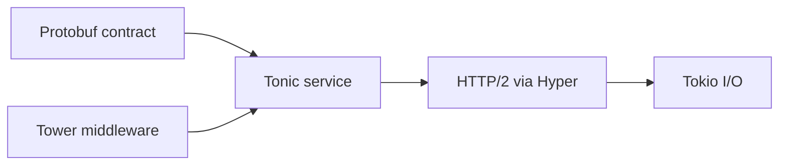
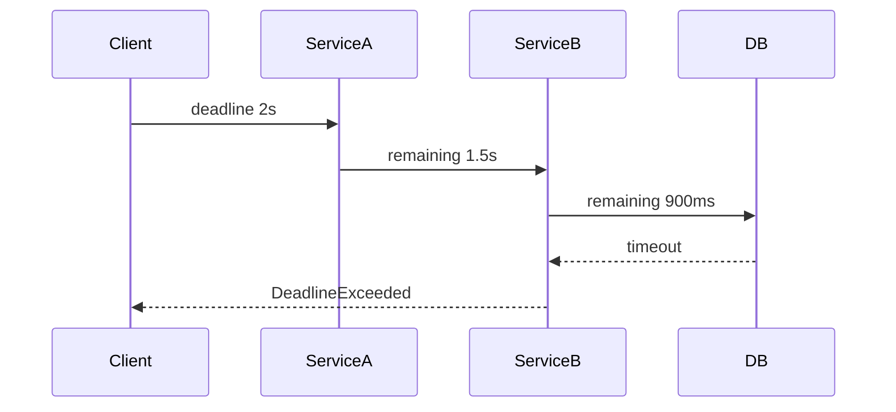

# Bài 54 — Tonic 0.14 Production gRPC

## Stack

## Nội dung trọng tâm

- Unary, client/server/bidirectional streaming.
- Deadline → cancellation.
- HTTP/2 connection/stream flow control.
- TLS với rustls.
- Health và reflection.
- gRPC-Web.
- Load balancing/xDS chỉ dùng khi operational model đủ trưởng thành.

## Deadline propagation

Server phải đọc deadline từ request, tạo budget cho DB/downstream và dừng công việc không còn giá trị.

## Streaming backpressure

Không đọc toàn bộ stream vào `Vec`. Xử lý incrementally, dùng bounded channel và xác định behavior khi peer chậm hoặc disconnect.

## Gap cần tránh

- Retry streaming call như unary idempotent call.
- Không giới hạn message size.
- Cho internal error đi thẳng vào `Status`.
- Bật keepalive quá aggressive.
- Coi Protobuf field number có thể tái sử dụng.

## Lab

Xây upload stream:

- 1 MB message limit.
- Checksum incremental.
- Cancellation khi client ngắt.
- Deadline.
- Trace span mỗi RPC, không span mỗi byte chunk.

## Liên kết

- [[Rust-Zero-To-Hero/Bai-28-Tonic-GRPC|Tonic gRPC]]
- [[concepts/grpc-protobuf-deep-dive|gRPC và Protobuf]]
- [[Rust-Zero-To-Hero/Bai-51-Axum-0.8.9-Production-Update|Axum/Tower stack]]

## Nguồn

- [Tonic repository](https://github.com/hyperium/tonic)

## Cập nhật 26/07/2026 — thay đổi governance quan trọng

**Tonic đã gia nhập chính thức dự án gRPC thuộc CNCF.** Repository đang chuyển từ `hyperium/tonic` sang `grpc/grpc-rust`. Ý nghĩa thực tế cho PDMS:

- Nhánh `master` hiện **không nhận feature mới** — chỉ nhận bug fix — vì đội ngũ đang chuẩn bị một crate `grpc` hoàn toàn mới (thiết kế lại API để kiểm soát allocation tốt hơn, upstream chính thức bởi Google/gRPC team).
- **Bản ổn định để dùng ngay bây giờ vẫn là nhánh `0.14.x`** — đúng như bài đã ghi, không cần đổi gì trong code hiện tại.
- Các link cũ tới `github.com/hyperium/tonic` (issue, commit) vẫn hoạt động bình thường sau khi chuyển tổ chức.
- **Cần theo dõi dài hạn:** đây là tín hiệu roadmap, không phải thay đổi cần hành động ngay — nhưng nếu PDMS còn dùng Tonic 2-3 năm nữa, nên dành thời gian đọc thông báo migration sang crate `grpc` mới khi nó ổn định, thay vì tiếp tục đầu tư sâu vào API 0.14.x cũ.

*Nguồn: grpc.io/blog/grpc-welcomes-tonic, luciofranco.com/blog/tonic-joins-grpc — truy cập 26/07/2026.*
