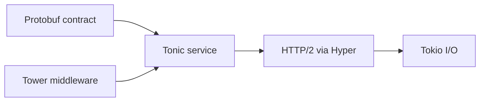
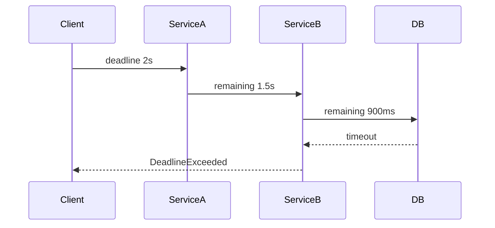

# Bài 54 — Tonic 0.14 Production gRPC

## Stack

## Nội dung trọng tâm

- Unary, client/server/bidirectional streaming.
- Deadline → cancellation.
- HTTP/2 connection/stream flow control.
- TLS với rustls.
- Health và reflection.
- gRPC-Web.
- Load balancing/xDS chỉ dùng khi operational model đủ trưởng thành.

## Deadline propagation

Server phải đọc deadline từ request, tạo budget cho DB/downstream và dừng công việc không còn giá trị.

## Streaming backpressure

Không đọc toàn bộ stream vào `Vec`. Xử lý incrementally, dùng bounded channel và xác định behavior khi peer chậm hoặc disconnect.

## Gap cần tránh

- Retry streaming call như unary idempotent call.
- Không giới hạn message size.
- Cho internal error đi thẳng vào `Status`.
- Bật keepalive quá aggressive.
- Coi Protobuf field number có thể tái sử dụng.

## Lab

Xây upload stream:

- 1 MB message limit.
- Checksum incremental.
- Cancellation khi client ngắt.
- Deadline.
- Trace span mỗi RPC, không span mỗi byte chunk.

## Liên kết

- [[Bai-28-Tonic-GRPC|Tonic gRPC]]
- [[grpc-protobuf-deep-dive|gRPC và Protobuf]]
- [[Bai-51-Axum-0.8.9-Production-Update|Axum/Tower stack]]

## Nguồn

- [Tonic repository](https://github.com/hyperium/tonic)

