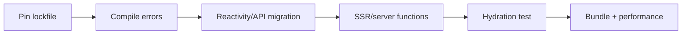

# Bài 55 — Leptos 0.8 Migration

## Migration strategy

Leptos đang ở dòng 0.8.x. Vì ecosystem Rust full-stack thay đổi nhanh, hãy tách migration thành compiler fixes và behavior verification.

## Các vùng phải audit

- Signal ownership và disposal.
- Resource/server-function API.
- Router integration.
- SSR/hydration boundary.
- Feature flags giữa CSR/SSR/hydrate.
- Axum integration và shared state.
- WASM bundle size.

## Hydration mental model

Server render HTML; client phải dựng lại reactive graph khớp với output đó. Nếu server/client phụ thuộc thời gian, random hoặc environment khác nhau, hydration có thể mismatch.

## Lab

Migrate một trang:

- Server-rendered document list.
- Search param.
- Server function.
- Loading/error state.
- Hydration test trong browser.
- So sánh HTML trước/sau.

## Gap cần tránh

- Dùng `cargo update` không pin rồi sửa hàng loạt thay đổi transitively.
- Đọc browser-only API trong SSR.
- Side effect chạy cả server và client.
- N+1 server function.
- Dùng signal global thay cho request/user-scoped state.

## Liên kết

- [[Bai-29-Leptos|Leptos foundation]]
- [[Bai-41-Auth-SSR|Auth SSR]]
- [[ssr-vs-csr-deep-dive|SSR vs CSR]]
- [[frontend-concept-map|Frontend Concept Map]]

## Nguồn

- [Leptos repository](https://github.com/leptos-rs/leptos)
- [Leptos releases](https://github.com/leptos-rs/leptos/releases)

