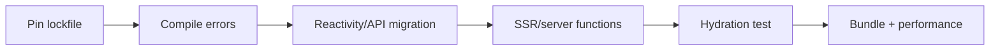

# Bài 55 — Leptos 0.8 Migration

## Migration strategy

Leptos đang ở dòng 0.8.x. Vì ecosystem Rust full-stack thay đổi nhanh, hãy tách migration thành compiler fixes và behavior verification.

## Các vùng phải audit

- Signal ownership và disposal.
- Resource/server-function API.
- Router integration.
- SSR/hydration boundary.
- Feature flags giữa CSR/SSR/hydrate.
- Axum integration và shared state.
- WASM bundle size.

## Hydration mental model

Server render HTML; client phải dựng lại reactive graph khớp với output đó. Nếu server/client phụ thuộc thời gian, random hoặc environment khác nhau, hydration có thể mismatch.

## Lab

Migrate một trang:

- Server-rendered document list.
- Search param.
- Server function.
- Loading/error state.
- Hydration test trong browser.
- So sánh HTML trước/sau.

## Gap cần tránh

- Dùng `cargo update` không pin rồi sửa hàng loạt thay đổi transitively.
- Đọc browser-only API trong SSR.
- Side effect chạy cả server và client.
- N+1 server function.
- Dùng signal global thay cho request/user-scoped state.

## Liên kết

- [[Rust-Zero-To-Hero/Bai-29-Leptos|Leptos foundation]]
- [[Rust-Zero-To-Hero/Bai-41-Auth-SSR|Auth SSR]]
- [[concepts/ssr-vs-csr-deep-dive|SSR vs CSR]]
- [[concepts/frontend-concept-map|Frontend Concept Map]]

## Nguồn

- [Leptos repository](https://github.com/leptos-rs/leptos)
- [Leptos releases](https://github.com/leptos-rs/leptos/releases)

## Cập nhật 26/07/2026 — tín hiệu bảo trì quan trọng, nên đọc trước khi cam kết dài hạn

Tác giả chính của Leptos đăng "Status Update" (05/2026, github.com/leptos-rs/leptos/issues/4707) với nội dung cốt lõi:

> Leptos **không bị bỏ rơi nhưng từ nay sẽ chỉ được bảo trì nhẹ** ("lightly maintained"). Tác giả coi framework đã **feature-complete** và **không kỳ vọng phát triển tính năng lớn** trong tương lai. Đang tìm thêm maintainer sẵn sàng đóng vai trò chủ động hơn.

**Ý nghĩa cho quyết định kiến trúc PDMS:**
- Nếu chọn Leptos cho một dashboard/tool nội bộ nhỏ, feature-complete + bảo trì nhẹ có thể chấp nhận được (ít breaking change hơn, ổn định).
- Nếu cân nhắc Leptos cho hệ thống chiến lược dài hạn cần roadmap tích cực (ví dụ tính năng mới, tối ưu performance liên tục), nên đối chiếu thêm với Dioxus (vẫn đang phát triển tích cực, xem cập nhật ở [[Rust-Zero-To-Hero/Bai-56-Dioxus-0.7-to-0.8-Watchlist]]) trước khi cam kết.
- Có nhánh `leptos_0.9` đang phát triển chậm (cleanup + vài breaking change nhỏ), nhưng không có timeline chính thức.

**Version xác nhận:** bản ổn định mới nhất vẫn là dòng 0.8.x, cụ thể **0.8.19** (16/04/2026) — đúng phạm vi bài này. `0.9.0-alpha` tồn tại từ 19/05/2026 nhưng chưa nên dùng production.

*Nguồn: github.com/leptos-rs/leptos/issues/4707, docs.rs/crate/leptos/latest — truy cập 26/07/2026.*
