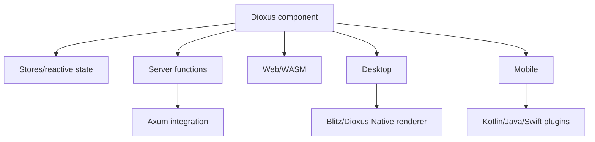

# Bài 56 — Dioxus 0.7 và 0.8 Watchlist

## Trạng thái

Dioxus stable đang ở 0.7.9; maintainers cho biết dòng 0.7 đi vào giai đoạn cuối và nhánh phát triển chuẩn bị breaking changes cho 0.8. Production nên pin 0.7.x, không theo git main.

## Kiến trúc mới cần hiểu

## Điểm nổi bật dòng 0.7

- Subsecond hot-patching.
- Native renderer dựa trên WGPU/Blitz.
- Full-stack server functions tích hợp Axum.
- WASM code splitting.
- Stores cho nested reactive state.
- UI primitives.
- Full-stack WebSocket.
- Mobile build/plugin customization.

## Production rule

- Pin CLI và crate cùng version.
- Commit `Cargo.lock` cho application.
- Test `dx bundle`, không chỉ `dx serve`.
- Tách server secret khỏi WASM client.
- Kiểm tra platform-specific code bằng CI matrix.
- Không coi hot patch là production update mechanism.

## 0.8 watchlist

Khi 0.8 stable:

1. Đọc migration guide chính thức.
2. Tạo branch upgrade riêng.
3. Nâng CLI trước trong môi trường cô lập.
4. Compile từng target.
5. Snapshot routes, server-function contracts và asset output.
6. Benchmark bundle/startup.

## Gap cần tránh

- Dùng API từ `main` trong bài stable.
- Trộn Dioxus state với backend global state.
- Đưa secret/config server vào client bundle.
- Giả định Web, Desktop và Mobile có lifecycle giống nhau.
- Dùng một abstraction chung đến mức không xử lý được platform failure.

## Lab

Xây document viewer chạy Web + Desktop:

- Shared domain crate.
- Platform adapter riêng.
- Server function có auth.
- Offline/error state.
- Bundle verification.

## Liên kết

- [[Rust-Zero-To-Hero/Bai-36-Dioxus-Core|Dioxus Core]]
- [[Rust-Zero-To-Hero/Bai-37-Dioxus-Advanced|Dioxus Advanced]]
- [[Rust-Zero-To-Hero/Bai-38-Dioxus-Desktop-Mobile|Desktop và Mobile]]
- [[Rust-Zero-To-Hero/Bai-42-JS-Interop|JS Interop]]
- [[concepts/frontend-concept-map|Frontend Concept Map]]

## Nguồn

- [Dioxus 0.7.9 release](https://github.com/DioxusLabs/dioxus/releases/tag/v0.7.9)
- [Dioxus releases](https://github.com/DioxusLabs/dioxus/releases)

## Cập nhật 26/07/2026

**Dioxus 0.8 đã bắt đầu chu kỳ alpha** (`v0.8.0-alpha.0`, nguồn github.com/DioxusLabs/dioxus/releases) — sớm hơn mức "chuẩn bị breaking changes" mà bài gốc mô tả. Theo roadmap chính thức (Discussion #5024):

- Trọng tâm 0.8 là **Native APIs và cross-platform** (camera, location, storage, OAuth...) và **không có kế hoạch thay đổi lớn về state management hay fullstack** — tin tốt cho phần đã học ở Bài 36-45, kiến thức đó dự kiến vẫn áp dụng được sau khi 0.8 stable.
- `dioxus-native`/Blitz renderer được nâng cấp đáng kể (incremental rendering, custom elements) — liên quan tới phần Desktop ở Bài 38.
- CLI (`dx`) đang được tách ra thành dự án độc lập khỏi repo chính — nếu pin version CLI + crate như bài đã khuyến nghị, chú ý theo dõi repo CLI riêng khi việc tách hoàn tất.
- **Chưa có timeline chính thức cho bản 0.8 stable** — giữ nguyên khuyến nghị "pin 0.7.x cho production" của bài này là đúng.

*Nguồn: github.com/DioxusLabs/dioxus/releases, github.com/DioxusLabs/dioxus/discussions/5024 — truy cập 26/07/2026.*
